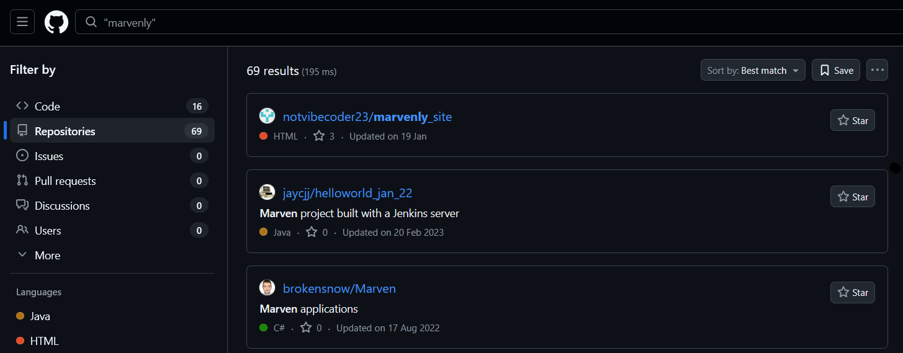
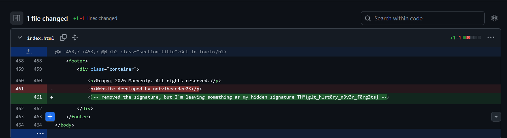

# DevDiaries - TryHackMe Writeup

Trace the digital footprint of a freelance developer who vanished without handing over the source code. This room focuses on subdomain discovery, GitHub reconnaissance, and deep-diving into git history.

[](https://tryhackme.com/room/devdiaries)
[](#)

**Key Concepts / Skills:**

- Subdomain Enumeration
- GitHub Content Discovery
- Git Log Forensics
- Digital Footprinting

## Table of Contents

- [General Overview](#general-overview)
- [Phase 1: Subdomain Discovery](#phase-1-subdomain-discovery)
- [Phase 2: GitHub Reconnaissance](#phase-2-github-reconnaissance)
- [Final Flag](#final-flag)
- [Summary](#summary)

---

## General Overview

We have just launched a website developed by a freelance developer. The source code was not shared with us, and the developer has since disappeared without handing it over.

Despite this, traces of the development process and earlier versions of the website may still exist online.

You are only given the website's primary domain as a starting point: **marvenly.com**

---

## Phase 1: Subdomain Discovery

### Question 1: What is the subdomain where the development version of the website is hosted?

Here We can make use of various tools but for now I am sticking with online tools like for subdomains I used this website [subdomainfinder](https://subdomainfinder.c99.nl/scans/2026-04-17/marvenly.com) and got the following result.

| Subdomain                                                    | IP                                                | Cloudflare                                                                        |
| ------------------------------------------------------------ | ------------------------------------------------- | --------------------------------------------------------------------------------- |
| [admin.marvenly.com](https://admin.marvenly.com)             | [none](https://subdomainfinder.c99.nl/geoip/none) |  |
| [uat-testing.marvenly.com](https://uat-testing.marvenly.com) | [none](https://subdomainfinder.c99.nl/geoip/none) |  |
| [www.marvenly.com](https://www.marvenly.com)                 | [none](https://subdomainfinder.c99.nl/geoip/none) |  |

We now have two subdomains for the website `marvenly.com` and we can see that the second one says testing meaning that is our development subdomain

So, answer for this question will be $\rightarrow$ `uat-testing.marvenly.com`

---

## Phase 2: GitHub Reconnaissance

### Question 2: What is the GitHub username of the developer?

For GitHub username we can search on GitHub with string `"marvenly"`.  
Let's check


And we got the username $\rightarrow$ `notvibecoder23`

### Question 3: What is the developer's email address?

> [!TIP]
> When investigating GitHub accounts, always check the commit history. Authorship metadata often contains the developer's real email address.

You can check the commit history of the user on [GitHub](https://github.com/notvibecoder23/marvenly_site/commits/main)

Now when we checked the user commit history this was the first commit of file `index.html` there is nothing for us it's a simple webpage.

While the Web Page is good and all but we don't have Email of the user so let's see other commits


Instead of email we got the final flag so I'll directly add this image on the final answer also.

There's also these git logs which stores the authors name, email and commit message.

So I cloned the repo and checked the git logs using command `git log` and this was the result

```shell
PS G:\%temp%\marvenly_site> git status
On branch main
Your branch is up to date with 'origin/main'.

nothing to commit, working tree clean
PS G:\%temp%\marvenly_site> git log
commit 7a7090dd0ce6b8932d0c4a44e050e7fa1e0b2edd (HEAD -> main, origin/main, origin/HEAD)
Author: notvibecoder23 <freelancedevbycoder23@gmail.com>
Date:   Tue Jan 20 00:38:53 2026 +0800

    Parking the domain until the issue is solved

commit 88baf1db29d7530a51c7bc13ae9f3c1b9a1eae25
Author: notvibecoder23 <freelancedevbycoder23@gmail.com>
Date:   Tue Jan 20 00:33:16 2026 +0800

    The project was marked as abandoned due to a payment dispute

commit 33c59e5feedcbcbfee7a1f6d3a435225698f616f
Author: notvibecoder23 <freelancedevbycoder23@gmail.com>
Date:   Tue Jan 20 00:32:28 2026 +0800

    Removed my signature, ready for deployment

commit e9ce1cebf3182472f729d976bf04b5d8e35b9b32
Author: notvibecoder23 <freelancedevbycoder23@gmail.com>
Date:   Tue Jan 20 00:12:43 2026 +0800

    Initial commit of the landing page
PS G:\%temp%\marvenly_site>
```

Hence we got our hand on the email of the user which is $\rightarrow$ `freelancedevbycoder23@gmail.com`

## Question 4: What reason did the developer mention in the commit history for removing the source code?

```shell
commit 88baf1db29d7530a51c7bc13ae9f3c1b9a1eae25
Author: notvibecoder23 <freelancedevbycoder23@gmail.com>
Date:   Tue Jan 20 00:33:16 2026 +0800

    The project was marked as abandoned due to a payment dispute

commit 33c59e5feedcbcbfee7a1f6d3a435225698f616f
Author: notvibecoder23 <freelancedevbycoder23@gmail.com>
Date:   Tue Jan 20 00:32:28 2026 +0800
```

Thus the reason is $\rightarrow$ The project was marked as abandoned due to a payment dispute

## Final Flag

### Question 5: What is the value of the hidden flag?

Check the second commit of the user on GitHub


Thus, our final (hidden) flag is : `THM{g1t_h1st0ry_n3v3r_f0rg3ts}`

---

## Summary

In this room, we navigated through the digital footprint of a freelance developer to recover lost information. Starting with only a domain name, we performed subdomain enumeration to find a development environment, which led us to a GitHub repository. By analyzing the **git commit history** and **logs**, we were able to uncover the developer's email address, understand the reasons for the project's abandonment, and ultimately retrieve the hidden flag.

**Key Takeaways:**

- **Subdomain Discovery:** Critical for finding non-production environments.
- **GitHub Reconnaissance:** Public repositories are often goldmines for metadata.
- **Git Log Analysis:** Even if files are removed, the history usually remains accessible.

Solved!

Happy Hacking! ❤️ 💻
