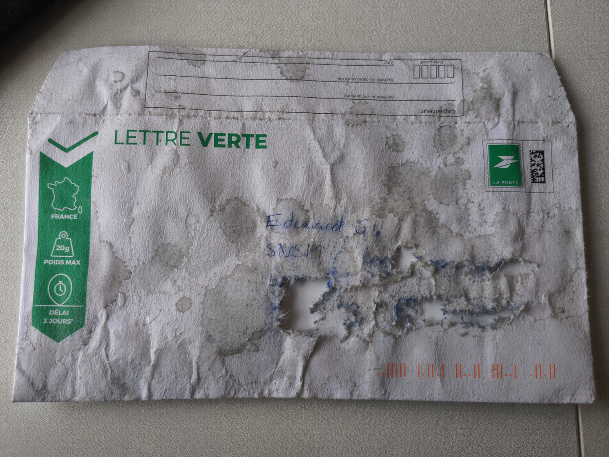
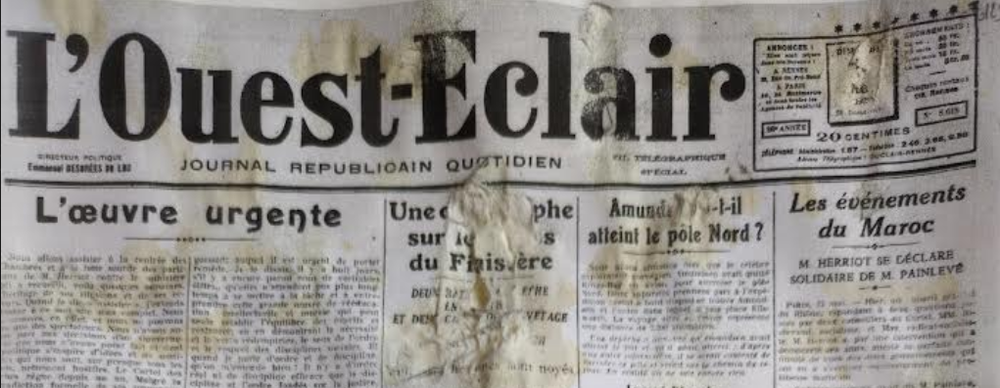
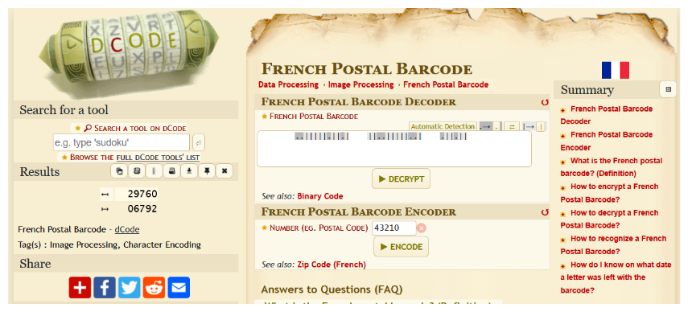

# Letter - TryHackMe Writeup

An unusual letter, a battered envelope, and a story buried in time. This challenge takes us through the process of decoding French postal markings and conducting historical research to solve a maritime mystery.

[](https://tryhackme.com/room/letter)
[](#)

**Key Concepts / Skills:**

- French Postal Barcode Decoding
- Historical OSINT Research
- Translation & Contextual Analysis
- Archive Navigation

## Table of Contents

- [General Overview](#general-overview)
- [Phase 1: Postal Code](#phase-1-postal-code)
- [Phase 2: Finding the Brave Youngster](#phase-2-finding-the-brave-youngster)
- [Summary](#summary)

---

## General Overview

It's just another Monday morning on your mail delivery route when an unusual letter catches your eye. The envelope is battered, riddled with holes as if it's been through a storm. The address is barely legible, and your coworkers at the post office wave it off as a lost cause.

But something about it nags at you.

You carefully open the damp envelope. Inside, you find a faded newspaper clipping and a short handwritten note. The clipping is torn and water-damaged, with key sections missing. The note is personal, clearly not meant for your eyes, but the fragments you can read hint at a story buried in time.

**Objective:**  Use the clues provided in the zip file to uncover the full name and age of the person mentioned in the note.

Flag format: {Name_Surname_age}, only the first letter of the name and surname should be capitalised

Example: {Pierre-Henry_Lagaffe_23}

---

We've got three files (2 images + 1 note).

1. Letter
   

2. NewsPaper clipping
   
3. Note

```text
Mon cher Édouard,

Aujourd'hui, en rangeant le grenier chez mes grands-parents, je suis tombée sur cette vieille coupure de journal. Ton arrière-grand-père n'avait même pas l'âge de passer le permis quand il s'est distingué ce jour-là. Le benjamin de l'équipe, et certainement pas le moins courageux.

Il serait si fier de te voir sur l'eau à ton tour.

Avec toute mon affection,
Audette
```

---

## Phase 1: Postal Code

### Question 1: What is the postal code of the delivery address on the envelope?

After looking at the envelope image we can only see a name that starts with `E` maybe `Édouard` something like that other than that nothing is visible.

But on the envelope there are these red tiles with dots printed on the bottom right corner, So when searched about them I found that these are the `French Postal Barcode` which can be decoded to locate the delivery `Postal Code`

> The postal barcode is a coding system used by French postal company `LaPoste` to digitally represent postal codes. It works by using bars and dots that represent the digits of the postcode, making them easier to read by **_sorting machines_**.

> [!TIP]
> This is a **French Postal Barcode**. You can decode these to find routing information including the postal code.

I used [dcode.fr/french-postal-barcode](https://www.dcode.fr/french-postal-barcode) to decode the markings from the image:

| Direction   | Decoded Value |
| :---------- | :------------ |
| ↤ (Reverse) | **29760**     |
| ↦ (Forward) | 06792         |



The postal code **29760** corresponds to the **Finistère** department in Brittany, France.

**Answer:** `29760`

---

## Phase 2: Finding the Brave Youngster

### Question 2: What is the flag?

The flag format is `{Name_Surname_age}`. To find this, we need to analyze the note and the clipping.

#### Step 1: Translation and Context

Translating the note gives us crucial clues:

> [!NOTE]
> **Translation:**
> "My dear Édouard,  
> Today, while cleaning out the attic at my grandparents', I came across this old newspaper clipping. Your **great-grandfather** wasn't even old enough to get his driver's license when he distinguished himself that day. The **youngest member** (benjamin) of the team/crew, and certainly not the least courageous.  
> He would be so proud to see you on the water in your turn.  
> With all my affection,  
> Audette

> [!tip]
> **The newspaper clipping and the personal note are directly connected to a specific maritime catastrophe in Brittany on 23 May 1925.**

> This was the tragic “`Naufrage de Penmarc’h`” (or “Catastrophe du 23 `mai` 1925” in `Penmarc’h`, `Finistère`, western Brittany). A sudden violent storm struck while local fishing boats were at sea. Two fishing vessels capsized first. Then the two lifeboats (`canots` de `sauvetage`) from `Kérity` and `Saint-Pierre-Penmarc’h` rushed to rescue them — and they also capsized in the heavy seas. In total, **27 men died**: 12 fishermen + 15 rescuers/`sauveteurs`. It left 23 widows and 45 orphans and was one of the worst local maritime disasters of the era. The event made national news and was heavily covered in regional papers like _`L’Ouest-Éclair`_.

Check this article which will give you the answer to our question i.e. the youngest rescuer [kbcpenmarch](https://kbcpenmarch.franceserv.com/la-catastrophe-du-23-mai-1925-selon-les-annales-du-sauvetage.html)

```text
2nd Class Silver Medal.
GOURLAOUEN (Yves-Marie) says Yvon, 15 years old, foam (mousse).
```


_Image: Deputy Danielou with the rescuers of May 23, 1925._

The "great-grandfather" mentioned in the note is **Yves-Marie Gourlaouen**, who was **15** years old at the time.

**Final Flag:** `THM{Yves-Marie_Gourlaouen_15}`

---

## Summary

And thus we got the great-grandparent of `Édouard` to which the letter was being delivered
So our final flag would be
Ans --> `THM{Yves-Marie_Gourlaouen_15}`

The **Letter** challenge is a fantastic introduction to real-world OSINT techniques. It demonstrates how modern technology (barcodes) can be used alongside historical archives to reconstruct a story from minimal fragments. By combining local postal knowledge with investigative research into maritime disasters, we were able to identify a hero from the past.

---

Happy Hacking! ❤️ 💻
