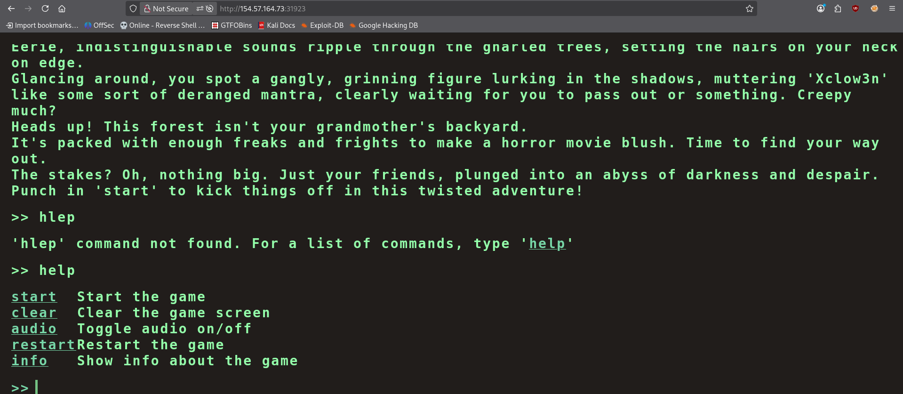
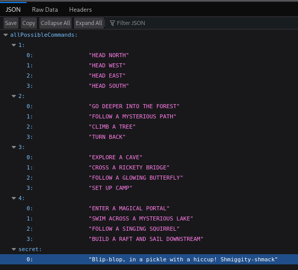
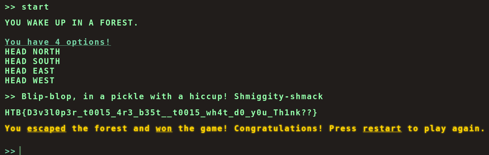

# Flag Command - HackTheBox Writeup

[](https://app.hackthebox.com/challenges/Flag%2520Command)
[](#)

> Room Link → [Flag Command](https://app.hackthebox.com/challenges/Flag%2520Command)

---

### Challenge Scenario

> Embark on the "Dimensional Escape Quest" where you wake up in a mysterious forest maze that's not quite of this world. Navigate singing squirrels, mischievous nymphs, and grumpy wizards in a whimsical labyrinth that may lead to otherworldly surprises. Will you conquer the enchanted maze or find yourself lost in a different dimension of magical challenges? The journey unfolds in this mystical escape!

---

> [!NOTE]
> Make sure to add `ip host` into `/etc/hosts` file.

We're given an IP and port hosting an HTTP page:



We can see there are five commands given, so it wants us to punch in `Start` to kick things off and take on an adventure.

Now let's take a look at the source code (`page source files`) of the HTML page.

This is the main `HTML` page code:

```html
<!doctype html>
<html lang="en">
  <head>
    <meta charset="utf-8" />
    <meta http-equiv="X-UA-Compatible" content="IE=edge" />
    <meta name="viewport" content="width=device-width, initial-scale=1" />
    <title>Flag Command</title>
    <link rel="stylesheet" href="/static/terminal/css/terminal.css" />
    <link rel="stylesheet" href="/static/terminal/css/commands.css" />
  </head>

  <body
    style="
            color: #94ffaa !important;
            position: fixed;
            height: 100vh;
            overflow: scroll;
            font-size: 28px;
            font-weight: 700;
        "
  >
    <div id="terminal-container" style="overflow: auto; height: 90%">
      <a id="before-div"></a>
    </div>
    <div id="command">
      <textarea id="user-text-input" autofocus></textarea>
      <div id="current-command-line">
        <span id="commad-written-text"></span><b id="cursor">█</b>
      </div>
    </div>
    <audio
      id="typing-sound"
      src="/static/terminal/audio/typing_sound.mp3"
      preload="auto"
    ></audio>
    <script src="/static/terminal/js/commands.js" type="module"></script>
    <script src="/static/terminal/js/main.js" type="module"></script>
    <script src="/static/terminal/js/game.js" type="module"></script>

    <script type="module">
      import {
        startCommander,
        enterKey,
        userTextInput,
      } from "/static/terminal/js/main.js";
      startCommander();

      window.addEventListener("keyup", enterKey);

      // event listener for clicking on the terminal
      document.addEventListener("click", function () {
        userTextInput.focus();
      });
    </script>
  </body>
</html>
```

When we check the `main.js` file, we can see in the `CheckMessage` function:

```js
// HTTP REQUESTS
// ---------------------------------------
async function CheckMessage() {
    fetchingResponse = true;
    currentCommand = commandHistory[commandHistory.length - 1];

    if (availableOptions[currentStep].includes(currentCommand) || availableOptions['secret'].includes(currentCommand)) {
        await fetch('/api/monitor', {
            method: 'POST',
```

This line is particularly important to us:

`availableOptions['secret'].includes(currentCommand)`

As it says that there are "secret" options for the commands in the game, so maybe those "secret" options have the flag or have a way to get the flag!

Thus, we check the `options` API because at the end of `main.js` we can see this function named `fetchOptions`:

```js
const fetchOptions = () => {
  fetch("/api/options")
    .then((data) => data.json())
    .then((res) => {
      availableOptions = res.allPossibleCommands;
    })
    .catch(() => {
      availableOptions = undefined;
    });
};
```

Which confirms that the server is fetching options from the `/api/options` endpoint. Let's go and check if we can get anything useful there!



There's a "secret" option with the value:  
`"Blip-blop, in a pickle with a hiccup! Shmiggity-shmack"`

Thus, let's put this into the command line of the game, which will give us our flag....

> [!NOTE] Make sure to start the game before entering the "secret" command.



**Flag Found:**

```text
HTB{D3v3l0p3r_t00l5_4r3_b35t__t0015_wh4t_d0_y0u_Th1nk??}
```

---

**Room Solved!**
