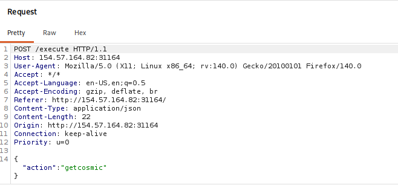
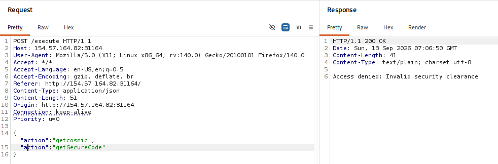
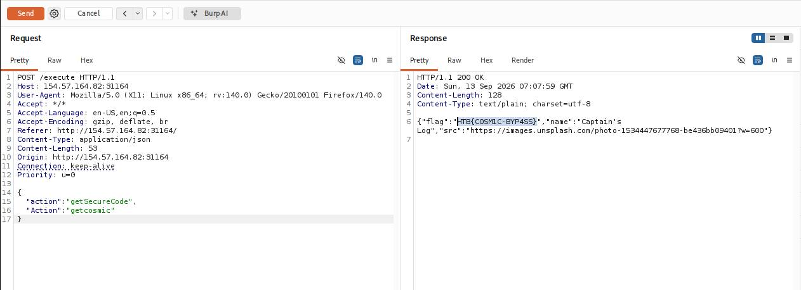

# Space Explorer - HackTheBox Writeup

[](https://app.hackthebox.com/challenges/Space%2520Explorer?tab=play_challenge)
[](#)

> **Challenge Link:** [Space Explorer](https://app.hackthebox.com/challenges/Space%2520Explorer?tab=play_challenge)

---

## Table of Contents

1. [Challenge Scenario](#challenge-scenario)
2. [Source Code & Architecture Analysis](#source-code--architecture-analysis)
   - [Python Service (`app.py`)](#python-service-apppy)
   - [Go Service (`main.go`)](#go-service-maingo)
3. [Initial Request Analysis](#initial-request-analysis)
4. [Vulnerability Analysis (JSON Parser Mismatch)](#vulnerability-analysis-json-parser-mismatch)
5. [Exploitation & Payload Crafting](#exploitation--payload-crafting)
6. [Summary of Flags](#summary-of-flags)

---

## Challenge Scenario

> **Scenario:** A lost space mission control system suffers from flawed authentication logic between its Sender and Receiver services.

We're given the source code of the space mission control system consisting of two backend microservices:

- **Go (Sender / Proxy)**: Validates incoming commands before forwarding.
- **Python (Receiver / Backend)**: Processes the execution requests and returns responses (including secret codes/flags).

---

## Source Code & Architecture Analysis

### Python Service (`app.py`)

Inside `space_explorer/python-service/app.py`, we can see the execution handler:

```python
@app.route('/execute', methods=['POST'])
def execute():
    if not request.is_json:
        return jsonify({"error": "Invalid transmission format"}), 400

    data = request.get_json()

    if 'action' not in data:
        return jsonify({"error": "No command received"}), 400

    if data['action'] == "getcosmic":
        anomaly = random.choice(COSMIC_ANOMALIES)
        return jsonify(anomaly)
    elif data['action'] == "getSecureCode":
        return jsonify({
            "flag": os.getenv("FLAG", "HTB{flag_not_set}"),
            "name": "Captain's Log",
            "src": "https://images.unsplash.com/photo-1534447677768-be436bb09401?w=600"
        })
    else:
        return jsonify({"error": "Unknown command"}), 400
```

Notice this critical condition:

```python
elif data['action'] == "getSecureCode":
```

This specifies that when the JSON key `action` equals `"getSecureCode"`, the server returns the flag.

### Go Service (`main.go`)

Now let's inspect the proxy/sender service written in Go (`/space_explorer/go-app/main.go`).

When a request arrives, Go unmarshals the raw JSON body:

```go
if err := json.Unmarshal(body, &requestData); err != nil {
    http.Error(w, "Invalid JSON", http.StatusBadRequest)
    return
}
```

It checks the action using:

```go
switch requestData.Action
```

If the action is validated (e.g. `"getcosmic"`), Go forwards the **original request body** to Python using:

```go
bytes.NewBuffer(body)
```

This means Python receives the exact, unmodified request body that we sent, rather than the parsed struct value Go checked.

---

## Initial Request Analysis

When we capture the request for a normal scan in Burp Suite:



The request sends `"action": "getcosmic"`. According to the Python code:

```python
if data['action'] == "getcosmic":
    anomaly = random.choice(COSMIC_ANOMALIES)
    return jsonify(anomaly)
```

This returns a random choice of cosmic anomaly.

Now, if we try directly editing the request to send `"action": "getSecureCode"` in Burp Repeater:



Hmm! `Access Denied`. The `Go` proxy checks `requestData.Action`, sees `"getSecureCode"`, and blocks the request before it ever reaches Python.

---

## Vulnerability Analysis (JSON Parser Mismatch)

The vulnerability comes from a key parsing differential between **Go** and **Python**:

- **Go's `encoding/json` parser is case-insensitive** when matching JSON keys to Go struct fields.
- **Python dictionaries are strictly case-sensitive.**

When Go receives a JSON payload containing duplicate keys with different casing (such as `"action"` and `"Action"`), both keys match the struct field `requestData.Action`. Go processes keys sequentially, so **the last matching key overwrites previous ones**.

> [!NOTE]
> Because Go forwards `bytes.NewBuffer(body)` without modifying the raw payload, Python receives both `"action"` and `"Action"` intact.

---

## Exploitation & Payload Crafting

To bypass the Go validation check while delivering `"getSecureCode"` to Python, we send the following payload:

```json
{
  "action": "getSecureCode",
  "Action": "getcosmic"
}
```

Let's break down how both microservices evaluate this payload:

### 1. Go Sender Evaluation

- Go unmarshals the JSON into `requestData`.
- It processes `"action": "getSecureCode"` first, setting `requestData.Action = "getSecureCode"`.
- Next, it processes `"Action": "getcosmic"`. Since Go matches struct fields case-insensitively, `"Action"` maps to the same `requestData.Action` field, causing **the last key to win**:
  ```go
  requestData.Action = "getcosmic"
  ```
- Go's `switch` check sees `requestData.Action` as `"getcosmic"`, passes validation, and forwards the raw body to Python.

### 2. Python Receiver Evaluation

- Python receives the raw body and parses it into a dictionary: `data = request.get_json()`.
- Since Python dictionaries are case-sensitive, `data` contains two separate keys: `"action"` and `"Action"`.
- Python evaluates `data['action']`:
  ```python
  data['action'] -> "getSecureCode"
  ```
- The `elif data['action'] == "getSecureCode":` block executes and returns the flag!

### Flag Capture

We send our modified payload in Burp Suite Repeater:



And boom! We got the flag! 😁.

---

## Summary of Flags

| Flag Type          | Flag Value           | Description                                                |
| :----------------- | :------------------- | :--------------------------------------------------------- |
| **Challenge Flag** | `HTB{C0SM1C-BYP4SS}` | Obtained via Go/Python JSON Parser Case Sensitivity Bypass |

---

Room solved!!
