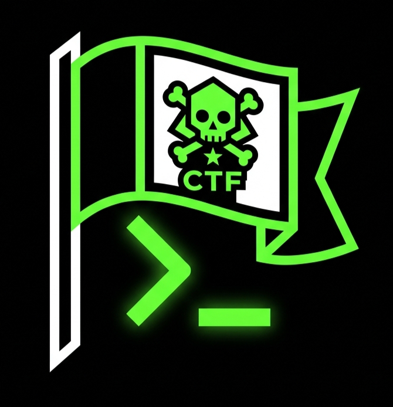

 
<h2>Valay's Writeups</h2>
<h3>Welcome to my archive of cybersecurity writeups!</h3>

# <a href="https://valay-2004.github.io/CTF-Writeups/" target="_blank" style="text-align: center;">Here's Link to main page</a>

##  Contents

- [TryHackMe Writeups](#-tryhackme-writeups)
  - [EASY](#easy)
  - [MEDIUM](#medium)
- [picoCTF 2026](#-picoctf-2026)
  - [Binary Exploitation](#binary-exploitation)
  - [Forensics](#forensics)
  - [General Skills](#general-skills)
  - [Reverse Engineering](#reverse-engineering)
  - [Web Exploitation](#web-exploitation)

---

##  &nbsp; TryHackMe Writeups

### EASY

- [Evil-GPT v2](./TryHackMe/EASY/evilgpt-v2/)
- [cryptosystem](./TryHackMe/EASY/cryptosystem/index.md)
- [Order](./TryHackMe/EASY/Order/)
- [catpictures](./TryHackMe/EASY/catpictures/)
- [JPGChat](./TryHackMe/EASY/JPGChat/)
- [Hidden Deep In My Heart](./TryHackMe/EASY/Hidden-Deep-Into-My-Heart/)
- [TryHeartMe](./TryHackMe/EASY/TryHeartMe/)
- [Operation Slither](./TryHackMe/EASY/operationslitherIU/)
- [Epoch](./TryHackMe/EASY/Epoch/)
- [Confidential](./TryHackMe/EASY/confidential/)
- [VulnNet Roasted](./TryHackMe/EASY/Vulnet/VulnetRoasted/)
- [Letter](./TryHackMe/EASY/Letter/)
- [DevDiaries](./TryHackMe/EASY/DevDiaries/)

### MEDIUM

- [Hammer](./TryHackMe/MEDIUM/Hammer/)
- [Unstable Twin](./TryHackMe/MEDIUM/Unstable-Twin/)
- [Masquerade](./TryHackMe/MEDIUM/Masquerade/)
- [Olympus](./TryHackMe/MEDIUM/Olympus/)
- [Recruit](./TryHackMe/MEDIUM/Recruit/)

### HARD

- [DeadEnd](./TryHackMe/HARD/DeadEnd/)

---

##  picoCTF 2026 Writeups

### Binary Exploitation

- [QuizSploit](./PicoCTF/picoCTF26/BinaryExploitation/QuizSploit.md)

### Forensics

- [Timeline 0 (100 pt)](./PicoCTF/picoCTF26/Forensics/Timeline_0.md)
- [Binary Digits](./PicoCTF/picoCTF26/Forensics/BinaryDigits.md)

### General Skills

- [KSECRETS (100 pt)](./PicoCTF/picoCTF26/GeneralSkills/KSECRETS.md)
- [Password Profiler (100 pt)](./PicoCTF/picoCTF26/GeneralSkills/Password_Profiler.md)
- [Shared Secret (100 pt)](./PicoCTF/picoCTF26/GeneralSkills/Shared_Secret.md)
- [ping-cmd (100 pt)](./PicoCTF/picoCTF26/GeneralSkills/ping-cmd.md)
- [bytemancy 0](./PicoCTF/picoCTF26/GeneralSkills/bytemancy_0.md)
- [MY GIT](./PicoCTF/picoCTF26/GeneralSkills/MY_GIT.md)
- [Piece by Piece](./PicoCTF/picoCTF26/GeneralSkills/Piece_by_Piece.md)
- [Printer Share](./PicoCTF/picoCTF26/GeneralSkills/PrinterShare.md)
- [SUDO MAKE ME A SANDWICH](./PicoCTF/picoCTF26/GeneralSkills/SUDO_MAKE_ME_A_SANDWICH.md)

### Reverse Engineering

- [GateKeeper](./PicoCTF/picoCTF26/ReverseEngineering/GateKeeper.md)

### Web Exploitation

- [North-South (100 pt)](./PicoCTF/picoCTF26/WebExploitation/North-South.md)
