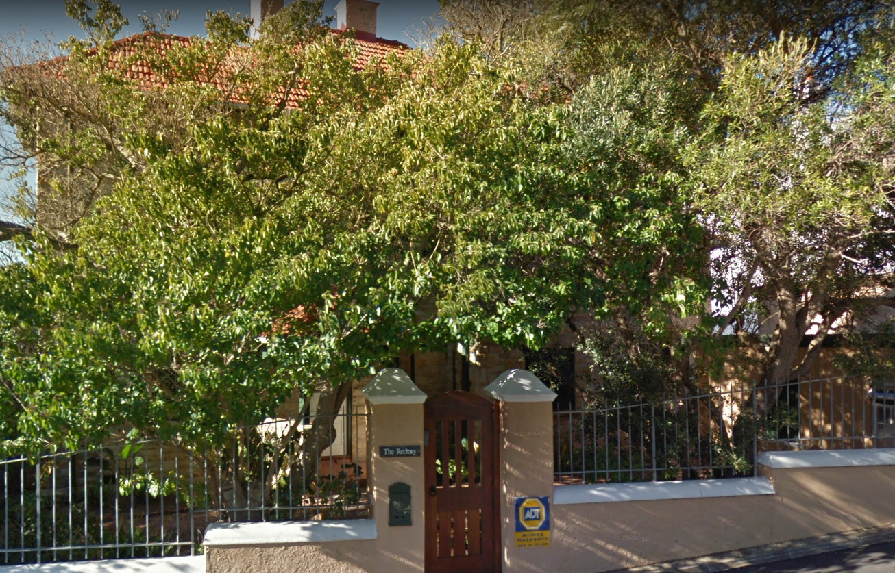
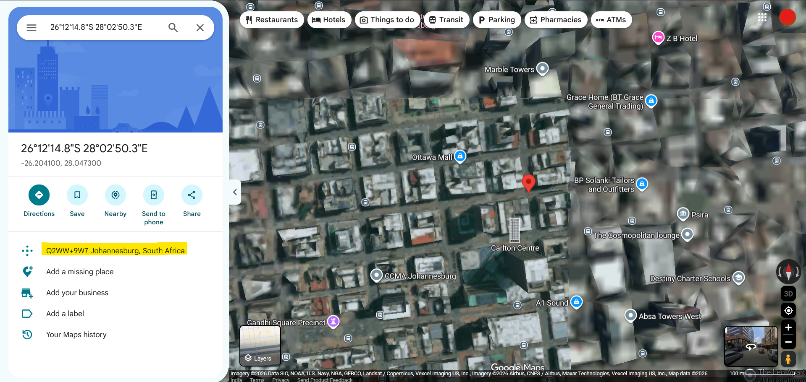
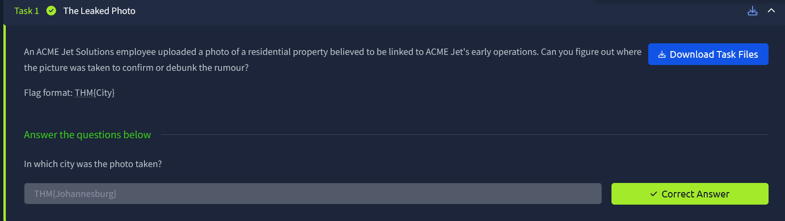
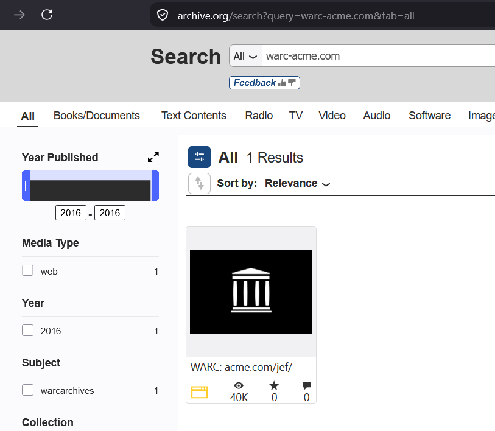
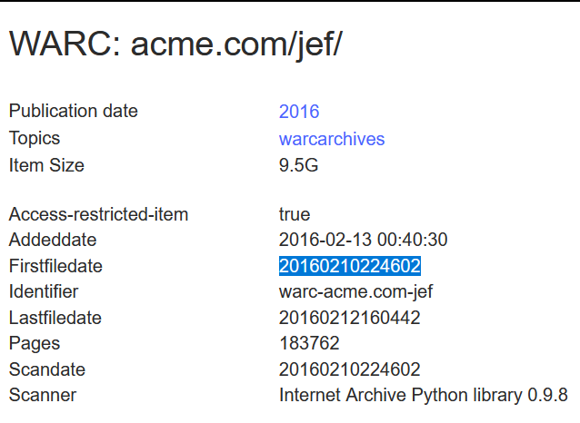
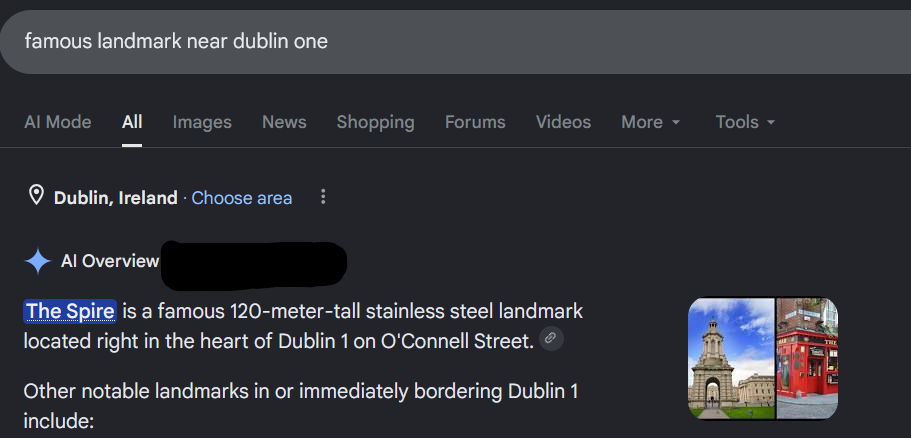
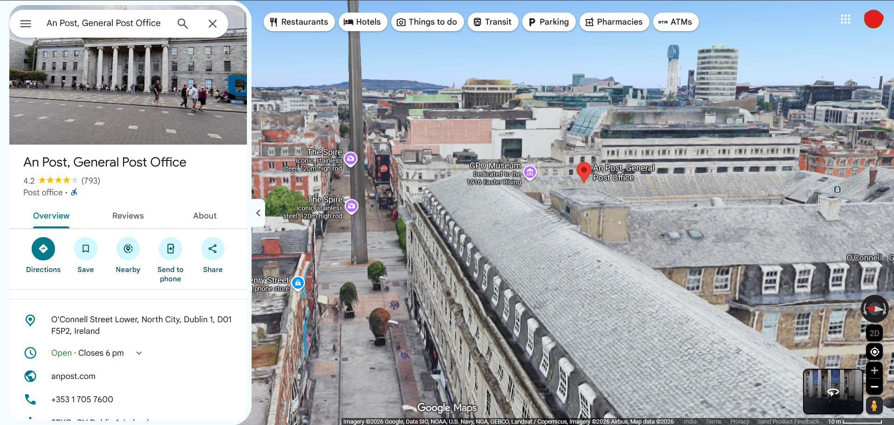
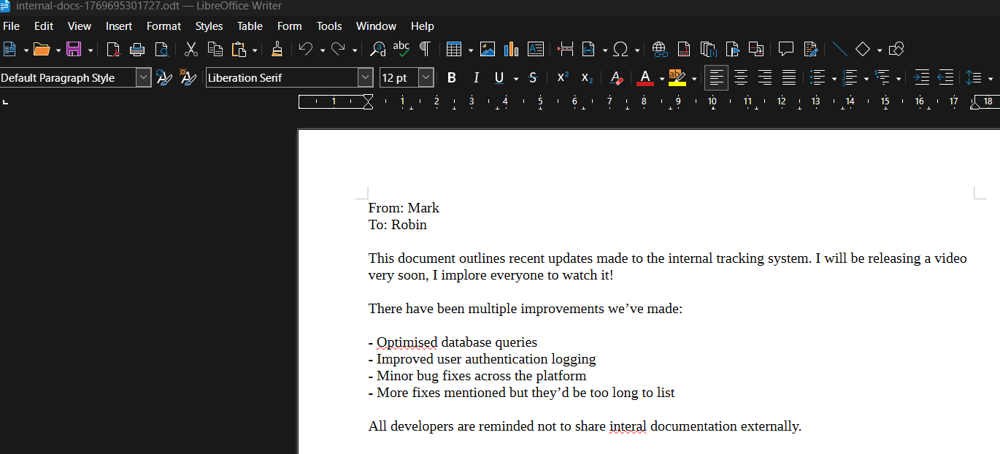

# Digital Footprint - TryHackMe Writeup

[](https://tryhackme.com/room/osintchallengeiv)
[](#)

> Room Link → [Digital Footprint](https://tryhackme.com/room/osintchallengeiv)

## Task 1: The Leaked Photo

```text
An ACME Jet Solutions employee uploaded a photo of a residential property believed to be linked to ACME Jet's early operations. Can you figure out where the picture was taken to confirm or debunk the rumour?

Flag format: THM{City}
```

`Given image:`


First rule of photo OSINT: run `exiftool` on the image and hope someone forgot to scrub the metadata. Lucky for us, the EXIF data was left wide open!

```bash
❯ exiftool edited-house-1763031553617.jpg
ExifTool Version Number         : 13.55
File Name                       : edited-house-1763031553617.jpg
Directory                       : .
File Size                       : 793 kB
File Modification Date/Time     : 2026:09:09 20:25:37+05:30
File Access Date/Time           : 2026:09:09 20:27:11+05:30
File Inode Change Date/Time     : 2026:09:09 20:27:06+05:30
File Permissions                : -rwxrwxrwx
File Type                       : JPEG
File Type Extension             : jpg
MIME Type                       : image/jpeg
Exif Byte Order                 : Big-endian (Motorola, MM)
GPS Latitude                    : 26 deg 12' 14.76"
GPS Longitude                   : 28 deg 2' 50.28"
JFIF Version                    : 1.01
Resolution Unit                 : None
X Resolution                    : 1
Y Resolution                    : 1
Image Width                     : 1306
Image Height                    : 837
Encoding Process                : Baseline DCT, Huffman coding
Bits Per Sample                 : 8
Color Components                : 3
Y Cb Cr Sub Sampling            : YCbCr4:4:4 (1 1)
Image Size                      : 1306x837
Megapixels                      : 1.1
GPS Position                    : 26 deg 12' 14.76", 28 deg 2' 50.28"
```

Look at that — exact GPS coordinates right in the open:

> `GPS Position                    : 26 deg 12' 14.76", 28 deg 2' 50.28"`

Popped those coordinates straight into Google Maps to see where this house actually is. Turned out to be `Johannesburg`.





## Task 2: Archived Company Website

```text
ACME Jet Solutions (warc-acme.com/jef/), is all over social meda claiming they were founded in 2025 and that they're the fastest-growing data company in Africa.
But something doesn't add up, one of their ex-employees ensures you that the company existed long before that.

Your job as an OSINT investigator is to verify their founding date using only public information.

Flag Format: THM{YYYYMMDDHHMMSS}
```

Next up, verifying their history. I took the given URL `warc-acme.com/jef/` over to the Internet Archive.

> [!NOTE]
> Quick tip here: notice how the URL contains `warc` (`Web ARChive`)? That's a subtle hint that we should look at the global **Internet Archive Items metadata** rather than standard Wayback Machine calendar snapshots!



Checking the item details revealed the exact timestamp we need for the flag:



## Task 3: Mysterious Landmark

```text
Further Investigation uncovers another image believed to be connected to the company's international expansion.

Research reveals that to the right of the iconic landmark is a building that played a big role in the fight for independence of a particular country. Signs on the external wall provides the name of the building.

Submit the name of building translated into English as the flag.

The flag format is THM{Landmark}
```

`Given Image:`


Checking out the image, on the left side there's a banner with `DUBLINONE` printed on it. A quick Google search confirms that's a hotel name in Dublin.

Searching for famous landmarks around that location gave us this spot:



Jumped onto Google Maps Street View to drop the pin on that exact path: [Street View](https://maps.app.goo.gl/9Fo7Ae5d5KchBw5C6)

> https://maps.app.goo.gl/9Fo7Ae5d5KchBw5C6

Looking right next to it, we find the iconic building: `An Post, General Post Office`.



Translating the name into English as instructed gives us the flag:


## Task 4: Internal Documents

```text
After uncovering ACME Jet Solutions origins and tracing their online presence through archived websites and international landmarks, investigators believe that an internal document was accidentally leaked by one of the company's developers.

The document may contain crucial information about the individual responsible for maintaining their systems.
```

We're handed an `.odt` file (`OpenDocument Text`). Basically, it's the open-source cousin of a Microsoft Word `.docx` file.

Under the hood, an `.odt` file is just a compressed ZIP archive containing XML files and metadata. So before even opening it up, `exiftool` strikes again to see if the developer snitched on themselves:

```bash
❯ sudo exiftool internal-docs-1769695301727.odt
ExifTool Version Number         : 13.55
File Name                       : internal-docs-1769695301727.odt
Directory                       : .
File Size                       : 15 kB
File Modification Date/Time     : 2026:09:10 17:16:23+05:30
File Access Date/Time           : 2026:09:10 17:16:23+05:30
File Inode Change Date/Time     : 2026:09:10 17:16:23+05:30
File Permissions                : -rwxr-x---
File Type                       : ODT
File Type Extension             : odt
MIME Type                       : application/vnd.oasis.opendocument.text
Creation-date                   : 2026:01:29 14:59:44
Description                     : Just remember Robin, don't publish this externally!
Language                        : en-US
Date                            : 2026:01:29 15:50:57.170215644
Editing-cycles                  : 4
Subject                         : Key Updates
Title                           : Internal Document
Editing-duration                : PT29M54S
Generator                       : LibreOffice/25.8.4.2$Linux_X86_64 LibreOffice_project/580$Build-2
Document-statistic Table-count  : 0
Document-statistic Image-count  : 0
Document-statistic Object-count : 0
Document-statistic Page-count   : 1
Document-statistic Paragraph-count: 7
Document-statistic Word-count   : 73
Document-statistic Character-count: 449
Document-statistic Non-whitespace-character-count: 380
User-defined Name               : Internal username
User-defined                    : markwilliams7243
Preview PNG                     : (Binary data 6403 bytes, use -b option to extract)
```

Look at the description metadata: _"Just remember Robin, don't publish this externally!"_ — great advice that was completely ignored. 😅

We also find the author's handle hidden in the user-defined metadata:

```text
User-defined                    : markwilliams7243
```

Now we have a target username: `markwilliams7243`.

I ran a quick username check on usersearch:

> https://usersearch.com/search_results

Also, reading between the lines of the document content, it mentioned he'd be uploading a video about the updates! So going straight to YouTube and searching `@markwilliams7243` directly led right to his channel. Always keep an eye out for those contextual clues!

When you open the file:


Found the video and grabbed the final flag:


---

**Room Solved!!** 🚀
