# C2 Carnage - TryHackMe Writeup

[](https://tryhackme.com/room/c2carnage/)
[](#)

> Room link $\rightarrow$ [C2 Carnage](https://tryhackme.com/room/c2carnage)

## Task 1: Scenario


Eric Fischer from the Purchasing Department at Bartell Ltd has received an email from a known contact with a Word document attachment.  Upon opening the document, he accidentally clicked on "Enable Content."  The Department immediately received an alert from the endpoint agent that Eric's workstation was making suspicious connections outbound. The was retrieved from the network sensor and handed to you for analysis. 

**Task**: Investigate the packet capture and uncover the malicious activities. 

\*Credit goes to [Brad Duncan (opens in new tab)](https://www.malware-traffic-analysis.net/) for capturing the traffic and sharing the packet capture with InfoSec community. 

NOTE: DO NOT directly interact with any domains and IP addresses in this challenge. 

---

Deploy the machine attached to this task; it will be visible in the split-screen view once it is ready.

If you don't see a lab machine load, then click the Show Split View button.


<hr>

## Task 2: Traffic Analysis

### What was the date and time for the first HTTP connection to the malicious IP? (answer format: yyyy-mm-dd hh:mm:ss)

First of all let's check the endpoints in the packets with `Statistics > Enpoints > IPv4`.
We can see there are `110` IP endpoints. Now if we filter by highest packets first we can see the IP `10.9.23.102` having `70419` packets which concludes that this IP has the highest traffic ..

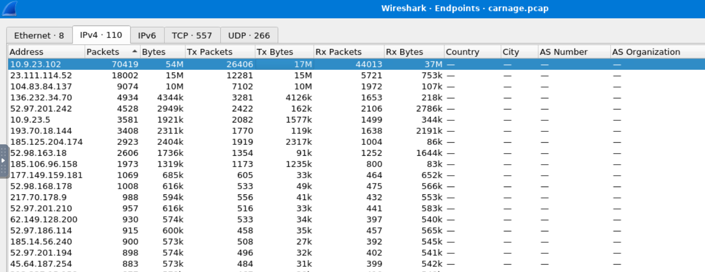

When filtered `http` packets with the above IP address we get the following result:
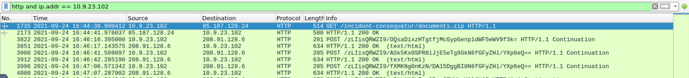

In which we can see a packet with `GET` for a `document.zip` file which is most likely the document which `Eric Fischer from the Purchasing Department` downloaded and opened.

And hence we got the time at which the fist **HTTP connection to the malicious IP** happened

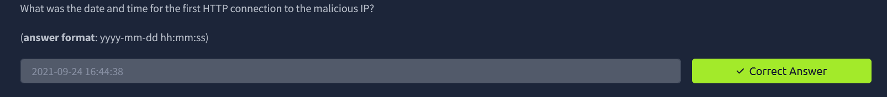

> [!TIP] Change Clock Format
> To change the Time/Clock Format to `yyyy-mm-dd hh:mm:ss.ms`
>
> - Go to :
>   `View > Time Display Format > Date and Time of the day`
> - Or simply press command `Alt + Ctrl + 1`

---

### What is the name of the zip file that was downloaded ?

From previous question we can see the name of the file downloaded is `documents.zip` .

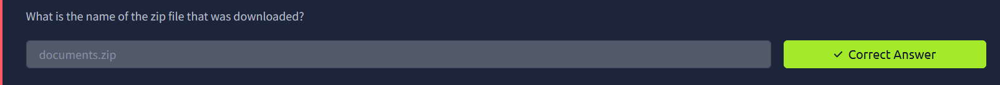

#### What was the domain hosting the malicious zip file?

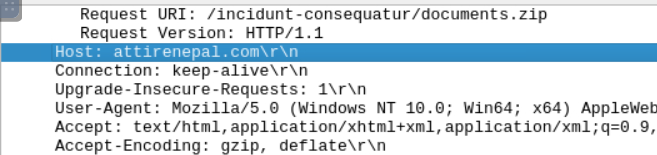

In HTTP protocol pane we can see the HOST name as `attirenepal.com`

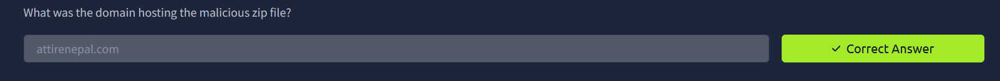

### Without downloading the file, what is the name of the file in the zip file?

We can simply follow the HTTP stream to see what are the content of the zip for that we need to `right click on the packet entry > Follow > HTTP stream`

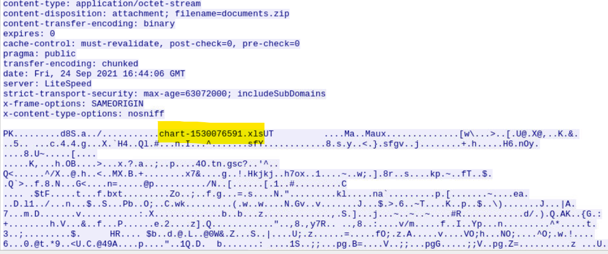

#### We can also do above by exporting the file

For this we need to get our hands on the `documents.zip` file which can be done by using the `export objects` option available in `File > Export Object > HTTP`

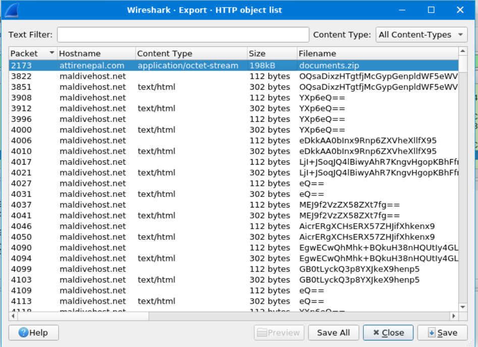

We can see the first entry has this `document.zip` file we'll save it and open inside unzip it to check what's inside

After saving when we unzip the `documents.zip` file we get the given result

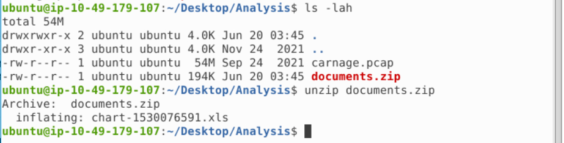

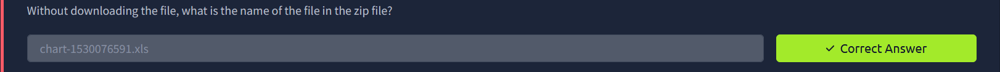

### What is the name of the webserver of the malicious IP from which the zip file was downloaded?

We can check in the `HTTP` stream name of the server is given as `LiteSpeed`

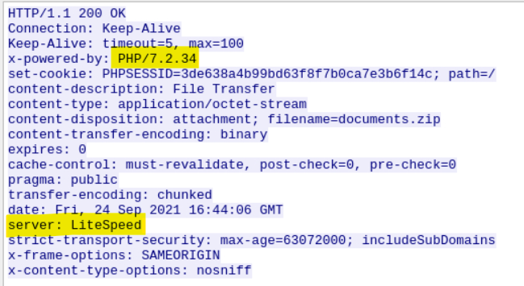

Also `version` of the server is `PHP/7.2.34`

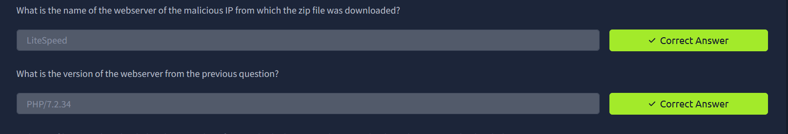

### Malicious files were downloaded to the victim host from multiple domains. What were the three domains involved with this activity?

As we have already exported the `documents.zip` file onto the machine if use `strings` on the file at the near bottom we can see these domains :

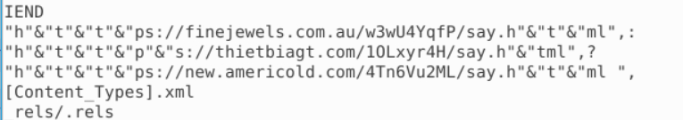

Which when constructed as a domain are:

- `https://finejewels.com.au`
- `https://thietbiagt.com`
- `https://new.americold.com`

Thus our answer is the above three domains

> finejewels.com.au, thietbiagt.com, new.americold.com

### Which certificate authority issued the SSL certificate to the first domain from the previous question?

For this we can do a `DNS Lookup` to know about the hosting provider which is `GoDaddy`.
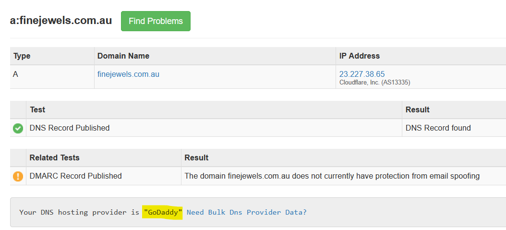

> `GoDaddy`

### What are the two IP addresses of the Cobalt Strike servers? Use VirusTotal (the Community tab) to confirm if IPs are identified as Cobalt Strike C2 servers. (answer format: enter the IP addresses in sequential order)

> [!TIP] HINT >
> Check the Conversations menu option

With the help of `hint` we'll check the conversations which is inside `Statistics > Conversations`

Also when I search for `which protocols does C2 servers use` the answer was primarily `HTTP`, `HTTPS`, `DNS` and others custom protocols

So with that information I started the search on `TCP` section of `Conversation` tab and if we filter the `Bytes` in descending order

We get the following result:

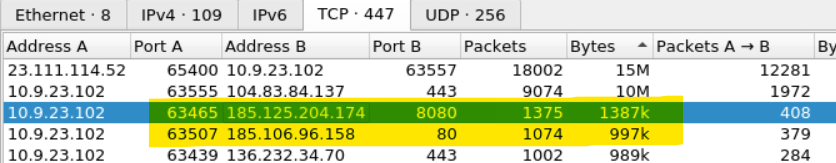

So now we have to check the `HTTP/HTTPS` port of `B Address` (most likely C2), when I searched the `185.125.204.174` IP address on VirusTotal I got to know that this IP address is a C2 server IP address which was stated in the `Community Section` of VirusTotal.

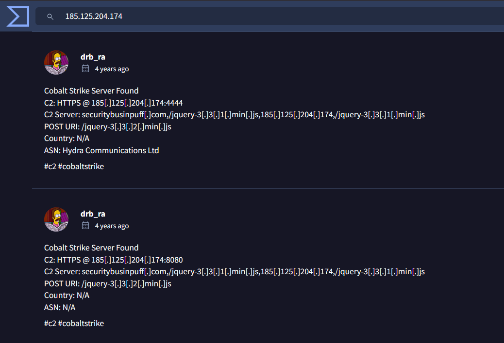

> VirusTotal Link $\rightarrow$ https://www.virustotal.com/gui/ip-address/185.125.204.174/community

Now there's also one more IP that starts with `185.*` and has port `80`, so if we check that also:

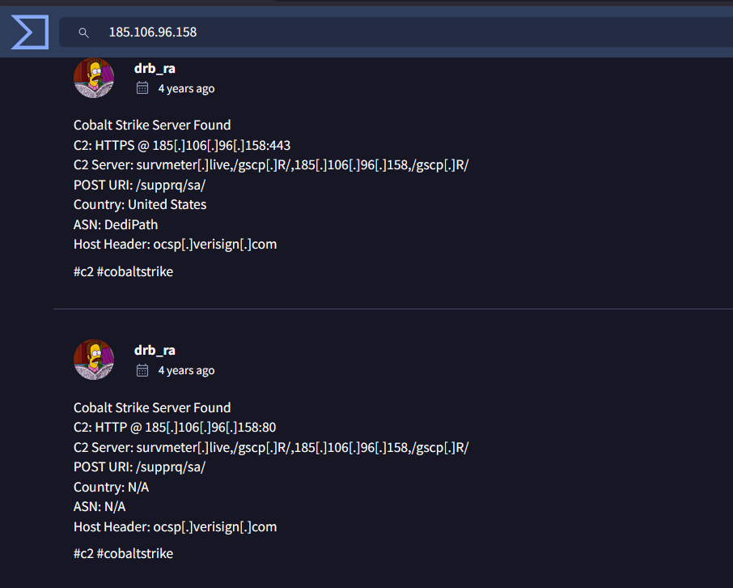

> VirusTotal Link $\rightarrow$ https://www.virustotal.com/gui/ip-address/185.106.96.158/community

Thus the two IP address related to the Cobalt Strike server are

> - 185.106.96.158
> - 185.125.204.174

### What is the Host header for the first Cobalt Strike IP address from the previous question?

> [!NOTE]
> This questions answer is already in the above/previous answer. If you see the `image` we can see the `Host Header: ocsp[.]verisign[.]com` which is the host name for the given IP.

**If you want to find using Filter:**
To get the host of first IP address from above question which is `185.106.96.158` we can use this filter which will give us the hostname.

```
ip.addr == 185.106.96.158 and http.host
```

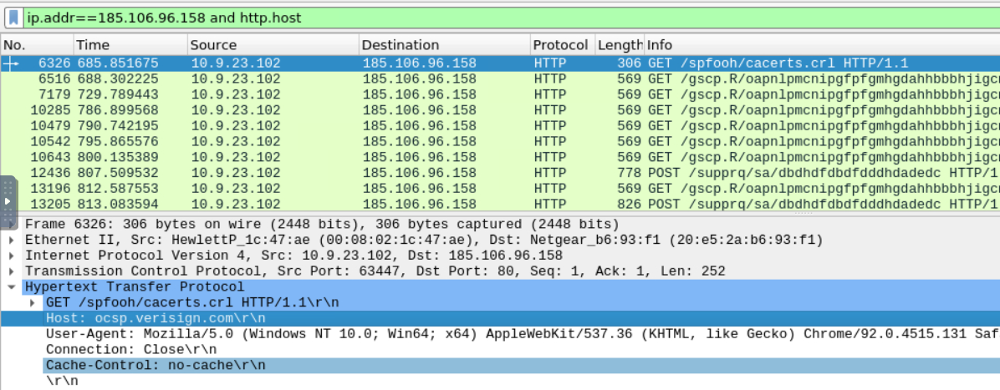

> Thus the Hostname is: `ocsp.verisign.com`

### What is the domain name for the first IP address of the Cobalt Strike server? You may use VirusTotal to confirm if it's the Cobalt Strike server (check the Community tab).

> [!NOTE]
> This questions answer is already in the above/previous answer. If you see the `image` we can see the `C2 Server: survmeter[.]live,/gscp[.]R/,185[.]106[.]96[.]158,/gscp[.]R/` which are the domain name for the given IP.

> Thus Domain name of IP `185.106.96.158` is `survmeter.live`

And If you want to search the DNS in `wireshark` we can make use of this filter
`dns.a == 185.106.96.158` which will give us the DNS

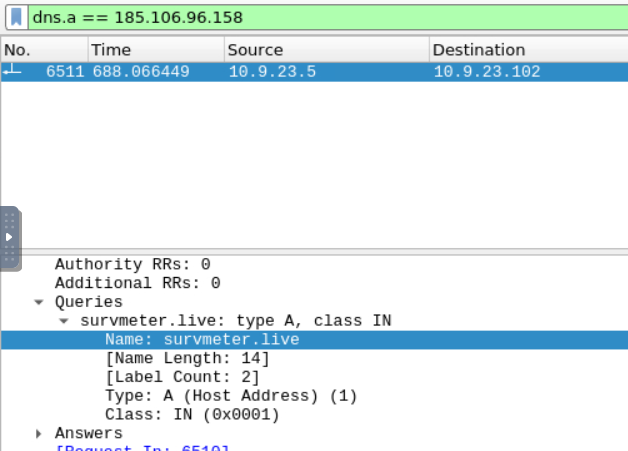

### What is the domain name of the second Cobalt Strike server IP?  You may use VirusTotal to confirm if it's the Cobalt Strike server (check the Community tab).

> [!NOTE]
> This questions answer is already in the above/previous answer. If you see the `image` we can see the `C2 Server: securitybusinpuff[.]com,/jquery-3[.]3[.]1[.]min[.]js,185[.]125[.]204[.]174,/jquery-3[.]3[.]1[.]min[.]js` which are the domain name for the given IP.

> Hence Domain Name : `securitybusinpuff.com`

And to find the DNS in `wireshark` {Same as we've did in previous question}

Run this filter `dns.a == 185.125.204.174`

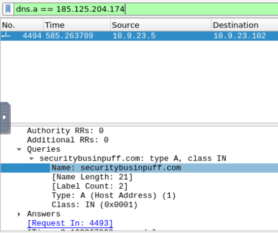

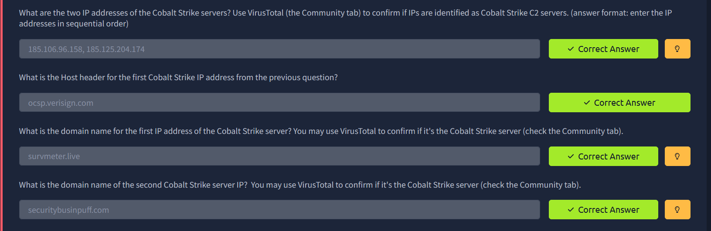

### What is the domain name of the post-infection traffic?

> [!TIP]
> HINT > Filter out for DNS queries

Using the given filter we can see the Host: `maldivehost.net`

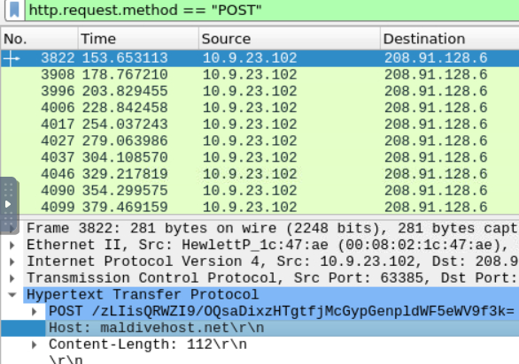

> Thus the first eleven chars for the POST request are `zLIisQRWZI9`

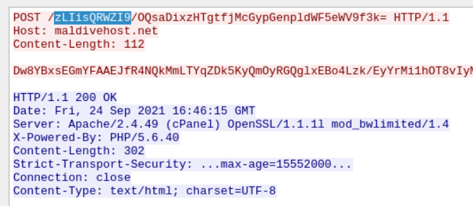

### What was the length for the first packet sent out to the C2 server?

> We can see the content length of the packet is : `281`

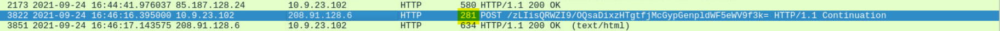

> [!NOTE] Content-Length
> In above image we've answered Length of the packet (complete packet) and thus the Content-length when followed or viewed the packet is different.

### What was the Server header for the malicious domain from the previous question?

We can find the server header in the previous question image which is titled as `Server: `

> `Apache/2.4.49 (cPanel) OpenSSL/1.1.1l mod_bwlimited/1.4`

### The malware used an API to check for the IP address of the victim’s machine. What was the date and time when the DNS query for the IP check domain occurred? (**answer format**: yyyy-mm-dd hh:mm:ss UTC)

We can try to filter DNS packets which contains "`api`" word which will give us these results

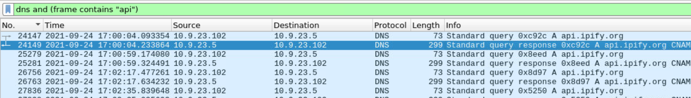

> Thus answer for this question is $\rightarrow$ `2021-09-24 17:00:04`

### What was the domain in the DNS query from the previous question?

We can see in the above image the Domain Name is `api.ipify.org`
Or you can check it in the details pane.

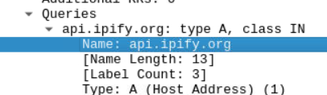

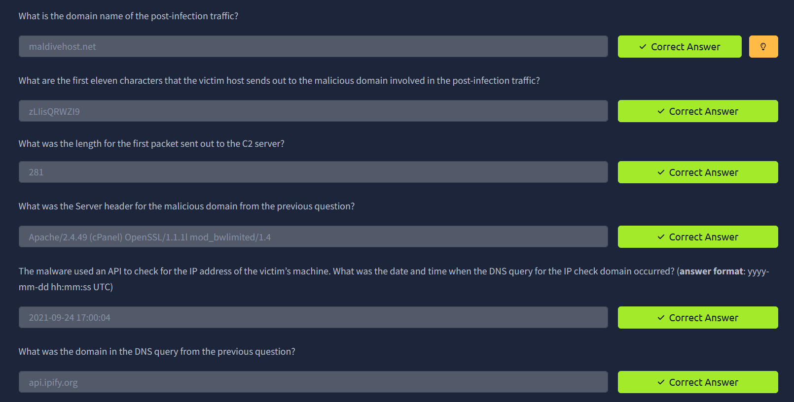

### Looks like there was some malicious spam (malspam) activity going on. What was the first MAIL FROM address observed in the traffic?

If there was a `malspam` activity that means there must be more than a small amount of mails dropped from the same mail again and again so let's check it with `smtp` as filter.

With only `smtp` filter we get `1439` packets so let's narrow it down more by adding IP of threat actor `10.9.23.102`

> `smtp and ip.addr == 10.9.23.102`

And just after a little scroll we got the `MAIL FROM`

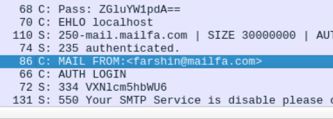

> `farshin@mailfa.com`

### How many packets were observed for the SMTP traffic?

Already answered in above question! $\rightarrow$ `1439`

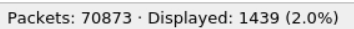

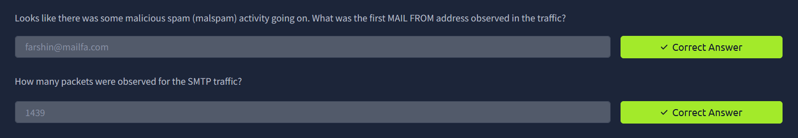

---

Room complete!!
